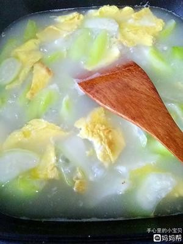

# 素炒瓠瓜 (Stir-Fried Calabash / Bottle Gourd)

## 📋 基本資訊 / Recipe Overview
- **料理名稱 (繁體)**：素炒瓠瓜
- **料理名称 (简体)**：素炒瓠瓜
- **English Title**：Stir-Fried Calabash / Bottle Gourd with Garlic
- **素食流派 / Diet**：全素 / 纯素 Vegan (含蒜；可去蒜做纯净素)
- **料理分類 / Category**：01-蔬菜本味类 / 夏季瓜类 / 嫩滑清甜
- **份量 / Servings**：2-3 人份
- **準備時間 / Prep Time**：5 分鐘
- **烹飪時間 / Cook Time**：3-4 分鐘
- **總計耗時 / Total Time**：8 分鐘
- **來源 / Source**：现代中华素菜 Top 100 · [01-蔬菜本味类.md](../01-蔬菜本味类.md) 第 89 道

## 📖 菜品特色 / Description
瓠子或蒲瓜清炒，质地白嫩，入口嫩滑化渣，清甜多汁，清热解暑。

---

## 🌿 食材與調味清單 / Ingredients & Seasonings

### 主料
- 鲜嫩瓠瓜（蒲瓜 / 瓠子 / 夜开花） 1 根（约 400g）
- 大蒜 3 瓣（切片）
- 红椒丝 10g（点缀配色）

### 调味用料
- 食用植物油 1.5 汤匙（约 22ml）
- 食盐 1/2 茶匙（约 2.5g）
- 素蚝油 1 茶匙（约 5ml）
- 白砂糖 1/4 茶匙（约 1g，提鲜）
- 纯净水 2 汤匙（约 30ml）
- 水淀粉（玉米淀粉 1/2 茶匙 + 清水 1 汤匙）

---

## 🍳 烹飪步驟 / Step-by-Step Cooking Steps

### 步骤 1：去皮改刀与验苦
1. 瓠瓜削去外皮，切去头尾蒂部（**提示**：可切一小片尝舌尖，若有苦味说明含有葫芦素毒素切勿食用；正常瓠瓜味微甜）。
2. 对半纵向切开，若瓜瓤嫩软可保留，若带老籽可用勺子刮净，随后切成厚度约 0.3 厘米的半圆形厚片。

### 步骤 2：蒜香爆锅
1. 炒锅烧热，倒入 1.5 汤匙植物油，油温 5 成热时下入蒜片煸炒出香味。

### 步骤 3：大火翻炒
1. 倒入切好的瓠瓜片，转大火快速翻炒 1 分钟，让瓜片表面均匀裹上蒜油，呈微透明状。

### 步骤 4：加水微焖至软滑
1. 加入 2 汤匙清水与红椒丝，盖上锅盖中火焖煮 1-1.5 分钟，让瓜肉彻底熟透变软滑多汁。

### 步骤 5：调味勾薄芡出锅
1. 揭盖加入 **食盐 1/2 茶匙**、**素蚝油 1 茶匙** 和 **白糖 1/4 茶匙** 翻炒均匀。
2. 淋入调好的水淀粉大火颠锅推匀，让薄薄的琉璃芡裹紧瓠瓜片，关火出锅。

---

## 💡 大厨秘诀 / Chef's Tips

1. **切片厚度适中（约 3 毫米）**：瓠瓜含水量高且肉质软，切太薄炒后易碎烂成糊，适度厚度能保持爆汁口感。
2. **尝苦防毒常识**：变异或苦味瓠瓜含高浓度葫芦素，高温不易破坏，若切开尝到明显苦味应坚决丢弃。
3. **薄薄琉璃芡锁住清甜**：出锅前淋微量水淀粉，能让瓜肉释放的清甜原汁重新包裹在瓜片上，入口顺滑鲜润。

---
*食谱归档时间：2026-08-20 · 收录于 20260818-vegetarianism 本地菜谱库 (1Top 精选)*
