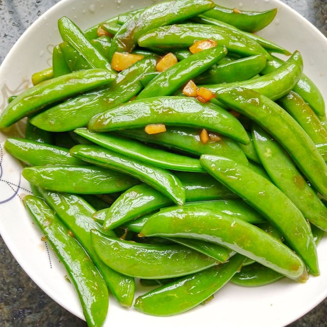

# 素炒甜豆 (Stir-Fried Sugar Snap Peas with Bell Peppers)

## 📋 基本資訊 / Recipe Overview
- **料理名稱 (繁體)**：素炒甜豆
- **料理名称 (简体)**：素炒甜豆
- **English Title**：Stir-Fried Sugar Snap Peas with Bell Peppers
- **素食流派 / Diet**：纯素 Vegan (纯净素/五辛素通用，含蒜可去)
- **料理分類 / Category**：01-蔬菜本味类 / 甜脆多汁 / 经典素炒
- **份量 / Servings**：2-3 人份
- **準備時間 / Prep Time**：5 分鐘
- **烹飪時間 / Cook Time**：3 分鐘
- **總計耗時 / Total Time**：8 分鐘
- **來源 / Source**：现代中华素菜 Top 100 · [01-蔬菜本味类.md](../01-蔬菜本味类.md) 第 56 道

## 📖 菜品特色 / Description
甜豆快炒，可配彩椒。甜豆荚饱满圆润，汁水充沛清甜，搭配红黄彩椒，色泽缤纷，爽脆甜美。

---

## 🌿 食材與調味清單 / Ingredients & Seasonings

### 主料
- 新鲜甜豆（甜豆荚） 350g
- 红黄彩椒 各 1/4 个（切小菱形片）
- 生姜 2 片（切丝）或大蒜 2 瓣（切片）

### 调味料
- 食用植物油 1.5 汤匙（约 22ml）
- 食盐 1/2 茶匙（约 3g）
- 白砂糖 1/4 茶匙（约 1g）
- 素高汤 / 温水 2 汤匙
- 水淀粉 1 茶匙（极薄芡粉水）

---

## 🍳 烹飪步驟 / Step-by-Step Cooking Steps

### 步骤 1：去蒂撕筋与彩椒改刀
1. 甜豆掐去两头蒂部，并顺势撕除两侧粗老筋络，洗净沥干。
2. 彩椒洗净切成菱形小片；生姜切丝（或蒜切片）。

### 步骤 2：短时焯水
1. 沸水锅中加入少许盐和油，下入甜豆焯烫 45-50 秒至断生（甜豆比荷兰豆厚实，时间稍长）。
2. 捞出迅速过凉水，沥干水分。

### 步骤 3：大火爆炒
1. 炒锅烧热倒油，下姜丝（或蒜片）爆香。
2. 倒入彩椒片和甜豆，转大火快速颠锅翻炒 30 秒。

### 步骤 4：调味抱汁
1. 加入 **食盐 1/2 茶匙**、**白糖 1/4 茶匙**，烹入 2 汤匙素高汤。
2. 淋入 1 茶匙水淀粉，大火翻炒 5 秒使清汁光亮包裹豆荚，立即出锅装盘。

---

## 💡 大厨秘诀 / Chef's Tips

1. **比荷兰豆多焯 15 秒**：甜豆豆粒饱满厚实，焯水 45-50 秒能确保内部豆粒熟化且保持外皮脆嫩。
2. **老筋务必彻底清除**：甜豆筋络较粗硬，两头彻底撕净才能获得极佳的咀嚼感。
3. **搭配彩椒色香俱全**：彩椒带来微甜果香与红黄亮色，清淡爽口，营养丰富。

---
*食谱归档时间：2026-08-20 · 收录于 20260818-vegetarianism 本地菜谱库 (1Top 精选)*
