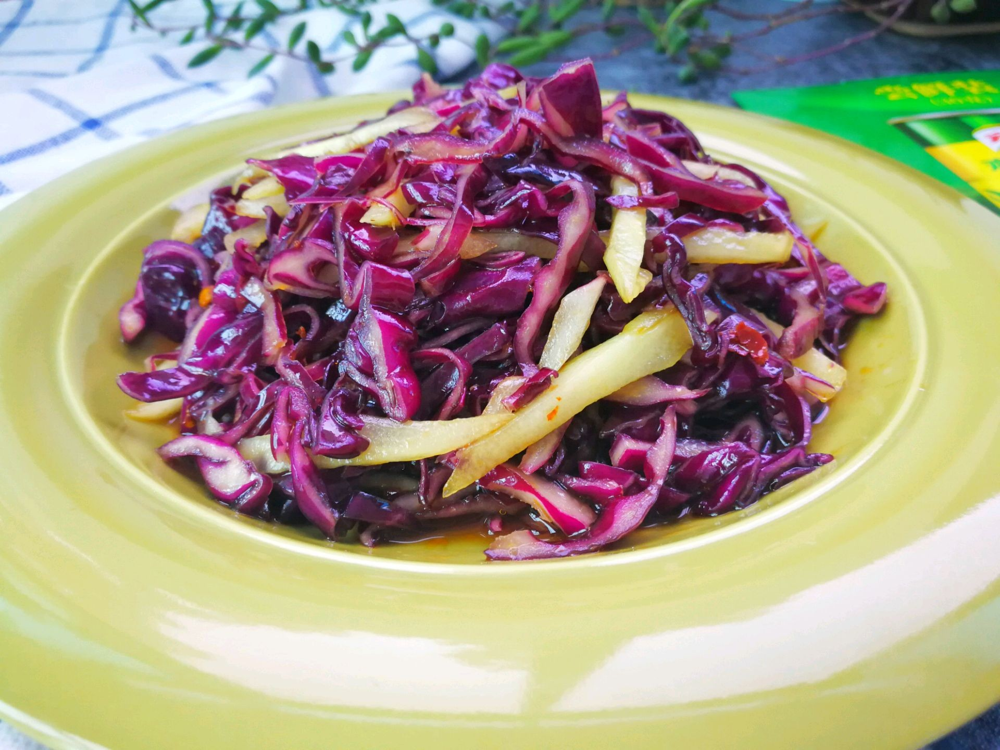

# 素炒紫甘蓝 (Stir-Fried Red Cabbage)

## 📋 基本資訊 / Recipe Overview
- **料理名稱 (繁體)**：素炒紫甘藍
- **料理名称 (简体)**：素炒紫甘蓝
- **English Title**：Stir-Fried Red Cabbage (with White Vinegar)
- **素食流派 / Diet**：全素 / 纯素 Vegan (纯素)
- **料理分類 / Category**：01-蔬菜本味类 / 护色快炒 / 脆甜爽口
- **份量 / Servings**：2-3 人份
- **準備時間 / Prep Time**：6 分鐘
- **烹飪時間 / Cook Time**：2-3 分鐘
- **總計耗時 / Total Time**：9 分鐘
- **來源 / Source**：现代中华素菜 Top 100 · [01-蔬菜本味类.md](../01-蔬菜本味类.md) 第 95 道

## 📖 菜品特色 / Description
紫甘蓝丝快炒，脆甜爽口。科学利用白醋固色，防止花青素受热变蓝变黑，成菜色泽艳丽紫红。

---

## 🌿 食材與調味清單 / Ingredients & Seasonings

### 主料
- 优质新鲜紫甘蓝 300g
- 大蒜 3 瓣（切片；纯素可用生姜丝 5g）
- 干辣椒 1-2 个（剪成小段，选配）

### 护色与调味用料
- 优质纯酿白醋 1.5 汤匙（约 22ml，护色定色之核心）
- 食用植物油 1.5 汤匙（约 22ml）
- 食盐 1/2 茶匙（约 2.5g）
- 白砂糖 1/2 茶匙（约 2.5g，平衡酸味提清甜）
- 优质生抽 1/2 茶匙（微量提鲜，不宜多）

---

## 🍳 烹飪步驟 / Step-by-Step Cooking Steps

### 步骤 1：切细丝与备料
1. 紫甘蓝一片片剥下洗净彻底沥干水分，卷紧后用刀切成厚度约 0.3 厘米的均匀细丝。
2. 大蒜切片，干辣椒剪段备用。

### 步骤 2：热油炝锅
1. 炒锅烧热，倒入 1.5 汤匙植物油，下入蒜片与干辣椒段，中小火煸出香味。

### 步骤 3：大火极速翻炒
1. 调至**最大猛火**，倒入紫甘蓝细丝。
2. 大火快速翻炒 40-50 秒至菜丝受油润亮、微微软化。

### 步骤 4：锅边烹入白醋（固色关键）
1. 迅速沿高温锅壁淋入 **白醋 1.5 汤匙**。
2. 白醋酸气遇热蒸腾，紫甘蓝丝受酸后颜色瞬间由暗暗发紫转变为鲜亮夺目的玫红色。

### 步骤 5：调味出锅
1. 紧接着加入 **食盐 1/2 茶匙**、**白糖 1/2 茶匙** 与 **生抽 1/2 茶匙**。
2. 保持大火快速颠锅翻匀 10 秒，保持脆嫩口感，即刻关火出锅装盘。

---

## 💡 大厨秘诀 / Chef's Tips

1. **白醋护色科学机理**：紫甘蓝富含花青素（酸性变红、碱性变蓝黑），快炒时加入白醋营造酸性环境，可彻底防止变暗发黑，成菜色泽娇艳紫红。
2. **全程大火敞锅快炒**：紫甘蓝耐炒但切丝后易熟，切忌盖盖焖煮，敞锅大火炒 1-2 分钟口感最为爽脆。
3. **糖醋比例协调**：白醋配等量白糖，酸甜适口，既去除了甘蓝的微涩，又大幅提升脆甜口感。

---
*食谱归档时间：2026-08-20 · 收录于 20260818-vegetarianism 本地菜谱库 (1Top 精选)*
