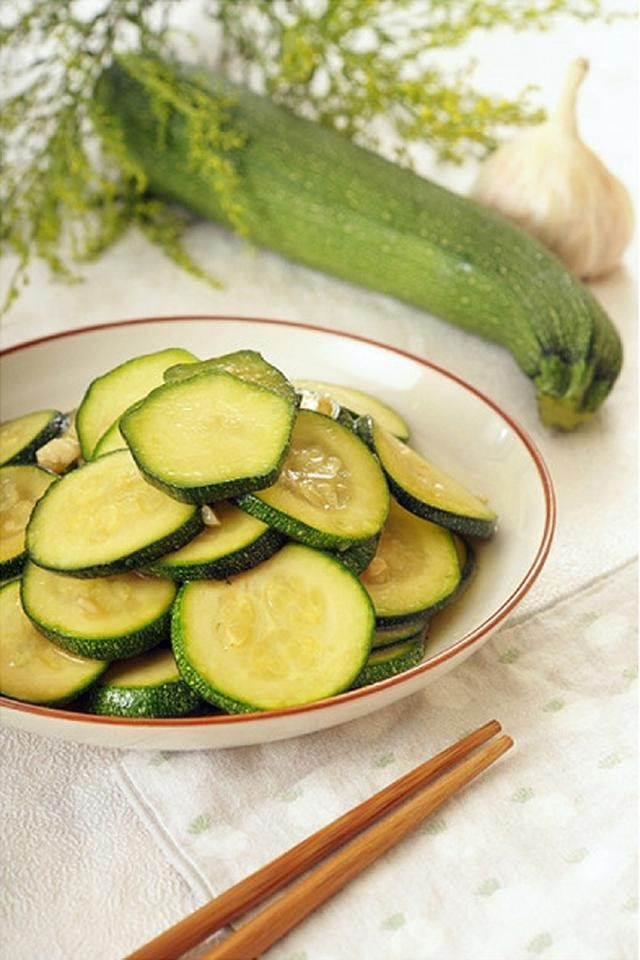

# 素炒节瓜 (Stir-Fried Fuzzy Melon)

## 📋 基本資訊 / Recipe Overview
- **料理名稱 (繁體)**：素炒節瓜
- **料理名称 (简体)**：素炒节瓜
- **English Title**：Cantonese Stir-Fried Fuzzy Melon with Vegetarian Oyster Sauce
- **素食流派 / Diet**：全素 / 纯素 Vegan (含蒜；可去蒜做纯净素)
- **料理分類 / Category**：01-蔬菜本味类 / 经典粤菜 / 岭南夏瓜
- **份量 / Servings**：2-3 人份
- **準備時間 / Prep Time**：6 分鐘
- **烹飪時間 / Cook Time**：4-5 分鐘
- **總計耗時 / Total Time**：11 分鐘
- **來源 / Source**：现代中华素菜 Top 100 · [01-蔬菜本味类.md](../01-蔬菜本味类.md) 第 90 道

## 📖 菜品特色 / Description
粤式夏瓜，蒜蓉或咸蛋黄改素蚝油。节瓜清甜软嫩，吸收素蚝油与蒜香，鲜滑多汁，解暑生津。

---

## 🌿 食材與調味清單 / Ingredients & Seasonings

### 主料
- 广东黑毛节瓜（毛瓜 / 小冬瓜） 1 根（约 350g）
- 大蒜 4 瓣（剁碎成蒜蓉，分两份：2/3 爆香，1/3 出锅提味）
- 枸杞 8 粒（温水泡发，点缀增色）

### 调味与芡汁
- 植物油 1.5 汤匙（约 22ml）
- 香菇素蚝油 1.5 汤匙（约 22ml，核心鲜醇来源）
- 优质生抽 1/2 茶匙（约 2.5ml）
- 食盐 1/3 茶匙（约 1.5g）
- 白砂糖 1/3 茶匙（约 1.5g）
- 素高汤 / 清水 4 汤匙（约 60ml）
- 水淀粉（玉米淀粉 1 茶匙 + 清水 1.5 汤匙）

---

## 🍳 烹飪步驟 / Step-by-Step Cooking Steps

### 步骤 1：刀背刮皮与切条（粤厨秘法）
1. 节瓜洗净，**用刀背轻刮**去表面细毛和极薄一层硬皮，保留一层浅绿表皮（切忌用削皮刀深削，保留浅绿层成菜更清脆碧绿）。
2. 将节瓜对半纵切，挖除内部松散瓜瓤，切成宽约 0.6 厘米、长约 5 厘米的厚长条。

### 步骤 2：蒜蓉炝锅起香
1. 炒锅烧热加油，油温 4-5 成热时下入 2/3 蒜蓉，中小火慢煸出金黄浓郁蒜香。

### 步骤 3：大火翻炒
1. 倒入节瓜条，转大火猛火翻炒 1 分钟，使节瓜条均匀裹上蒜油。

### 步骤 4：素蚝油煨焖透味
1. 调入 **香菇素蚝油 1.5 汤匙**、**生抽 1/2 茶匙**、**白糖 1/3 茶匙** 与 **4 汤匙素高汤**。
2. 翻拌均匀后盖上锅盖，中小火焖煮 2-3 分钟，直至节瓜软嫩透明且充分吸饱鲜味汁。

### 步骤 5：补生蒜勾芡出锅
1. 揭盖放入泡发枸杞与剩余 **1/3 生蒜蓉**，撒入微量食盐调味。
2. 淋入水淀粉，大火快速推匀翻炒收汁，见汤汁浓亮挂汁，关火装盘。

---

## 💡 大厨秘诀 / Chef's Tips

1. **刀背刮皮留翠绿**：用刀背刮毛不仅能去除硬皮，还能保留节瓜外层的翠绿纤维，防止炒后软烂变黄。
2. **香菇素蚝油是调味核心**：素炒节瓜改传统咸蛋黄或虾米为香菇素蚝油，菌菇多糖的醇厚鲜味与节瓜天然清甜相得益彰。
3. **金银蒜法增香提神**：前期熟蒜出醇香，出锅前补少量生蒜末激发出清爽辛香，风味极具层次。

---
*食谱归档时间：2026-08-20 · 收录于 20260818-vegetarianism 本地菜谱库 (1Top 精选)*
