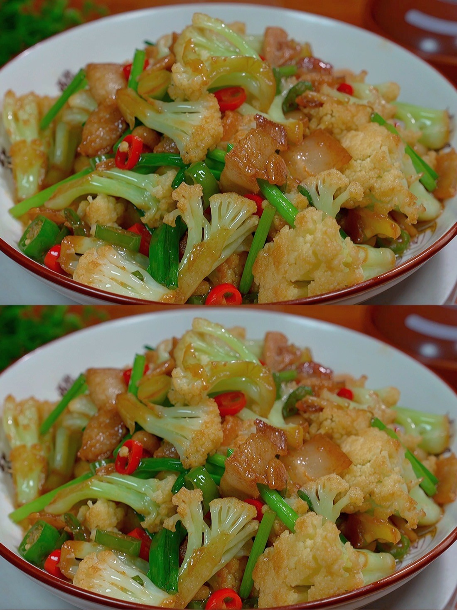

# 素炒花椰菜 (Stir-Fried Cauliflower)

## 📋 基本資訊 / Recipe Overview
- **料理名稱 (繁體)**：素炒花椰菜
- **料理名称 (简体)**：素炒花椰菜
- **English Title**：Homestyle Stir-Fried Cauliflower with Garlic and Carrots
- **素食流派 / Diet**：全素 / 纯素 Vegan (含蒜；可去蒜做纯净素)
- **料理分類 / Category**：01-蔬菜本味类 / 经典家常 / 清甜微脆
- **份量 / Servings**：2-3 人份
- **準備時間 / Prep Time**：5 分鐘
- **烹飪時間 / Cook Time**：4 分鐘
- **總計耗時 / Total Time**：9 分鐘
- **來源 / Source**：现代中华素菜 Top 100 · [01-蔬菜本味类.md](../01-蔬菜本味类.md) 第 41 道

## 📖 菜品特色 / Description
清炒或蒜蓉，保留微脆。

---

## 🌿 食材與調味清單 / Ingredients & Seasonings

### 主料
- 鲜嫩花椰菜 / 白花菜 350g（切小朵）
- 胡萝卜 半根（切菱形薄片配色）
- 大蒜 4 瓣（切蒜末）
- 小葱（选配） 1 根（切葱段）

### 清炒调味料
- 食用植物油 2 汤匙（约 30ml）
- 优质生抽 1 汤匙（约 15ml）
- 素蚝油 1/2 汤匙（约 7.5ml）
- 食盐 1/2 茶匙（约 2.5g）
- 白糖 1/4 茶匙（约 1g，提鲜）
- 清水 / 素高汤 2-3 汤匙（约 30-45ml，水汽焖透用）
- 纯芝麻香油 1/2 茶匙（约 2.5ml）

---

## 🍳 烹飪步驟 / Step-by-Step Cooking Steps

### 步骤 1：食材改刀
1. 花椰菜切成大小均匀的小花朵，根茎去硬皮切薄片。
2. 胡萝卜切薄菱形片，蒜切蒜末备用。

### 步骤 2：爆香与翻炒
1. 锅热倒入食用油，油温 5 成热时下入蒜末和葱段爆出香味。
2. 下入花椰菜小朵和胡萝卜片，大火翻炒 1 分钟，使花菜均匀裹上油脂。

### 步骤 3：少许水汽润透（水炒技法）
1. 沿锅边烹入 **2-3 汤匙清水或素高汤**，迅速盖上锅盖，利用高温蒸汽中火焖蒸 40-50 秒（**大厨妙招**：花椰菜质地紧密不易熟，加极少量水焖汽化既能让内部迅速熟透，又不会像长时间水煮那样发软变烂）。

### 步骤 4：调味与大火收亮
1. 揭开锅盖，锅中水分基本收干。
2. 加入生抽 1 汤匙、素蚝油 1/2 汤匙、食盐 1/2 茶匙和白糖 1/4 茶匙。
3. 转大火快速翻炒 20-30 秒收干汤汁，淋入香油即可出锅装盘。

---

## 💡 大厨秘诀 / Chef's Tips

1. **切成均匀小朵**：花朵过大内部不易熟透，切成一口大小的小朵熟化迅速且口感爽脆。
2. **微量水汽焖蒸法（水炒法）**：免去繁琐的大锅焯水，炒锅内烹两勺水焖半分钟，花菜熟得快、营养不流失，脆甜多汁。
3. **胡萝卜点缀提色**：少量胡萝卜片增添天然胡萝卜素与橙红色泽，整盘菜清爽养眼。

---
*食谱归档时间：2026-08-20 · 收录于 20260818-vegetarianism 本地菜谱库 (1Top 精选)*
