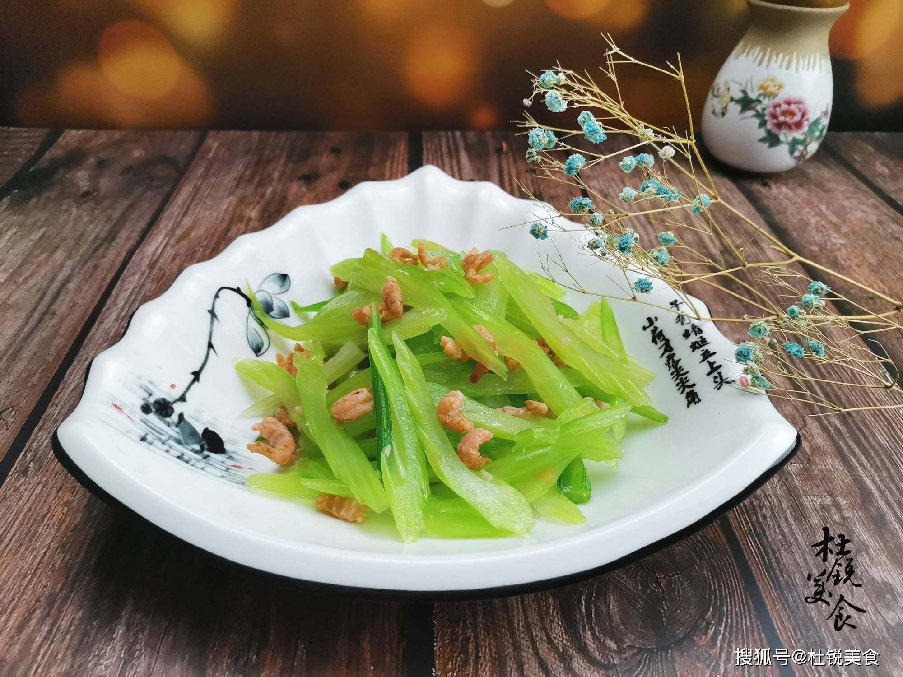

# 素炒芹菜 (Stir-Fried Celery with Dried Chili)

## 📋 基本資訊 / Recipe Overview
- **料理名稱 (繁體)**：素炒芹菜
- **料理名称 (简体)**：素炒芹菜
- **English Title**：Stir-Fried Celery with Dried Chili
- **素食流派 / Diet**：全素 / 纯素 Vegan (五辛素/纯净素通用，含蒜可去)
- **料理分類 / Category**：01-蔬菜本味类 / 脆嫩爽口 / 家常素炒
- **份量 / Servings**：2-3 人份
- **準備時間 / Prep Time**：5 分鐘
- **烹飪時間 / Cook Time**：3 分鐘
- **總計耗時 / Total Time**：8 分鐘
- **來源 / Source**：现代中华素菜 Top 100 · [01-蔬菜本味类.md](../01-蔬菜本味类.md) 第 47 道

## 📖 菜品特色 / Description
芹菜段快炒，可加干椒，清香有嚼劲。选用西芹或本地香芹，大火爆炒，干椒微辣提香，芹香浓郁，清脆多汁。

---

## 🌿 食材與調味清單 / Ingredients & Seasonings

### 主料
- 新鲜香芹 / 细西芹 350g
- 干红辣椒 3-4 根（剪段去籽）
- 花椒粒 8-10 粒（增香）
- 生姜 2 片（切丝）
- 大蒜 2 瓣（切片，纯净素可省）

### 调味料
- 食用植物油 1.5 汤匙（约 22ml）
- 食盐 1/2 茶匙（约 3g）
- 优质生抽 1 茶匙（约 5ml）
- 白砂糖 1/4 茶匙（约 1g）
- 素高汤 / 清水 1 汤匙

---

## 🍳 烹飪步驟 / Step-by-Step Cooking Steps

### 步骤 1：处理芹菜（拍裂斜切）
1. 芹菜摘去老叶（留少许鲜嫩叶尖），洗净沥干。
2. 若背部老筋明显，顺势撕去外皮粗筋；用刀背在芹菜茎上轻轻拍扁（破坏密实纤维以便入味）。
3. 斜刀将芹菜切成约 4cm 长的菱形小段。

### 步骤 2：炝香料油
1. 炒锅烧热倒入食用植物油，冷油下入花椒粒。
2. 小火慢炸至花椒出香、微变深色，捞出花椒粒不用。
3. 下入干辣椒段、姜丝和蒜片，小火爆出干香微辣气息。

### 步骤 3：猛火爆炒
1. 转**大火旺锅**，倒入芹菜段，快速颠锅翻炒 40-50 秒。
2. 芹菜受热由浅绿转为明亮翠绿。

### 步骤 4：调味出锅
1. 沿锅边淋入 **生抽 1 茶匙** 激发出酱香锅气。
2. 撒入 **食盐 1/2 茶匙**、**白糖 1/4 茶匙** 及 1 汤匙清水，大火快速翻炒 10 秒入味，即刻关火出锅。

---

## 💡 大厨秘诀 / Chef's Tips

1. **刀背拍扁再斜切**：轻拍能使芹菜结构松弛，斜刀增大横截面，受热极快且能迅速吸附调味。
2. **花椒干椒炝香**：先用花椒炝出椒香底油，再下干辣椒爆香，复合香气能完美压住芹菜的青草涩味。
3. **猛火急炒断生即起**：芹菜最忌长时间焖炒，炒至断生保持 9 分熟，口感最为爽脆多汁。

---
*食谱归档时间：2026-08-20 · 收录于 20260818-vegetarianism 本地菜谱库 (1Top 精选)*
