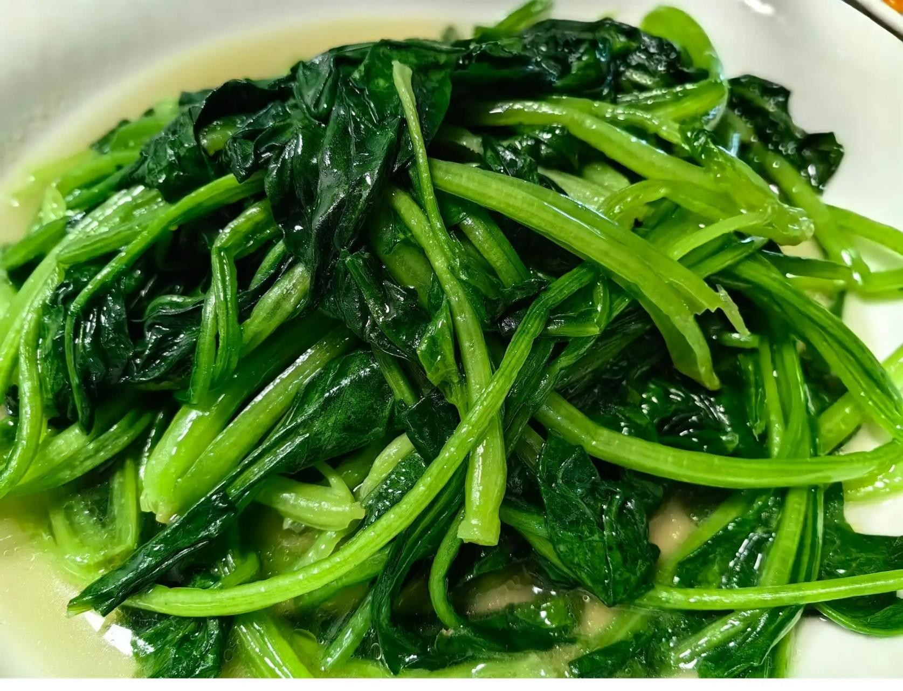

# 素炒菠菜豆腐 (Stir-Fried Spinach with Tofu)

## 📋 基本資訊 / Recipe Overview
- **料理名稱 (繁體)**：素炒菠菜豆腐
- **料理名称 (简体)**：素炒菠菜豆腐
- **English Title**：Stir-Fried Spinach with Pan-Seared Golden Tofu
- **素食流派 / Diet**：全素 / 纯素 Vegan (纯素/五辛素均可)
- **料理分類 / Category**：01-蔬菜本味类 / 经典家常 / 菠菜为主
- **份量 / Servings**：2-3 人份
- **準備時間 / Prep Time**：8 分鐘
- **烹飪時間 / Cook Time**：4-5 分鐘
- **總計耗時 / Total Time**：13 分鐘
- **來源 / Source**：现代中华素菜 Top 100 · [01-蔬菜本味类.md](../01-蔬菜本味类.md) 第 97 道

## 📖 菜品特色 / Description
菠菜为主料快炒，豆腐切片煎金黄点缀相衬，豆香浓郁与菠菜嫩滑相得益彰，清爽不涩，营养丰富。

---

## 🌿 食材與調味清單 / Ingredients & Seasonings

### 主料
- 鲜嫩菠菜 350g（主料）
- 传统老豆腐 / 北豆腐 120g（配料点缀）
- 生姜 2 片（切末；亦可用蒜末 2 瓣）

### 菠菜焯水用料
- 食盐 1/2 茶匙
- 食用植物油 1/2 茶匙

### 调味料
- 食用植物油 2 汤匙（约 30ml，分煎豆腐与炒菜）
- 优质生抽 1 汤匙（约 15ml）
- 食盐 1/2 茶匙（约 2.5g）
- 香菇素蚝油 1 茶匙（约 5ml）
- 白砂糖 1/4 茶匙（约 1g，提鲜中和草酸残余）
- 清水 2 汤匙（约 30ml）
- 水淀粉（玉米淀粉 1/2 茶匙 + 清水 1 汤匙）

---

## 🍳 烹飪步驟 / Step-by-Step Cooking Steps

### 步骤 1：煎制金黄豆腐块（定型不碎）
1. 老豆腐洗净擦干表面水分，切成长约 3cm、厚约 0.5cm 的长方薄片（或小方块）。
2. 平底锅倒入 1 汤匙植物油烧热，下入豆腐片，中小火慢煎至两面呈金黄微硬壳状，盛出备用。

### 步骤 2：菠菜焯水去草酸（去涩关键）
1. 锅内加入宽水大火烧开，放入 1/2 茶匙盐和 1/2 茶匙油。
2. 放入洗净的菠菜焯烫 20-30 秒至变软翠绿，立即捞出投入冷水中过凉。
3. 轻轻攥干水分，切成 4-5 厘米长段备用。

### 步骤 3：爆香与煨焖豆腐
1. 炒锅烧热倒入剩余 1 汤匙植物油，下入姜末（或蒜末）煸炒出香味。
2. 放入煎好的金黄豆腐，加入 **生抽 1 汤匙**、**素蚝油 1 茶匙**、**白糖 1/4 茶匙** 与 **2 汤匙清水**，小火煨煮半分钟让豆腐吸足咸鲜汁。

### 步骤 4：大火合炒出锅
1. 倒入焯好挤干的菠菜段，撒入 **食盐 1/2 茶匙**，转大火快速翻炒均匀 20 秒。
2. 淋入薄水淀粉快速颠锅推匀锁汁，关火装盘。

---

## 💡 大厨秘诀 / Chef's Tips

1. **菠菜必先焯水去草酸**：菠菜含有较高草酸，焯水 20-30 秒可去除绝大部分草酸，消除涩口感，同时防止草酸与豆腐钙质结合。
2. **豆腐先煎金黄定型**：豆腐先煎出硬边，翻炒时不破碎、不糊烂，外香内嫩且能充分吸收调料汁。
3. **最后下菠菜快速翻匀**：菠菜已熟，最后合锅只需大火快翻裹汁，避免过度受热变黄发暗。

---
*食谱归档时间：2026-08-20 · 收录于 20260818-vegetarianism 本地菜谱库 (1Top 精选)*
