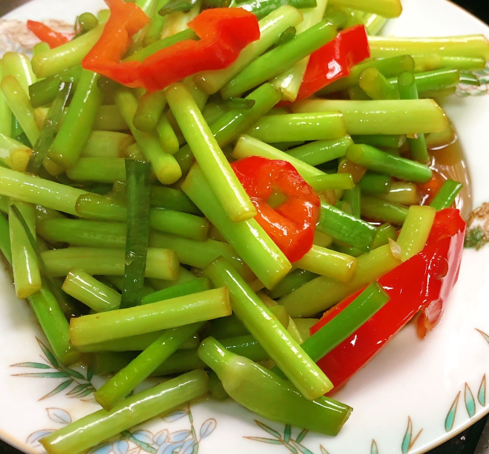

# 素炒蒜苔 (Stir-Fried Garlic Scapes (Crisp Sautéed Garlic Sprouts))

## 📋 基本資訊 / Recipe Overview
- **料理名稱 (繁體)**：素炒蒜苔
- **料理名称 (简体)**：素炒蒜苔
- **English Title**：Stir-Fried Garlic Scapes (Crisp Sautéed Garlic Sprouts)
- **素食流派 / Diet**：纯素 / 五辛素（含蒜苔，标明五辛素）
- **料理分類 / Category**：01-蔬菜本味类 / 家常快炒 / 脆爽回甘
- **份量 / Servings**：2-3 人份
- **準備時間 / Prep Time**：10 分鐘（含轻盐渍 5 分鐘）
- **烹飪時間 / Cook Time**：3 分鐘
- **總計耗時 / Total Time**：13 分鐘
- **來源 / Source**：现代中华素菜 Top 100 · [01-蔬菜本味类.md](../01-蔬菜本味类.md) 第 70 道

## 📖 菜品特色 / Description
蒜苔快炒，可纯素不放肉，脆香。

---

## 🌿 食材與調味清單 / Ingredients & Seasonings
### 主料
- 新鲜嫩蒜苔 350g

### 配料
- 红甜椒半个（切细丝配色）
- 生姜末 3g
- 干红辣椒 2 根（剪段去籽；可选）

### 盐渍去硬料
- 食盐 1/3 茶匙（约 2g，用于杀水破皮）

### 调味品
- 优质植物油 1.5 汤匙（约 20ml）
- 食盐 1/3 茶匙（出锅前定味）
- 纯酿生抽 1 汤匙（约 15ml）
- 香菇素蚝油 1/2 茶匙（约 2.5ml）
- 白砂糖 1/3 茶匙（约 1.5g，中和辛辣提鲜回甘）
- 水淀粉 1 汤匙（淀粉 1/2 茶匙 + 水 1 汤匙）

---

## 🍳 烹飪步驟 / Step-by-Step Cooking Steps
### 步骤 1：摘尾切段与盐渍破蜡（大厨核心诀窍）
1. 摘去蒜苔梢部花苞与基部老硬部位，洗净切成 4cm 长段。
2. 将蒜苔段置于碗中，撒入 **1/3 茶匙食盐** 抓拌均匀，静置腌制 5 分钟。
3. 待蒜苔表面微微出水软化，倒掉涩水并用清水快速冲洗一次沥干（**盐渍法能破坏蒜苔表皮天然蜡质层，使蒜苔入味快、成熟快且比焯水更脆更绿**）。

### 步骤 2：炝香姜末与干椒
1. 炒锅烧热加油，下姜末与干红辣椒段，小火慢煸出香。

### 步骤 3：大火快煸出微虎皮
1. 倒入腌渍沥干的蒜苔段，转大火猛烈翻炒 1.5 分钟。
2. 炒至蒜苔表皮微起细小气泡（微虎皮状），散发出浓郁熟蒜甜香。

### 步骤 4：入红椒与调味
1. 下入红椒丝，调入 **生抽 1 汤匙**、**素蚝油 1/2 茶匙**、**白糖 1/3 茶匙** 与剩余少许食盐。
2. 保持大火翻炒 20 秒，让鲜香酱汁完全渗透进蒜苔。

### 步骤 5：薄芡裹汁出锅
1. 淋入 1 汤匙水淀粉，颠锅翻拌数下让芡汁薄薄裹匀蒜苔表面，亮油装盘。

---

## 💡 大厨秘诀 / Chef's Tips
1. **轻盐渍法完胜焯水与干炒**：直接干炒蒜苔易焦且夹生不入味，水焯又易发软褪色；用少许盐腌 5 分钟破坏表皮蜡质层，炒后鲜脆多汁、入味至深。
2. **煸炒至微现虎皮**：大火快煸使蒜苔表皮微起褶皱，蒜素的辛辣转变为醇厚清甜。
3. **糖与素蚝油柔和辛辣**：微量白糖与素蚝油能完美提引蒜苔的天然甘甜，去除生涩辛冲感。

---
*食谱归档时间：2026-08-20 · 收录于 20260818-vegetarianism 本地菜谱库 (1Top 精选)*
