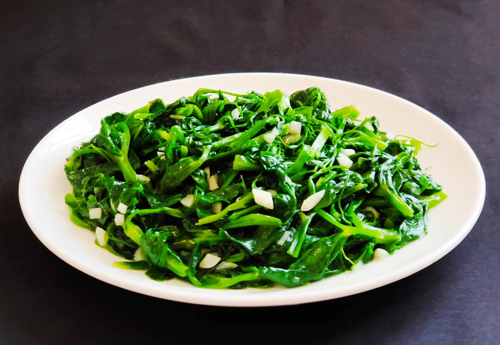

# 素炒豌豆苗 (Stir-Fried Pea Shoots with Sizzling Garlic (Sautéed Pea Tendrils))

## 📋 基本資訊 / Recipe Overview
- **料理名稱 (繁體)**：素炒豌豆苗
- **料理名称 (简体)**：素炒豌豆苗
- **English Title**：Stir-Fried Pea Shoots with Sizzling Garlic (Sautéed Pea Tendrils)
- **素食流派 / Diet**：纯素 Vegan（含蒜；戒五辛者可去蒜改用姜汁与白酒提香）
- **料理分類 / Category**：01-蔬菜本味类 / 粤苏经典 / 极鲜时蔬
- **份量 / Servings**：2-3 人份
- **準備時間 / Prep Time**：5 分鐘
- **烹飪時間 / Cook Time**：1-2 分鐘 (猛火炒 45 秒)
- **總計耗時 / Total Time**：6 分鐘
- **來源 / Source**：现代中华素菜 Top 100 · [01-蔬菜本味类.md](../01-蔬菜本味类.md) 第 71 道

## 📖 菜品特色 / Description
豆苗大火快炒，极嫩，酒楼与家常。

---

## 🌿 食材與調味清單 / Ingredients & Seasonings
### 主料
- 新鲜嫩豌豆苗（豌豆尖/龙须菜） 350g

### 配料
- 大蒜 4 瓣（剁碎成蒜蓉；纯素以生姜末或鲜姜汁 1 茶匙替代）
- 高度白酒 / 广东米酒 1/2 茶匙（约 2.5ml，酒楼去青除涩独门秘方）

### 调味料
- 优质植物油（花生油或清亮植物油） 2 汤匙（约 30ml，豆苗喜油）
- 食盐 1/2 茶匙（约 3g）
- 白砂糖 1/3 茶匙（约 1.5g，去涩提鲜）
- 蘑菇精 / 素高汤粉 1/4 茶匙（选配）

---

## 🍳 烹飪步驟 / Step-by-Step Cooking Steps
### 步骤 1：摘选嫩尖，极致沥干
1. 豌豆苗摘去粗老茎须与发黄叶片，只留顶部最娇嫩的 2-3 叶嫩芽。
2. 放入淡盐水中轻轻淘洗干净，放入沥水篮彻底沥干，或用厨房纸巾吸干表面水分（**豆苗水分极娇嫩，带水下锅必成烂糊水煮菜**）。

### 步骤 2：热锅宽油，爆香蒜蓉
1. 炒锅烧至微冒青烟，倒入 2 汤匙植物油（豆苗喜油，油宽方能锁绿）。
2. 油温 5 成热下蒜蓉（或姜末），中小火快速爆出浓郁蒜香。

### 步骤 3：猛火下苗，烹酒激香
1. 将炉火调至最大猛火，将豌豆苗一口气倒入锅中。
2. 快速用筷子或锅铲翻拌散开，顺着炽热锅边烹入 **1/2 茶匙高度白酒或米酒**（高温瞬间气化，带走草酸青涩味，激发出浓烈酒楼镬气）。

### 步骤 4：极速调味融化
1. 见豆苗体积迅速受热塌缩变软（翻炒约 25 秒），立即撒入 **食盐 1/2 茶匙**、**白糖 1/3 茶匙** 与 **蘑菇精 1/4 茶匙**。

### 步骤 5：闪电出锅装盘
1. 迅速颠锅大火猛翻 10 秒使盐糖融化裹匀，豆苗刚断生即刻关火出锅（全程入锅到盛盘严格控制在 45 秒内）。

---

## 💡 大厨秘诀 / Chef's Tips
1. **油宽火烈保翠嫩**：豆苗娇嫩且含水量高，宽油在叶片表面形成保护油膜锁住叶绿素，烈火猛炒瞬间熟化防出苦水。
2. **锅边烹酒去青气（酒楼秘笈）**：名厨炒豆苗必沿锅边烹少许高度白酒，利用酒精高温蒸发带走豆苗特有的草腥气与微涩感，香气四溢。
3. **严禁加水与盖锅盖**：炒豆苗全程不得加水、不得盖锅盖，否则叶片在蒸汽中迅速发黄变酸软烂。

---
*食谱归档时间：2026-08-20 · 收录于 20260818-vegetarianism 本地菜谱库 (1Top 精选)*
