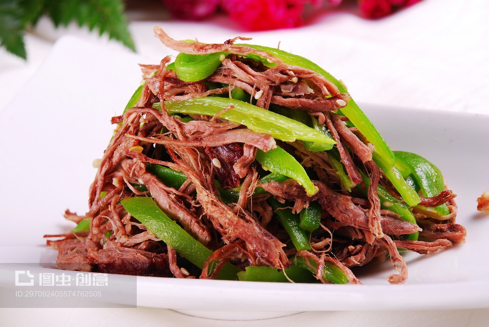

# 素炒青椒 (Stir-Fried Green Bell Peppers)

## 📋 基本資訊 / Recipe Overview
- **料理名稱 (繁體)**：素炒青椒
- **料理名称 (简体)**：素炒青椒
- **English Title**：Stir-Fried Green Bell Peppers
- **素食流派 / Diet**：全素 / 纯素 Vegan (纯素/五辛素均可)
- **料理分類 / Category**：01-蔬菜本味类 / 经典家常 / 极简下饭菜
- **份量 / Servings**：2-3 人份
- **準備時間 / Prep Time**：5 分鐘
- **烹飪時間 / Cook Time**：3-4 分鐘
- **總計耗時 / Total Time**：8 分鐘
- **來源 / Source**：现代中华素菜 Top 100 · [01-蔬菜本味类.md](../01-蔬菜本味类.md) 第 83 道

## 📖 菜品特色 / Description
青椒块或丝清炒，最简下饭。大火快炒锁住脆甜水分，微带锅气，清香扑鼻。

---

## 🌿 食材與調味清單 / Ingredients & Seasonings

### 主料
- 厚肉甜青椒（菜椒/圆青椒） 3 个（约 300g）
- 大蒜 3 瓣（切薄片；纯素者可用生姜 5g 切丝替代）

### 调味用料
- 食用植物油 1.5 汤匙（约 22ml）
- 优质生抽 1 汤匙（约 15ml，沿锅边烹入）
- 食盐 1/2 茶匙（约 2.5g）
- 白砂糖 1/3 茶匙（约 1.5g，提鲜中和生青涩味）
- 清水 / 素高汤 1 汤匙（约 15ml）

---

## 🍳 烹飪步驟 / Step-by-Step Cooking Steps

### 步骤 1：改刀去白筋（清甜不涩关键）
1. 青椒洗净，去蒂、剖开挖去白籽。
2. **改刀技巧**：用刀片去内部发白的较厚筋膜（白筋带微苦生涩味），随后将青椒切成约 2.5 厘米的菱形块或粗丝备用。

### 步骤 2：热锅干煸微去水气
1. 净锅烧热，**先不倒油**，将切好的青椒块倒入热锅中。
2. 保持中火干煸 30-40 秒，期间用锅铲轻轻按压，使青椒表面水分微收、生涩气散出，盛出备用。

### 步骤 3：炝锅起香
1. 锅内倒入 1.5 汤匙食用油，烧至 5 成热，下入蒜片（或姜丝）爆出香味。

### 步骤 4：旺火回锅炒脆
1. 转大火，倒入干煸过的青椒块，快速翻炒 30 秒，使青椒裹匀热油。

### 步骤 5：锅边烹汁与出锅
1. 沿锅壁四周淋入 **生抽 1 汤匙** 激发出浓郁酱香，接着加入 **食盐 1/2 茶匙**、**白糖 1/3 茶匙** 与 **1 汤匙清水**。
2. 大火快速颠翻 10-15 秒，汁水瞬间收紧裹在青椒表面，即刻出锅装盘。

---

## 💡 大厨秘诀 / Chef's Tips

1. **片去白筋口感甜脆**：青椒内侧白色海绵筋膜含苦味素，片除后炒出来的青椒清脆多汁、本味更甜。
2. **微干煸去生水气**：先无油干煸半分钟破坏外表蜡质层，后续炒制时不仅更容易吸附酱汁入味，而且不会在盘中渗出大量水分。
3. **锅边烹酱油出锅气**：酱油不要直接浇在青椒上，沿高温锅壁淋入产生焦化香气，成菜锅气十足。

---
*食谱归档时间：2026-08-20 · 收录于 20260818-vegetarianism 本地菜谱库 (1Top 精选)*
