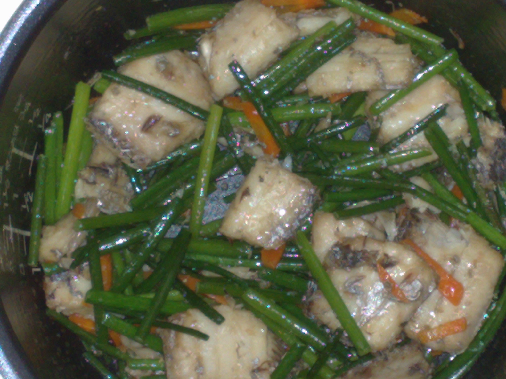

# 素炒韭菜花 (Stir-Fried Garlic Chive Blossoms (Sautéed Chive Scapes))

## 📋 基本資訊 / Recipe Overview
- **料理名稱 (繁體)**：素炒韭菜花
- **料理名称 (简体)**：素炒韭菜花
- **English Title**：Stir-Fried Garlic Chive Blossoms (Sautéed Chive Scapes)
- **素食流派 / Diet**：纯素 / 五辛素（含韭菜，标明五辛素；严格佛教纯净素可用嫩芦笋/蒜薹替代）
- **料理分類 / Category**：01-蔬菜本味类 / 时令鲜蔬 / 鲜嫩脆甜
- **份量 / Servings**：2-3 人份
- **準備時間 / Prep Time**：5 分鐘
- **烹飪時間 / Cook Time**：2-3 分鐘
- **總計耗時 / Total Time**：8 分鐘
- **來源 / Source**：现代中华素菜 Top 100 · [01-蔬菜本味类.md](../01-蔬菜本味类.md) 第 69 道

## 📖 菜品特色 / Description
韭菜花快炒，春末夏初。

---

## 🌿 食材與調味清單 / Ingredients & Seasonings
### 主料
- 新鲜嫩韭菜花（带花苞嫩薹） 300g

### 配料
- 红甜椒半个（切细丝，增添红绿相映色泽）
- 鲜生姜丝 3g（或大蒜 2 瓣切片）

### 调味料
- 食用植物油 1.5 汤匙（约 20ml）
- 食盐 1/2 茶匙（约 3g）
- 白砂糖 1/4 茶匙（约 1g，提鲜柔和）
- 纯酿生抽 1/2 茶匙（约 2.5ml，微量增香不遮色）
- 纯净水 1 汤匙（约 15ml）

---

## 🍳 烹飪步驟 / Step-by-Step Cooking Steps
### 步骤 1：掐除老根，切成寸段
1. 韭菜花用手指从根部试掐，掐不动的老硬纤维部分一律折断丢弃，只取嫩脆部位。
2. 清水冲洗干净后沥干水分，切成长约 3.5cm 的寸段；红甜椒切细丝备用。

### 步骤 2：热锅凉油，姜蒜爆香
1. 炒锅烧热，倒入 1.5 汤匙植物油。
2. 油温 5 成热下姜丝（或蒜片），小火煸炒 5 秒爆出香味。

### 步骤 3：猛火急炒韭菜花
1. 迅速将炉火调至最大猛火，倒入韭菜花段。
2. 快速翻炒 40-50 秒，韭菜花在高温热油中迅速转为油润深碧绿色。

### 步骤 4：入红椒与水汽透热
1. 倒入红椒丝，顺锅边淋入 1 汤匙清水，蒸汽瞬间升腾帮助韭菜花由表及里快速熟透。
2. 撒入 **食盐 1/2 茶匙**、**白糖 1/4 茶匙** 与 **生抽 1/2 茶匙**。

### 步骤 5：极速翻颠出锅
1. 保持最大火快速颠锅翻炒 15 秒，使调味完全融合，即刻关火装盘（全程炒制不超过 2 分钟）。

---

## 💡 大厨秘诀 / Chef's Tips
1. **手掐验嫩，老根必除**：韭菜花基部木质化纤维极硬，必须用手指手掐检验，凡发韧不易折断处全部切除，方保盘盘鲜嫩无渣。
2. **大火急炒，切忌久焖**：韭菜花的硫化物芳香极易高温挥发，大火 1-2 分钟内断生即起，久炒则发黑软塌、香气散失。
3. **微量水汽加速熟化**：淋入 1 汤匙清水产生的瞬间蒸汽，能让韭苔内部迅速热透，同时保持颜色油绿发亮。

---
*食谱归档时间：2026-08-20 · 收录于 20260818-vegetarianism 本地菜谱库 (1Top 精选)*
