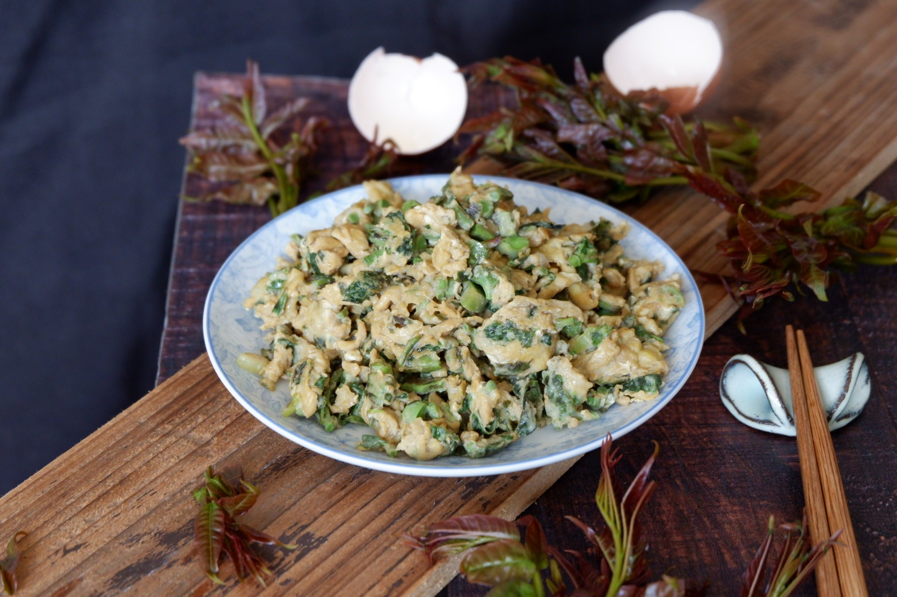

# 素炒香椿 (Sautéed Spring Chinese Toon Shoots (Spring Toon Bud Stir-Fry))

## 📋 基本資訊 / Recipe Overview
- **料理名稱 (繁體)**：素炒香椿
- **料理名称 (简体)**：素炒香椿
- **English Title**：Sautéed Spring Chinese Toon Shoots (Spring Toon Bud Stir-Fry)
- **素食流派 / Diet**：纯素 Vegan
- **料理分類 / Category**：01-蔬菜本味类 / 时令春鲜 / 极品树生野菜
- **份量 / Servings**：2-3 人份
- **準備時間 / Prep Time**：6 分鐘
- **烹飪時間 / Cook Time**：2 分鐘
- **總計耗時 / Total Time**：8 分鐘
- **來源 / Source**：现代中华素菜 Top 100 · [01-蔬菜本味类.md](../01-蔬菜本味类.md) 第 80 道

## 📖 菜品特色 / Description
春椿芽快炒或拌，香气极冲，时令。

---

## 🌿 食材與調味清單 / Ingredients & Seasonings
### 主料
- 新鲜紫红嫩香椿头（春季初芽） 250g

### 配料
- 鲜生姜末 1 茶匙（约 5g）
- 红甜椒丝（选配配色） 10g

### 焯水调料（去亚硝酸盐与定色关键）
- 食盐 1 茶匙（约 5g）
- 食用植物油 1/2 汤匙（约 7.5ml）

### 调味料
- 纯正花生油 / 菜籽油 1.5 汤匙（约 20ml）
- 食盐 1/2 茶匙（约 3g）
- 白砂糖 1/4 茶匙（约 1g，柔和浓烈香气）
- 纯白胡椒粉 1/5 茶匙（约 0.5g）
- 纯正芝麻香油 1/2 茶匙（约 2.5ml）

---

## 🍳 烹飪步驟 / Step-by-Step Cooking Steps
### 步骤 1：摘择去老茎
1. 将香椿芽洗净，摘去基部木质化老硬根梗，只留嫩叶与嫩茎。

### 步骤 2：沸水焯烫转碧绿（安全与保香核心步）
1. 锅中烧开足量沸水，加入 1 茶匙盐与半汤匙油。
2. 下入香椿芽焯水 30-45 秒。在沸水中香椿芽会**由紫红色瞬间神奇转化为翡翠碧绿色**。
3. 立即捞出投入冷水中过凉沥干（**焯水能去除 80% 以上亚硝酸盐与草酸，使香椿芳香精油完全释放**）。

### 步骤 3：轻攥切段
1. 捞出后用手轻轻攥干水分，放在案板上切成约 2-3cm 的小段。

### 步骤 4：热油煸姜，大火快炒
1. 炒锅烧热注入花生油，下姜末小火煸炒出香味。
2. 倒入切好的香椿段与红椒丝，转大火快速翻炒 30 秒。

### 步骤 5：极简调味出锅
1. 撒入 **食盐 1/2 茶匙**、**白糖 1/4 茶匙** 与 **白胡椒粉 1/5 茶匙**。
2. 颠锅翻拌均匀使盐糖融入香椿纤维，出锅前淋入少许香油，立即关火盛盘。

---

## 💡 大厨秘诀 / Chef's Tips
1. **科学焯水不可省略**：香椿天然亚硝酸盐含量偏高，沸水焯烫 30-45 秒不仅消除安全隐患，更能彻底激发香椿烯等芳香精油，令其香气醇正。
2. **极简调味保本香**：香椿自带极霸道的天然树生芳香，切忌添加生抽、蚝油、十三香等深色浓味调料，仅用盐、极少糖和花生油，方显春鲜本色。
3. **轻挤控水急火炒**：焯水后必须轻挤水分，大火快炒 30 秒出锅，锁住外酥里嫩与浓郁镬气。

---
*食谱归档时间：2026-08-20 · 收录于 20260818-vegetarianism 本地菜谱库 (1Top 精选)*
