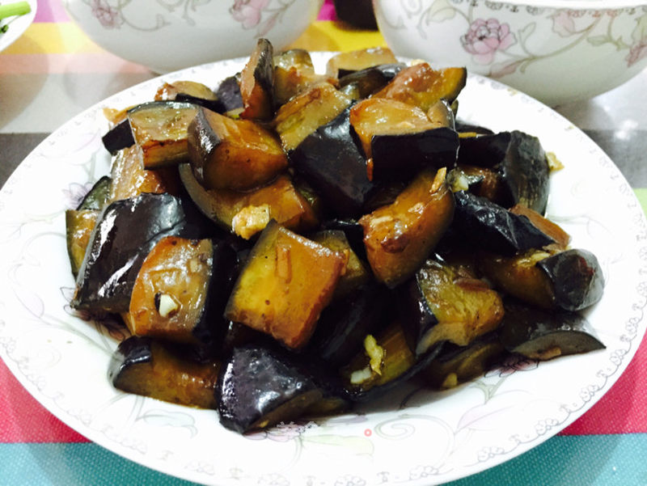

# 紅燒茄子 (Braised Eggplant in Brown Sauce)

## 📋 基本資訊 / Recipe Overview
- **料理名稱 (繁體)**：紅燒茄子
- **料理名称 (简体)**：红烧茄子
- **English Title**：Homestyle Braised Eggplant in Savory Brown Garlic Sauce
- **素食流派 / Diet**：全素 / 纯素 Vegan (含蒜；可去蒜改生姜丝做纯净素)
- **料理分類 / Category**：01-蔬菜本味类 / 传统家常 / 软糯浓香
- **份量 / Servings**：2-3 人份
- **準備時間 / Prep Time**：10 分鐘
- **烹飪時間 / Cook Time**：8-10 分鐘
- **總計耗時 / Total Time**：18-20 分鐘
- **來源 / Source**：现代中华素菜 Top 100 · [01-蔬菜本味类.md](../01-蔬菜本味类.md) 第 29 道

## 📖 菜品特色 / Description
少油煎软，生抽老抽糖蒜红烧收汁，软糯酱香极下饭。

---

## 🌿 食材與調味清單 / Ingredients & Seasonings

### 主料
- 紫圆茄子或长茄子 2 根（约 450g）
- 青椒 半个（切滚刀块配色）
- 西红柿（选配） 半个（切小块增加自然果酸与红亮色泽）
- 大蒜 6 瓣（切蒜末，分两半使用）
- 生姜 1 小块（切碎）
- 玉米淀粉 2-3 汤匙（约 20-30g，用于裹茄块防吸油）

### 秘制红烧碗汁
- 优质生抽 2 汤匙（约 30ml）
- 优质老抽 1/2 汤匙（约 7.5ml，调浓郁酱色）
- 素蚝油 1 汤匙（约 15ml）
- 香醋 / 陈醋 1/2 汤匙（约 7.5ml，解腻提香）
- 白糖 1 汤匙（约 15g，红烧回甘关键）
- 玉米淀粉 1 茶匙（约 5g）
- 清水 / 素高汤 4-5 汤匙（约 60-75ml）

### 煎炒用油
- 食用植物油 3 汤匙（约 45ml，少油少脂健康煎制）

---

## 🍳 烹飪步驟 / Step-by-Step Cooking Steps

### 步骤 1：茄子改刀与锁水挂粉（省油核心）
1. 茄子洗净，可选择保留部分皮增加营养与韧性，切成均匀的滚刀块。
2. **拍水裹粉**：将茄块放入盆中，用手抓撒少许清水使表面微湿，然后分次撒入 **玉米淀粉 2-3 汤匙**，颠翻拌匀，使每块茄子表面都薄薄裹上一层淀粉白霜（淀粉层在遇热时瞬间形成保护壳，阻断油脂渗入，外焦里嫩且吸油量减少 80%）。

### 步骤 2：少油中小火煎软透
1. 平底不粘锅烧热，倒入 2.5 汤匙植物油（无需宽油油炸）。
2. 下入裹好粉的茄块，中小火慢慢煎制，适时翻面，煎至茄块各面金黄微焦、质地软塌熟透（约 4-5 分钟），盛出备用。

### 步骤 3：爆锅与红烧焖制
1. 原锅留少许底油，下入生姜末和 **一半蒜末** 爆出香味。
2. 放入西红柿块与青椒块翻炒 30 秒出汁。
3. 倒入煎好的金黄茄块，翻炒均匀。

### 步骤 4：倒入碗汁与二次下蒜收汁
1. 将调匀的红烧碗汁顺锅边倒入，大火烧开转中火焖煮 1-2 分钟，让茄子充分吸饱酱汁入味。
2. 见汤汁浓稠油亮包裹在茄块上时，撒入**剩下的一半生蒜末**。
3. 大火颠翻收汁 10 秒，关火出锅装盘。

---

## 💡 大厨秘诀 / Chef's Tips

1. **喷水裹淀粉彻底告别高油**：茄子像海绵极易吸油，表面喷微量水裹干淀粉后煎制，能迅速锁住内部水分并隔绝大量油脂，做出传统炸茄子般软糯口感。
2. **前后两道蒜香**：先下蒜末出熟香底味，出锅前补生蒜末激发出辛鲜生蒜香，“金银蒜”层次让红烧茄子香气极其醇厚。
3. **少许陈醋中和油腻**：碗汁中加入半勺醋，加热后酸味挥发只留醋香，能解腻提鲜，让咸甜酱汁回味更甘甜。

---
*食谱归档时间：2026-08-20 · 收录于 20260818-vegetarianism 本地菜谱库 (1Top 精选)*
