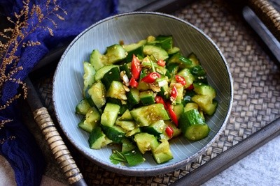

# 蒜泥黃瓜 (Garlic Sliced Cucumber Salad)

## 📋 基本資訊 / Recipe Overview
- **料理名稱 (繁體)**：蒜泥黃瓜
- **料理名称 (简体)**：蒜泥黄瓜
- **English Title**：Garlic Cucumber Salad with Sesame Soy Dressing
- **素食流派 / Diet**：全素 / 纯素 Vegan (含大量大蒜，五辛素)
- **料理分類 / Category**：01-蔬菜本味类 / 家常凉菜 / 浓香蒜味
- **份量 / Servings**：2-3 人份
- **準備時間 / Prep Time**：8 分鐘
- **烹飪時間 / Cook Time**：0 分鐘
- **總計耗時 / Total Time**：8 分鐘
- **來源 / Source**：现代中华素菜 Top 100 · [01-蔬菜本味类.md](../01-蔬菜本味类.md) 第 27 道

## 📖 菜品特色 / Description
拍或切条，蒜泥生抽香油，比拍黄瓜更蒜。

---

## 🌿 食材與調味清單 / Ingredients & Seasonings

### 主料
- 脆嫩黄瓜 2 根（约 400g）
- 新鲜大蒜 1 整头（约 8-10 瓣，捣成特浓蒜泥）
- 小葱（选配） 1 根（切葱花）

### 调味清爽料汁
- 优质生抽 2 汤匙（约 30ml）
- 纯芝麻香油 1.5 汤匙（约 20ml，锁蒜香关键）
- 米醋 / 香醋 1 汤匙（约 15ml，微酸托蒜）
- 食盐 1/2 茶匙（约 3g）
- 白糖 1/2 茶匙（约 2.5g）
- 松茸鲜蔬粉 / 素高汤精 1/4 茶匙（选配增鲜）

---

## 🍳 烹飪步驟 / Step-by-Step Cooking Steps

### 步骤 1：黄瓜改刀
1. 黄瓜洗净，可以用刀拍裂后切段，亦可直接纵向一剖为四切成长条块。
2. 黄瓜条放入盆中，撒入少许盐拌匀腌制 3-5 分钟，滤去多余水分。

### 步骤 2：特浓蒜泥熟化调制（大厨绝招）
1. 大蒜去皮加少许食盐放入蒜臼中用力捣成极细的糊状蒜泥。
2. **蒜泥调香**：将 1.5 汤匙纯芝麻香油直接淋在刚捣好的蒜泥中搅拌均匀（香油脂能迅速包裹大蒜素，既能保留辛烈香气，又能去其生涩辣喉感，蒜香更加醇厚绵长）。

### 步骤 3：调汁与浇拌
1. 在蒜油中加入生抽 2 汤匙、米醋 1 汤匙、食盐、白糖搅拌至糖盐融化。
2. 将调好的浓郁蒜泥香油汁浇在黄瓜条上。
3. 充分拌匀，使每根黄瓜条都均匀裹满如珍珠般的蒜泥，装盘即食。

---

## 💡 大厨秘诀 / Chef's Tips

1. **蒜泥用香油“封香”**：生蒜泥捣好后立即与纯芝麻香油混合，大蒜素与油脂融合后香气翻倍且不烧心。
2. **蒜量要足，捣烂成糊**：此菜核心在于浓郁蒜味，切碎的蒜粒无法产生这种乳化糊状包裹感，必须用石臼捣成泥。
3. **糖醋微量衬托**：蒜泥黄瓜以“蒜香、咸鲜、芝麻油香”为主调，醋与糖仅作辅助衬托，不可夺走主味。

---
*食谱归档时间：2026-08-20 · 收录于 20260818-vegetarianism 本地菜谱库 (1Top 精选)*
