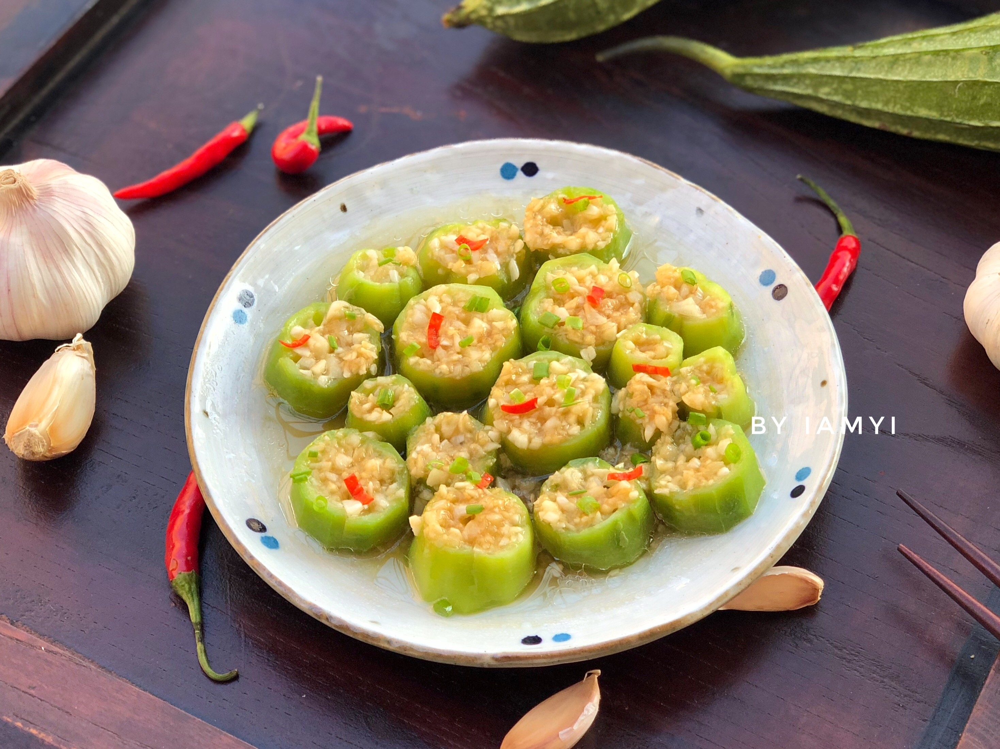

# 蒜蓉丝瓜 (Stir-Fried Luffa / Sponge Gourd with Minced Garlic)

## 📋 基本資訊 / Recipe Overview
- **料理名稱 (繁體)**：蒜蓉絲瓜
- **料理名称 (简体)**：蒜蓉丝瓜
- **English Title**：Stir-Fried Luffa / Sponge Gourd with Minced Garlic
- **素食流派 / Diet**：全素 / 纯素 Vegan (含大蒜；五辛素，可去蒜改纯素)
- **料理分類 / Category**：01-蔬菜本味类 / 鲜甜滑嫩 / 经典夏菜
- **份量 / Servings**：2-3 人份
- **準備時間 / Prep Time**：5 分鐘
- **烹飪時間 / Cook Time**：3 分鐘
- **總計耗時 / Total Time**：8 分鐘
- **來源 / Source**：现代中华素菜 Top 100 · [01-蔬菜本味类.md](../01-蔬菜本味类.md) 第 59 道

## 📖 菜品特色 / Description
丝瓜蒜蓉快炒，出水即起，嫩滑。丝瓜碧绿清甜，质地嫩滑如脂，蒜香浓郁，汤汁清润鲜美。

---

## 🌿 食材與調味清單 / Ingredients & Seasonings

### 主料
- 新鲜嫩丝瓜 2 根（约 400g）
- 大蒜 6 瓣（剁成细蒜蓉）
- 枸杞 10 粒（温水泡发，点缀配色）

### 调味料
- 食用植物油 2 汤匙（约 30ml）
- 食盐 1/2 茶匙（约 3g）
- 白砂糖 1/4 茶匙（约 1g，提鲜）
- 温水 / 素高汤 2 汤匙（约 30ml）

---

## 🍳 烹飪步驟 / Step-by-Step Cooking Steps

### 步骤 1：刮皮与防黑处理（关键秘诀）
1. **刮皮不深削**：用刮皮刀或水果刀轻轻刮去丝瓜最外层薄硬皮，**尽量保留贴近表皮的翠绿果肉层**。
2. **滚刀改刀**：将丝瓜切成滚刀块，立即浸入淡盐水中浸泡备用（淡盐水隔绝氧气，防止多酚酶氧化变黑）。

### 步骤 2：慢火煸香蒜蓉
1. 炒锅烧热倒入食用油，油温四成热下入蒜蓉。
2. 中小火慢煸至蒜蓉微黄冒泡、蒜香四溢（切勿大火炒焦）。

### 步骤 3：大火快翻与微焖
1. 丝瓜捞出沥干，转**最大猛火**倒入锅中，快速翻炒 45 秒使每一块丝瓜均匀裹上蒜油。
2. 沿锅边淋入 2 汤匙温水，盖上锅盖大火焖煮 30-40 秒。

### 步骤 4：出水即起，临出锅放盐
1. 揭开锅盖，见丝瓜中心瓤由白色转为半透明。
2. 立即加入 **食盐 1/2 茶匙**、**白糖 1/4 茶匙** 与泡发的枸杞，快速颠锅翻匀 5 秒，汁水清亮即刻关火出锅。

---

## 💡 大厨秘诀 / Chef's Tips

1. **刮皮保留翠绿层**：削皮过深会切掉绿肉露出白肉，炒后极易氧化发黑；轻轻刮除硬皮才能保持通体碧绿。
2. **淡盐水浸泡防氧化**：切好后立即泡入淡盐水隔绝空气，下锅前捞出沥干。
3. **见半透明即熟，最后放盐**：丝瓜瓤转半透明即达到最佳滑嫩状态，久煮会缩水变黑；最后放盐避免过早脱水渗出黑汁。

---
*食谱归档时间：2026-08-20 · 收录于 20260818-vegetarianism 本地菜谱库 (1Top 精选)*
