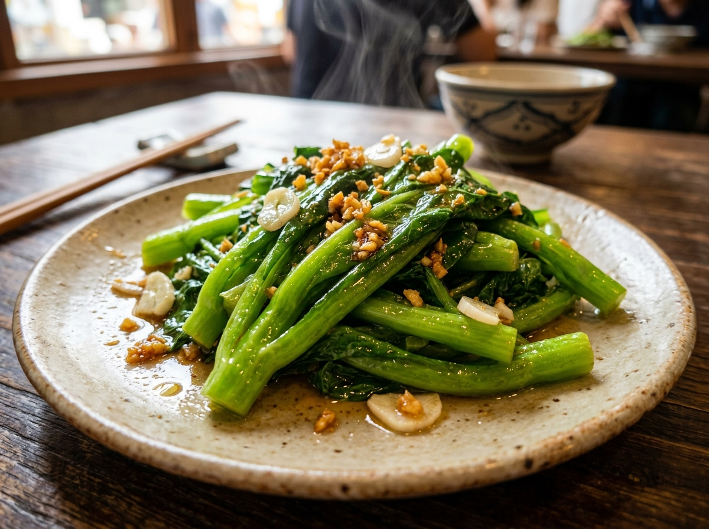

# 蒜蓉油麥菜 (Stir-Fried You Mai Cai with Garlic)

## 📋 基本資訊 / Recipe Overview
- **料理名稱 (繁體)**：蒜蓉油麥菜
- **料理名称 (简体)**：蒜蓉油麦菜
- **English Title**：Stir-Fried You Mai Cai with Minced Garlic (Chinese Lettuce)
- **素食流派 / Diet**：全素 / 纯素 Vegan (含蒜；可依戒律去蒜做纯净素)
- **料理分類 / Category**：01-蔬菜本味类 / 经典家常 / 粤式快炒
- **份量 / Servings**：2-3 人份
- **準備時間 / Prep Time**：3 分鐘
- **烹飪時間 / Cook Time**：2 分鐘 (大火猛炒 40-60 秒)
- **總計耗時 / Total Time**：5 分鐘
- **來源 / Source**：现代中华素菜 Top 100 · [01-蔬菜本味类.md](../01-蔬菜本味类.md) 第 2 道

## 📖 菜品特色 / Description
粤式快炒。蒜爆香大火翻炒，断生即起，翠绿不发黄，三分钟上桌。

---

## 🌿 食材與調味清單 / Ingredients & Seasonings

### 主料
- 新鲜油麦菜 400g
- 大蒜 6-8 瓣（分成两份：2/3 剁细碎爆香，1/3 留待出锅提味）

### 调味用料
- 食用植物油（建议花生油或清亮色拉油） 1.5 - 2 汤匙（约 25-30ml）
- 食盐 1/2 茶匙（约 3g）
- 素蚝油（或松茸鲜调味汁） 1/2 茶匙（约 2.5ml，增鲜提亮）
- 白砂糖 1/4 茶匙（约 1g，关键调和剂：中和油麦菜天然微苦，激发鲜甜）

---

## 🍳 烹飪步驟 / Step-by-Step Cooking Steps

### 步骤 1：手撕与极致沥水（防发黑、防出水关键）
1. **手撕处理**：将油麦菜一片片剥开，在清水中冲洗干净。**切勿用金属菜刀切段**，用手直接将油麦菜掰成 5-6 厘米左右的长段（手撕能保护植物细胞壁，避免氧化酶大量释放导致炒后发黑）。
2. **彻底沥干**：将手撕好的油麦菜放入沥水篮充分甩干，或用厨房纸巾吸干表面水分（**核心要点**：菜叶表面带水下锅会导致油温骤降，瞬间变成“水煮菜”，从而大量出水且口感软塌变黄）。

### 步骤 2：金银蒜备料
1. 大蒜去皮拍碎剁成蒜末，分成两份（约 2:1）。
2. 较多的一份（2/3）用于热锅炝出熟蒜香，较少的一份（1/3）留作后下，形成“金银蒜”层次香气。

### 步骤 3：热锅温油，慢煸蒜蓉
1. 炒锅烧热，倒入食用油（油量可比普通炒青菜略宽一些，形成油膜包裹菜叶）。
2. 油温 4-5 成热时下入 2/3 蒜末，转中小火慢煸至蒜末微黄冒泡、蒜香浓烈溢出（切勿高温烧焦变苦）。

### 步骤 4：大火猛炒，极速断生
1. 迅速将炉火调至**最大猛火**。
2. 先下入较硬的油麦菜根茎段翻炒 5-10 秒，紧接着下入全部菜叶。
3. 快速大火颠锅翻炒 20-30 秒，使油麦菜在高热蒜油中迅速受热断生，菜叶体积微微软缩。

### 步骤 5：调味与二次提香
1. 见菜叶刚转翠绿软塌（约八成熟），立即撒入 **食盐 1/2 茶匙**、**白糖 1/4 茶匙**、**素蚝油 1/2 茶匙**，并加入剩余的 **1/3 生蒜末**。
2. 保持最大火猛翻 10 秒使调味完全融合均匀，即刻关火出锅装盘（全程从下菜到出锅控制在 40-60 秒内）。

---

## 💡 粤菜大厨秘诀 / Chef's Tips

1. **手撕不刀切，防黑第一步**：菜刀金属切口易发生氧化变黑，手撕断口自然，菜叶更脆嫩青绿。
2. **不建议提前焯水**：油麦菜质地极薄嫩，焯水会导致水溶性维生素与风味大量流失；只要大火猛炒 40-60 秒即可完美熟透断生。
3. **加糖中和微苦**：油麦菜自带莴苣类的微苦回甘，少许白砂糖能柔和苦味，让蔬菜本身的清香脆甜更为突出。
4. **金银蒜法香气加倍**：先下蒜末熟化出醇香，出锅前补生蒜末激发出辛香，层次分明，风味直逼酒楼大厨。

---
*食谱归档时间：2026-08-20 · 收录于 20260818-vegetarianism 本地菜谱库 (1Top 精选)*
