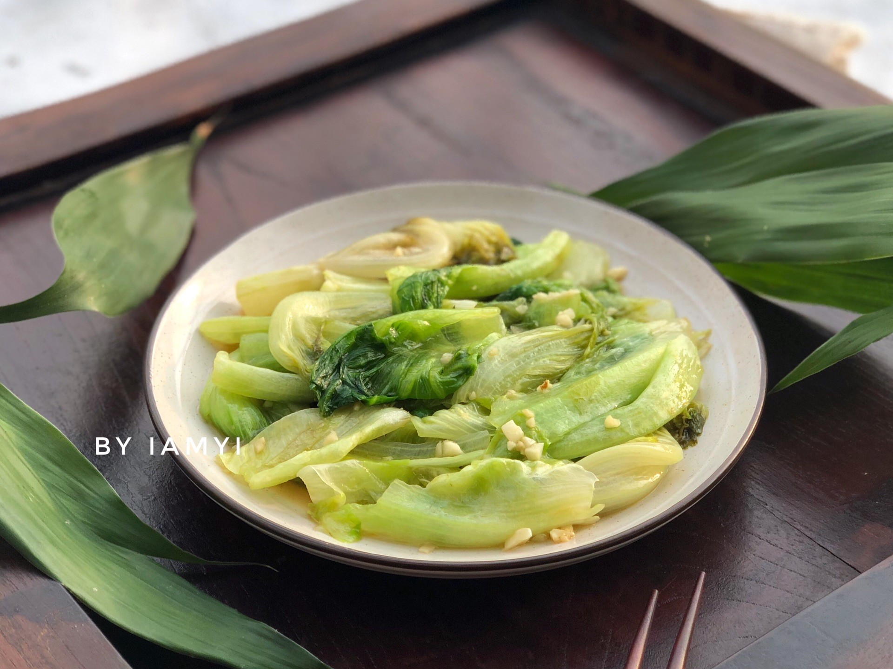

# 蒜蓉生菜 (Stir-Fried Lettuce with Minced Garlic)

## 📋 基本資訊 / Recipe Overview
- **料理名稱 (繁體)**：蒜蓉生菜
- **料理名称 (简体)**：蒜蓉生菜
- **English Title**：Stir-Fried Lettuce with Minced Garlic
- **素食流派 / Diet**：全素 / 纯素 Vegan (含大蒜；五辛素，可去蒜改纯净素)
- **料理分類 / Category**：01-蔬菜本味类 / 经典家常 / 粤式快炒
- **份量 / Servings**：2-3 人份
- **準備時間 / Prep Time**：3 分鐘
- **烹飪時間 / Cook Time**：2 分鐘 (大火快炒 40-50 秒)
- **總計耗時 / Total Time**：5 分鐘
- **來源 / Source**：现代中华素菜 Top 100 · [01-蔬菜本味类.md](../01-蔬菜本味类.md) 第 43 道

## 📖 菜品特色 / Description
生炒蒜蓉生菜，粤式、家常都常见。大火急炒，保留生菜的清脆与蒜香，成菜油绿发亮，入口清甜爽脆。

---

## 🌿 食材與調味清單 / Ingredients & Seasonings

### 主料
- 新鲜圆生菜 / 罗马生菜 400g
- 大蒜 6-8 瓣（采用金银蒜法：2/3 剁细碎爆香，1/3 留待出锅提鲜）

### 调味料
- 食用植物油（花生油为佳） 2 汤匙（约 30ml）
- 食盐 1/2 茶匙（约 3g）
- 白砂糖 1/4 茶匙（约 1g，中和生菜天然涩味并提鲜）
- 素蚝油 / 松茸鲜 1 茶匙（约 5ml，提鲜增亮）
- 水淀粉（选配） 1 汤匙（极薄芡粉水，帮助料汁包裹菜叶）

---

## 🍳 烹飪步驟 / Step-by-Step Cooking Steps

### 步骤 1：手撕与极致甩干水分（防软塌出水关键）
1. **手撕处理**：将生菜一片片剥下，在冷水中漂洗干净。用手撕成适口的大片，**切勿用金属菜刀切块**，以防刀口氧化发黑。
2. **彻底沥干**：将生菜放入脱水篮彻底甩干表面水分，或用厨房纸巾轻压吸干（菜叶带水下锅会导致油温骤降变“水煮菜”，大量出汤变软）。

### 步骤 2：金银蒜备料
1. 大蒜去皮剁碎，分成两份（约 2:1）。
2. 较多的一份用于下锅煸出熟蒜油，较少的一份留作最后增添辛香。

### 步骤 3：热锅温油，慢煸熟蒜
1. 炒锅充分烧热，倒入食用植物油。
2. 油温 4-5 成热时下入 2/3 蒜末，转中小火慢煸至蒜末微黄冒泡、浓郁蒜香四溢（切忌大火烧焦变苦）。

### 步骤 4：大火猛炒，极速断生
1. 迅速将炉火调至**最大猛火**。
2. 倒入沥干的生菜叶，快速大火颠锅翻炒 20-30 秒，使高热蒜油均匀裹附每一片生菜，叶片微微软缩翠绿。

### 步骤 5：调味出锅
1. 见生菜刚转翠绿（八成熟），立刻撒入 **食盐 1/2 茶匙**、**白糖 1/4 茶匙**、**素蚝油 1 茶匙**，并下入剩余的 **1/3 生蒜末**。
2. 大火连续翻炒 10 秒使调料完全融化包裹，见出微汤即刻关火装盘（全程下锅到出锅控制在 40-50 秒内）。

---

## 💡 大厨秘诀 / Chef's Tips

1. **甩干水分是第一要义**：生菜叶薄且含水量极高，叶片表面若有残留水分，下锅瞬间油温大跌，生菜会迅速萎蔫发黄并析出大量汤汁。
2. **手撕不刀切**：手撕断裂自然，能保护蔬菜细胞壁完整，减少氧化酶释放导致的刀口变黑。
3. **加糖中和微涩**：生菜自带微弱莴苣类苦涩乳汁，少许白砂糖能有效柔和口感，让脆甜更加鲜明。
4. **金银蒜层次分明**：熟蒜提供焦香底韵，生蒜带来辛香提神，二者结合让家常炒生菜达到酒楼风味。

---
*食谱归档时间：2026-08-20 · 收录于 20260818-vegetarianism 本地菜谱库 (1Top 精选)*
