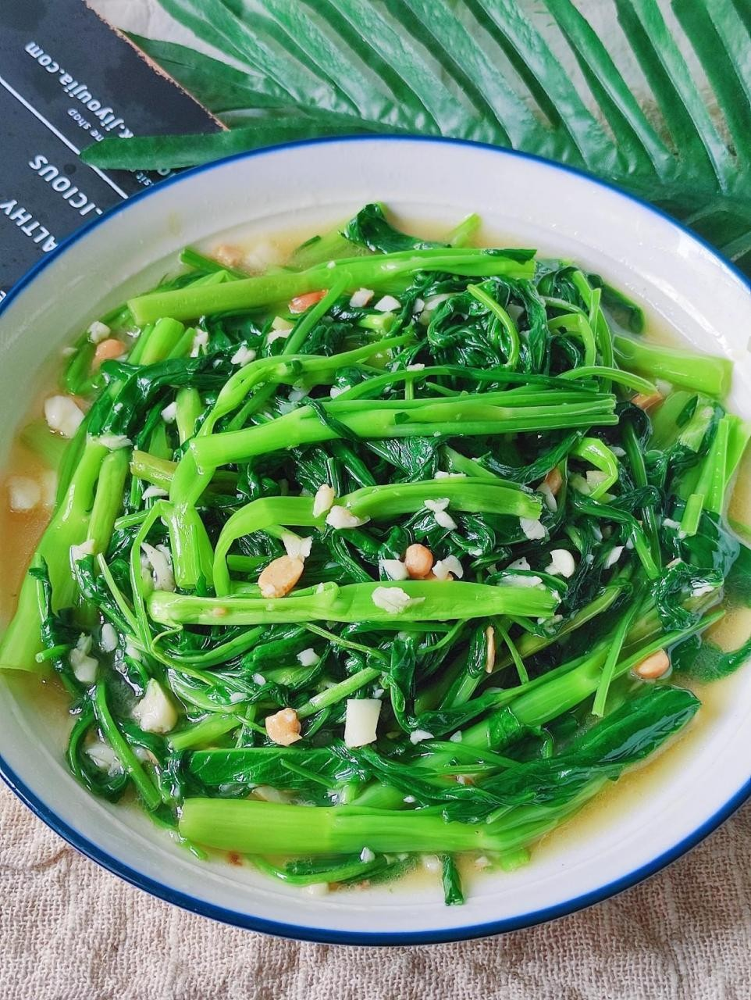

# 蒜蓉空心菜 (Stir-Fried Water Spinach with Minced Garlic)

## 📋 基本資訊 / Recipe Overview
- **料理名稱 (繁體)**：蒜蓉空心菜
- **料理名称 (简体)**：蒜蓉空心菜
- **English Title**：Cantonese Garlic Water Spinach (Kong Xin Cai)
- **素食流派 / Diet**：全素 / 纯素 Vegan (含蒜五辛素；可依戒律去蒜做纯净素)
- **料理分類 / Category**：01-蔬菜本味类 / 粤式快炒 / 经典素馔
- **份量 / Servings**：2-3 人份
- **準備時間 / Prep Time**：5 分鐘
- **烹飪時間 / Cook Time**：2 分鐘
- **總計耗時 / Total Time**：7 分鐘
- **來源 / Source**：现代中华素菜 Top 100 · [01-蔬菜本味类.md](../01-蔬菜本味类.md) 第 5 道

## 📖 菜品特色 / Description
空心菜梗叶分开，蒜蓉先炒梗再下叶，比清炒更香。

---

## 🌿 食材與調味清單 / Ingredients & Seasonings

### 主料
- 嫩空心菜 400g
- 大蒜 8-10 瓣（分两份：2/3 熟煸蒜油，1/3 出锅生蒜末）

### 调味料
- 食用植物油（花生油佳） 2 汤匙（约 30ml）
- 食盐 1/2 茶匙（约 3g）
- 素蚝油 1/2 茶匙（约 2.5ml，增鲜提亮）
- 优质生抽 1/2 茶匙（约 2.5ml）
- 白砂糖 1/4 茶匙（约 1g）
- 素高汤 / 沸水 1 汤匙（约 15ml）

---

## 🍳 烹飪步驟 / Step-by-Step Cooking Steps

### 步骤 1：食材精细准备
1. 空心菜摘净老茎，洗净后用甩水篮充分甩干表面水珠。
2. 将空心菜切成 5cm 段，将菜梗与菜叶严格分开放置。
3. 大蒜拍扁剁成细腻蒜蓉，按 2:1 比例分成两份备用。

### 步骤 2：慢煸金蒜油
1. 炒锅大火烧热，倒入 2 汤匙花生油。
2. 油温 4-5 成热时下入 2/3 的蒜末，转中小火慢煸至蒜末微黄冒香、油色清亮。

### 步骤 3：猛火分炒与金银蒜融合
1. 将炉火转至**最大猛火**。
2. 迅速倒入空心菜梗，大火翻炒 15 秒，使蒜油充分渗透菜梗中空纤维。
3. 下入全部空心菜叶，同时倒入剩余的 1/3 生蒜末，沿锅边泼入 1 汤匙素高汤。
4. 大火猛烈翻炒颠锅 20 秒，金蒜醇香与生蒜辛香瞬间融合激荡。

### 步骤 4：极速调味出锅
1. 菜叶一见转软，立刻撒入食盐 1/2 茶匙、素蚝油 1/2 茶匙、生抽 1/2 茶匙与白糖 1/4 茶匙。
2. 保持大火快速颠翻 5-8 秒均匀裹汁，立即关火盛盘上桌。

---

## 💡 大厨秘诀 / Chef's Tips

1. **金银蒜双重层次**：先下蒜末熟化出焦香蒜油，后下生蒜末激发出清冽辛香，蒜香深厚立体。
2. **大火短时镬气锁汁**：全程大火翻炒不超过 45 秒，菜叶翠绿如玉，菜梗清脆多汁。
3. **素蚝油与白糖点睛**：微量素蚝油与白糖能中和青菜微涩，激发天然清甜回甘。

---
*食谱归档时间：2026-08-20 · 收录于 20260818-vegetarianism 本地菜谱库 (1Top 精选)*
