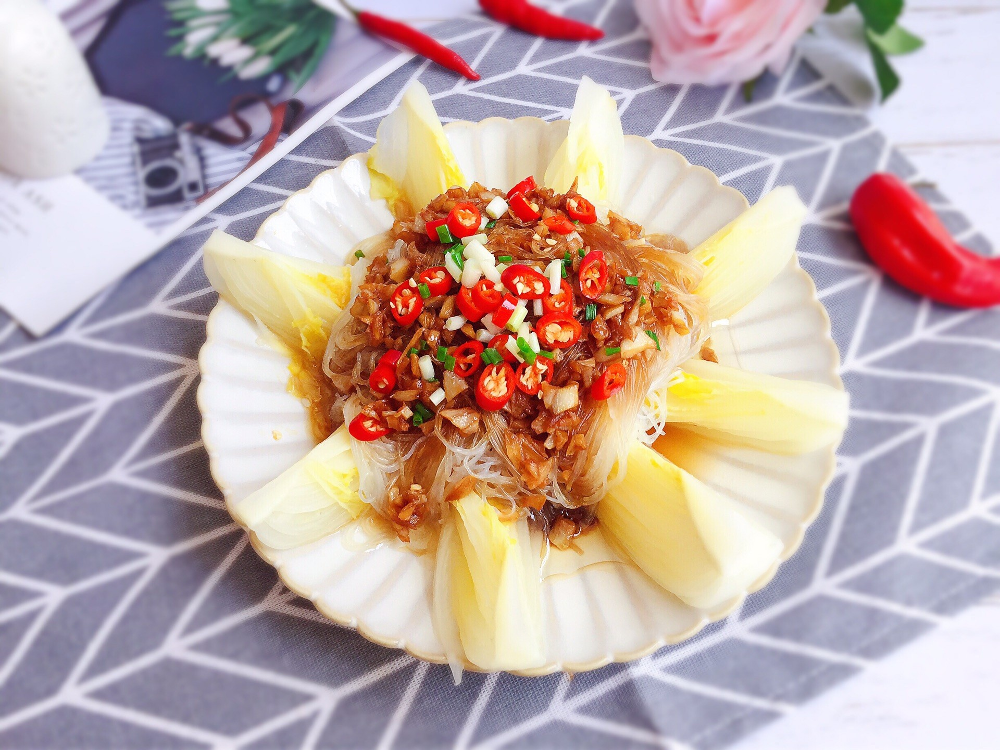

# 蒜蓉粉絲娃娃菜 (Steamed Baby Cabbage with Glass Noodles and Minced Garlic)

## 📋 基本資訊 / Recipe Overview
- **料理名稱 (繁體)**：蒜蓉粉絲娃娃菜
- **料理名称 (简体)**：蒜蓉粉丝娃娃菜
- **English Title**：Cantonese Steamed Baby Cabbage with Glass Noodles and Golden Garlic
- **素食流派 / Diet**：全素 / 纯素 Vegan (含蒜五辛素；可依戒律去蒜做纯净素)
- **料理分類 / Category**：01-蔬菜本味类 / 粤式清蒸 / 酒楼经典
- **份量 / Servings**：2-3 人份
- **準備時間 / Prep Time**：10 分鐘
- **烹飪時間 / Cook Time**：6 分鐘
- **總計耗時 / Total Time**：16 分鐘
- **來源 / Source**：现代中华素菜 Top 100 · [01-蔬菜本味类.md](../01-蔬菜本味类.md) 第 7 道

## 📖 菜品特色 / Description
粤式蒸菜。娃娃菜铺底，泡软粉丝与大量炒香蒜蓉清蒸。

---

## 🌿 食材與調味清單 / Ingredients & Seasonings

### 主料
- 娃娃菜 2 棵（约 300g）
- 优质绿豆粉丝 1 把（约 50g）
- 大蒜 2 头（约 12-15 瓣，剁碎成细蒜蓉）
- 红彩椒丁 1 汤匙（约 10g，配色用）
- 葱花 / 香菜末（选配） 少许

### 黄金金银蒜蓉酱配方
- 食用植物油 3 汤匙（约 45ml）
- 优质生抽 / 蒸鱼豉油（纯植物） 2 汤匙（约 30ml）
- 香菇素蚝油 1 汤匙（约 15ml）
- 白砂糖 1/2 茶匙（约 2.5g）
- 食盐 1/4 茶匙（约 1.5g）
- 素高汤 / 温水 2 汤匙（约 30ml）

### 出锅泼香
- 热植物油 1 汤匙（约 15ml）

---

## 🍳 烹飪步驟 / Step-by-Step Cooking Steps

### 步骤 1：粉丝泡发与娃娃菜预处理
1. **温水泡发**：绿豆粉丝用 40℃ 左右温水浸泡 15-20 分钟至完全变软，捞出沥干，用剪刀从中间剪一刀（便于夹取），平铺在深盘底部。
2. **娃娃菜改刀与快焯**：娃娃菜洗净，纵向切成 8 瓣长条；水烧开加少许盐，下入娃娃菜焯烫 20 秒杀青捞出沥干，放射状或整齐排在粉丝上方。

### 步骤 2：秘制金银蒜蓉酱制作
1. 大蒜剥皮剁成细蒜蓉，用清水快速漂洗一下并用纱布挤干水分（洗去黏液防炸糊发苦）。
2. 将蒜蓉均分为两份（1:1）。
3. 锅中倒入 3 汤匙植物油，油温 4 成热下入第一份蒜蓉，保持小火慢炸至蒜蓉呈微金黄色且香味四溢。
4. 立即关火，倒入剩余的一半生蒜蓉，利用余温激发出蒜香；加入生抽 2 汤匙、素蚝油 1 汤匙、白糖 1/2 茶匙、盐 1/4 茶匙与温水 2 汤匙搅匀即成金银蒜酱。

### 步骤 3：铺酱与大火蒸制
1. 用小勺将调好的金银蒜蓉酱均匀铺撒在每一瓣娃娃菜和底部的粉丝上。
2. 蒸锅内加足量水，大火烧开上大汽。
3. 将装好盘的娃娃菜放入蒸屉中，加盖大火猛蒸 **5-6 分钟**。

### 步骤 4：出锅泼油提香
1. 蒸好后小心取出，在表面撒上红彩椒碎（或葱花）。
2. 小锅烧热 1 汤匙植物油至 8 成热，趁热浇在蒜蓉与红椒上激发浓香即可上桌。

---

## 💡 大厨秘诀 / Chef's Tips

1. **金银蒜 1:1 黄金配比**：熟蒜提供浓醇焦香，生蒜提供清鲜辛香，加少许糖调和，不苦不涩。
2. **粉丝温水泡发不宜过烂**：温水泡至无硬心即可，蒸制时能完全吸收上层的娃娃菜甜汁与蒜蓉酱香。
3. **蒸制严格控时 5-6 分钟**：大火快蒸让娃娃菜脆嫩多汁，过久则软烂脱水失去鲜度。

---
*食谱归档时间：2026-08-20 · 收录于 20260818-vegetarianism 本地菜谱库 (1Top 精选)*
