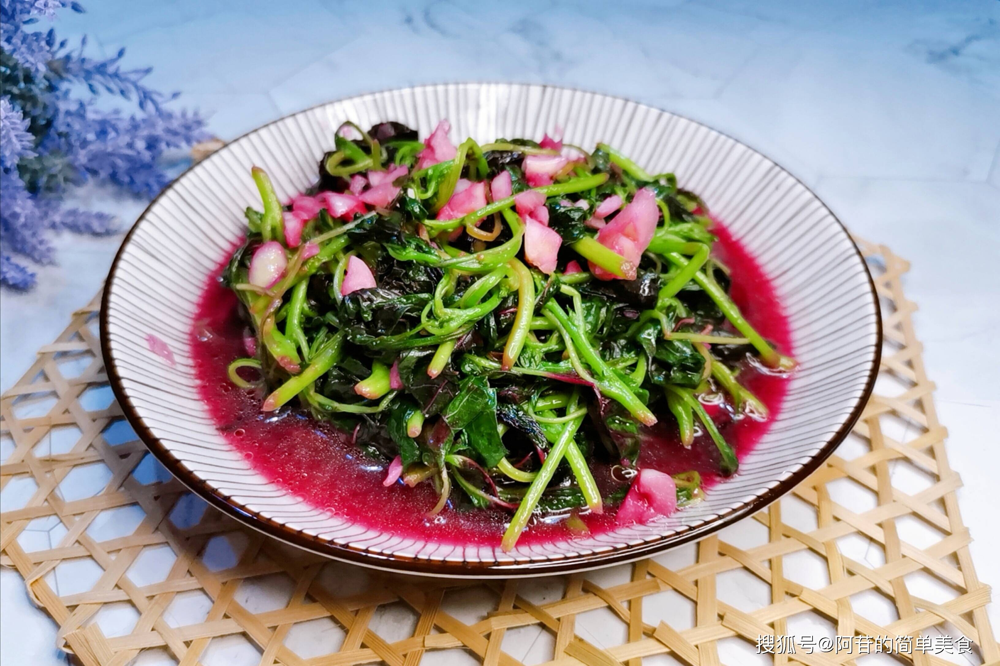

# 蒜蓉苋菜 (Stir-Fried Red Amaranth with Sizzling Garlic)

## 📋 基本資訊 / Recipe Overview
- **料理名稱 (繁體)**：蒜蓉莧菜
- **料理名称 (简体)**：蒜蓉苋菜
- **English Title**：Stir-Fried Red Amaranth with Sizzling Garlic
- **素食流派 / Diet**：全素 / 纯素 Vegan (含大蒜；五辛素，可去蒜改纯净素)
- **料理分類 / Category**：01-蔬菜本味类 / 夏季时令 / 传统家常
- **份量 / Servings**：2-3 人份
- **準備時間 / Prep Time**：5 分鐘
- **烹飪時間 / Cook Time**：3 分鐘
- **總計耗時 / Total Time**：8 分鐘
- **來源 / Source**：现代中华素菜 Top 100 · [01-蔬菜本味类.md](../01-蔬菜本味类.md) 第 45 道

## 📖 菜品特色 / Description
夏菜。苋菜遇蒜油更香，出汤红亮。红苋菜含有丰富花青素与铁质，大火快炒后汤汁如玛瑙红润，蒜香扑鼻，拌饭一绝。

---

## 🌿 食材與調味清單 / Ingredients & Seasonings

### 主料
- 新鲜红苋菜 400g
- 大蒜 8-10 瓣（用量加倍，蒜香浓郁）

### 调味料
- 食用植物油 2 汤匙（约 30ml）
- 食盐 1/2 茶匙（约 3g）
- 白砂糖 1/4 茶匙（约 1g）
- 纯米酒 / 黄酒 1 茶匙（约 5ml，沿锅边烹入激香）
- 素高汤 / 温水 1 汤匙（约 15ml，帮助乳化红亮汤汁）

---

## 🍳 烹飪步驟 / Step-by-Step Cooking Steps

### 步骤 1：择洗与处理
1. 苋菜摘去老根，若下部老梗外皮较硬可顺手撕去表皮；反复漂洗干净泥沙。
2. 捞出充分沥干水分；将梗与叶切成约 5-6cm 长段。
3. 大蒜去皮拍碎剁成均匀蒜末。

### 步骤 2：慢煸金黄蒜蓉
1. 炒锅烧热，倒入 2 汤匙植物油。
2. 保持中小火，下入全部蒜末，慢煸至蒜末泛起微金黄色、蒜香扑鼻溢出（注意控火，切勿炒焦糊）。

### 步骤 3：大火猛炒，激发红汁
1. 转最大火，先下苋菜梗翻炒 15 秒。
2. 紧接着倒入苋菜叶，大火快速颠锅翻炒 30 秒，苋菜叶受热逐渐软塌，天然红亮花青素汁水开始析出。
3. 沿锅边烹入 1 茶匙米酒与 1 汤匙温水，蒸汽瞬间包裹苋菜，加速红汤释放。

### 步骤 4：调味收官
1. 撒入 **食盐 1/2 茶匙** 与 **白砂糖 1/4 茶匙**。
2. 快速翻炒 10 秒让盐糖融于红润蒜汁中，汤汁呈鲜亮紫红色，即可关火盛盘。

---

## 💡 大厨秘诀 / Chef's Tips

1. **重蒜是灵魂**：苋菜草本气息浓重，搭配倍量大蒜经油煸香后，能产生极佳的风味碰撞，香醇回甘。
2. **天然红汤的秘密**：选用叶片深紫红的红苋菜，高温大火破壁释放花青素，加一小勺温水能使蒜油与菜汁乳化成诱人红汤，拌饭极鲜。
3. **嫩苋菜不焯水**：鲜嫩苋菜直接生炒风味最足；若苋菜偏老涩味重，可先入沸水快速焯烫 15 秒捞出再炒。

---
*食谱归档时间：2026-08-20 · 收录于 20260818-vegetarianism 本地菜谱库 (1Top 精选)*
