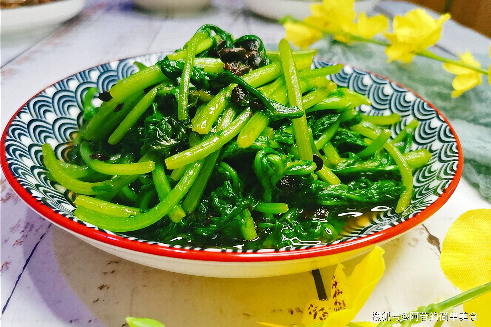

# 蒜蓉茼蒿 (Stir-Fried Tong Ho with Garlic)

## 📋 基本資訊 / Recipe Overview
- **料理名稱 (繁體)**：蒜蓉茼蒿
- **料理名称 (简体)**：蒜蓉茼蒿
- **English Title**：Stir-Fried Garland Chrysanthemum Greens with Minced Garlic
- **素食流派 / Diet**：全素 / 纯素 Vegan (含蒜五辛素；可依戒律去蒜做纯净素)
- **料理分類 / Category**：01-蔬菜本味类 / 江南粤式 / 清香时蔬
- **份量 / Servings**：2-3 人份
- **準備時間 / Prep Time**：5 分鐘
- **烹飪時間 / Cook Time**：2 分鐘
- **總計耗時 / Total Time**：7 分鐘
- **來源 / Source**：现代中华素菜 Top 100 · [01-蔬菜本味类.md](../01-蔬菜本味类.md) 第 21 道

## 📖 菜品特色 / Description
水油焖或爆炒，蒿香浓，广东、上海都爱。

---

## 🌿 食材與調味清單 / Ingredients & Seasonings

### 主料
- 新鲜茼蒿（菊花菜 / 蓬蒿） 400g
- 大蒜 6 瓣（剁成细碎蒜末）

### 调味用料
- 食用植物油 2 汤匙（约 30ml）
- 食盐 1/2 茶匙（约 3g）
- 白砂糖 1/4 茶匙（约 1g，中和精油苦味）
- 白胡椒粉 1/8 茶匙（一小撮，提香去寒）
- 水淀粉 1/2 茶匙（玉米淀粉 1/4 茶匙 + 水 1/2 茶匙，极薄芡）

---

## 🍳 烹飪步驟 / Step-by-Step Cooking Steps

### 步骤 1：茼蒿择洗与甩干
1. 茼蒿摘去老硬根茎和黄叶，冲洗干净。
2. 切成 5-6cm 长的长段。
3. **必须彻底甩干水分**（茼蒿叶极易吸水，水分多入锅会迅速软烂出黑水）。

### 步骤 2：热锅爆香蒜蓉
1. 炒锅烧至大热，倒入 2 汤匙植物油。
2. 油温 5 成热下入全部蒜末，中小火煸炒 5 秒爆出浓郁蒜香。

### 步骤 3：猛火分炒极速断生
1. 转**最大猛火**，先下茼蒿茎翻炒 10 秒。
2. 迅速倒入全部茼蒿叶，大火快速翻炒颠锅 20 秒，使茼蒿在热油中快速受热塌软。

### 步骤 4：调味出锅
1. 见茼蒿刚转深绿软缩，立刻撒入食盐 1/2 茶匙、白糖 1/4 茶匙、微量白胡椒粉，并沿锅边淋入极薄水淀粉。
2. 猛火颠锅 5 秒，关火立刻出锅装盘（全程下锅到出锅不超过 40 秒）。

---

## 💡 大厨秘诀 / Chef's Tips

1. **极致控干水分**：茼蒿天然水分充足，下锅前表面务必干燥，方能炒出干爽脆嫩质感。
2. **大火猛炒 40 秒出锅**：茼蒿极易过熟变黑出水，断生即起是保留蒿香精油与翠绿颜色的核心秘诀。
3. **少许白糖与白胡椒粉点睛**：白糖柔和茼蒿独特的精油辛香，白胡椒粉增添温润鲜爽。

---
*食谱归档时间：2026-08-20 · 收录于 20260818-vegetarianism 本地菜谱库 (1Top 精选)*
