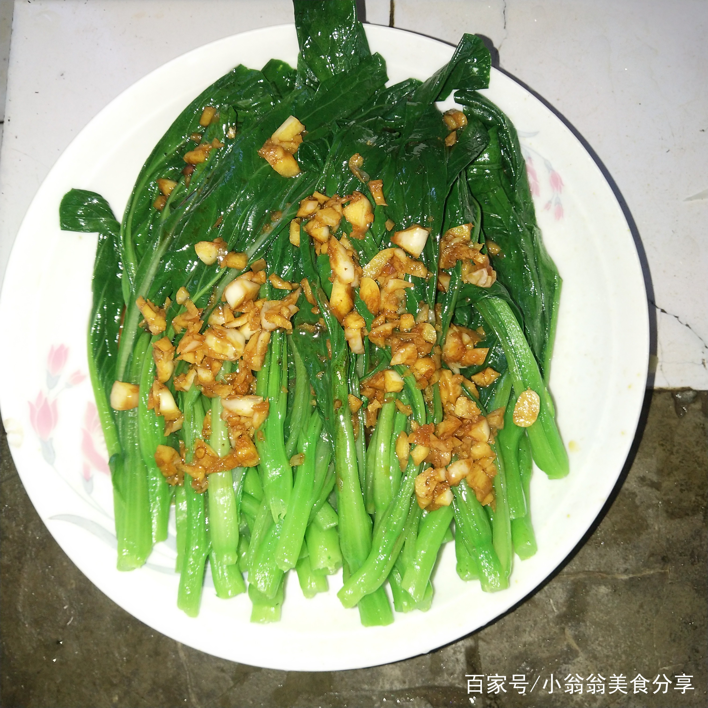

# 蒜蓉菜心 (Stir-Fried Choy Sum with Minced Garlic)

## 📋 基本資訊 / Recipe Overview
- **料理名稱 (繁體)**：蒜蓉菜心
- **料理名称 (简体)**：蒜蓉菜心
- **English Title**：Cantonese Wok-Fried Choy Sum with Fragrant Garlic
- **素食流派 / Diet**：全素 / 纯素 Vegan (含蒜五辛素；可依戒律去蒜做纯净素)
- **料理分類 / Category**：01-蔬菜本味类 / 粤港家常 / 经典镬气
- **份量 / Servings**：2-3 人份
- **準備時間 / Prep Time**：5 分鐘
- **烹飪時間 / Cook Time**：2.5 分鐘
- **總計耗時 / Total Time**：7.5 分鐘
- **來源 / Source**：现代中华素菜 Top 100 · [01-蔬菜本味类.md](../01-蔬菜本味类.md) 第 18 道

## 📖 菜品特色 / Description
菜心蒜蓉爆炒，广东、香港酒楼与家常都点。

---

## 🌿 食材與調味清單 / Ingredients & Seasonings

### 主料
- 广东菜心 400g
- 大蒜 8 瓣（剁成细蒜蓉，按 2:1 分两份）

### 调味用料
- 食用植物油（花生油佳） 2 汤匙（约 30ml）
- 食盐 1/2 茶匙（约 3g）
- 香菇素蚝油 1/2 茶匙（约 2.5ml）
- 白砂糖 1/4 茶匙（约 1g）
- 素高汤 / 热水 1 汤匙（约 15ml）

---

## 🍳 烹飪步驟 / Step-by-Step Cooking Steps

### 步骤 1：菜心处理与彻底甩干
1. 菜心洗净，摘去老根黄叶，粗菜茎底部轻划十字刀。
2. 放入沥水篮充分甩干表面水分。

### 步骤 2：金蒜油制作
1. 炒锅大火烧热，倒入 2 汤匙花生油。
2. 油温 4 成热下入 2/3 蒜末，小火慢煸至蒜蓉呈微金黄色、蒜香四溢。

### 步骤 3：大火猛炒与生蒜提香
1. 转最大猛火，先下菜心根茎快速翻炒 15 秒。
2. 下入全部菜叶和剩余的 1/3 生蒜末，沿锅边洒入 1 汤匙热水。
3. 猛烈颠锅翻炒 30 秒，使镬气与金银蒜香完全渗透菜心。

### 步骤 4：调味出锅
1. 见菜心转深绿变软，立刻撒入食盐 1/2 茶匙、素蚝油 1/2 茶匙和白糖 1/4 茶匙。
2. 保持大火快速颠翻 10 秒使调味完全融合，关火装盘。

---

## 💡 大厨秘诀 / Chef's Tips

1. **镬气快炒比白灼更浓郁**：旺火热油生炒菜心，蒜香与菜汁在高热中乳化，镬气十足。
2. **金银蒜提香法则**：熟蒜出焦香底油，出锅前生蒜提辛香，双重蒜香浓厚诱人。
3. **洒锅边热水助透**：菜心根茎较实，洒一勺热水借蒸汽 10 秒透芯，不失爽脆。

---
*食谱归档时间：2026-08-20 · 收录于 20260818-vegetarianism 本地菜谱库 (1Top 精选)*
