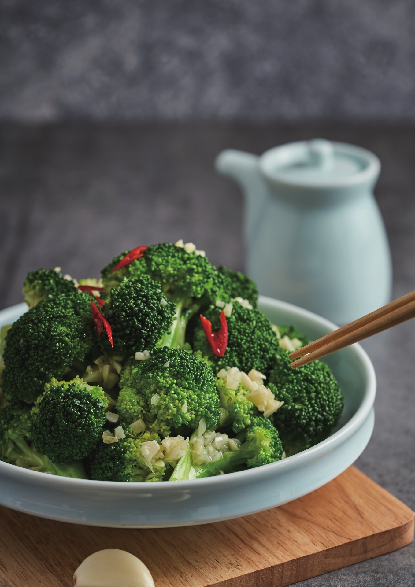

# 蒜蓉西蘭花 (Stir-Fried Broccoli with Garlic)

## 📋 基本資訊 / Recipe Overview
- **料理名稱 (繁體)**：蒜蓉西蘭花
- **料理名称 (简体)**：蒜蓉西兰花
- **English Title**：Stir-Fried Broccoli with Golden Minced Garlic
- **素食流派 / Diet**：全素 / 纯素 Vegan (含蒜五辛素；可依戒律去蒜做纯净素)
- **料理分類 / Category**：01-蔬菜本味类 / 全国家常 / 快手健康菜
- **份量 / Servings**：2-3 人份
- **準備時間 / Prep Time**：6 分鐘
- **烹飪時間 / Cook Time**：3 分鐘
- **總計耗時 / Total Time**：9 分鐘
- **來源 / Source**：现代中华素菜 Top 100 · [01-蔬菜本味类.md](../01-蔬菜本味类.md) 第 14 道

## 📖 菜品特色 / Description
快手清炒，保留清脆，全国饭桌常见。

---

## 🌿 食材與調味清單 / Ingredients & Seasonings

### 主料
- 新鲜西兰花 350g
- 大蒜 6-8 瓣（剁碎成蒜蓉，分两份）

### 焯水调料（保色保脆）
- 食盐 1 茶匙（约 5g）
- 食用油 1/2 汤匙（约 7.5ml）

### 调味料与薄芡
- 植物油 1.5 汤匙（约 22ml）
- 食盐 1/2 茶匙（约 3g）
- 香菇素蚝油 / 松茸鲜 1/2 茶匙（约 2.5ml）
- 白砂糖 1/4 茶匙（约 1g）
- 素高汤 / 清水 2 汤匙（约 30ml）
- 水淀粉 1 汤匙（玉米淀粉 1/2 茶匙 + 清水 1 汤匙调匀）

---

## 🍳 烹飪步驟 / Step-by-Step Cooking Steps

### 步骤 1：浸泡清洗与改刀
1. 西兰花顺着根茎切成大小均匀的小朵，较粗的根茎削去硬外皮切成薄片。
2. 放入淡盐水中浸泡 5 分钟（驱除花蕾中的微小杂质与农残），捞出冲洗干净。

### 步骤 2：沸水焯烫与极速过凉
1. 锅内加入宽水大火烧开，加入食盐 1 茶匙和食用油半汤匙。
2. 下入西兰花焯烫 **60-90 秒**，见西兰花颜色变深绿翠亮、八成熟即刻捞出。
3. 迅速投入凉水或冰水中浸泡 15 秒降温锁色，捞出彻底沥干水分。

### 步骤 3：蒜香爆锅与大火快炒
1. 炒锅烧热，倒入 1.5 汤匙植物油，下入 2/3 蒜末，小火慢煸至蒜末微黄溢香。
2. 转大火，下入沥干的西兰花快速翻炒 20 秒。
3. 撒入食盐 1/2 茶匙、白糖 1/4 茶匙、素蚝油 1/2 茶匙和 2 汤匙素高汤，倒入剩余的 1/3 生蒜末。

### 步骤 4：勾薄芡出锅
1. 沿锅边淋入调匀的薄水淀粉。
2. 保持大火快速颠锅翻炒 10 秒，使薄薄的蒜蓉芡汁均匀挂在凹凸的花蕾上，亮油出锅。

---

## 💡 大厨秘诀 / Chef's Tips

1. **淡盐水浸洗**：花蕾结构紧密，盐水浸泡能彻底清洁内部浮尘。
2. **焯水不过 90 秒并过凉**：焯水加盐油使色泽油绿挺拔，快速过凉热胀冷缩保持脆嫩爽口。
3. **薄芡挂汁**：西兰花表面不易吸附调料，淋入薄水淀粉能让浓郁蒜香牢牢包裹在每一朵花球上。

---
*食谱归档时间：2026-08-20 · 收录于 20260818-vegetarianism 本地菜谱库 (1Top 精选)*
