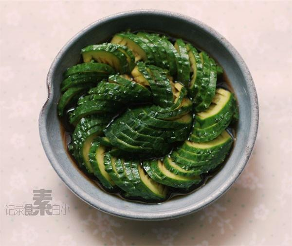

# 蓑衣黃瓜 (Suoyi Cucumber Salad / Accordion Cucumber)

## 📋 基本資訊 / Recipe Overview
- **料理名稱 (繁體)**：蓑衣黃瓜
- **料理名称 (简体)**：蓑衣黄瓜
- **English Title**：Chinese Accordion Cucumber Salad (Suoyi Cucumber)
- **素食流派 / Diet**：全素 / 纯素 Vegan (含蒜、花椒、干椒；可去五辛)
- **料理分類 / Category**：01-蔬菜本味类 / 传统鲁菜刀工 / 爽脆凉菜
- **份量 / Servings**：2-3 人份
- **準備時間 / Prep Time**：15 分鐘
- **烹飪時間 / Cook Time**：2 分鐘 (热油激香)
- **總計耗時 / Total Time**：17 分鐘
- **來源 / Source**：现代中华素菜 Top 100 · [01-蔬菜本味类.md](../01-蔬菜本味类.md) 第 28 道

## 📖 菜品特色 / Description
花刀蓑衣，盐醋蒜，造型与口感都清爽。

---

## 🌿 食材與調味清單 / Ingredients & Seasonings

### 主料
- 笔直均匀黄瓜 2 根（中等粗细，长度均匀）
- 大蒜 4 瓣（切蒜末）
- 干红辣椒 3-4 根（剪细丝）
- 花椒粒 15 粒
- 熟白芝麻 1 茶匙

### 蓑衣腌制汁
- 食盐 1 茶匙（约 5g，杀水软化花刀）
- 优质生抽 2 汤匙（约 30ml）
- 镇江香醋 / 陈醋 2 汤匙（约 30ml）
- 白糖 1.5 汤匙（约 20g，酸甜清爽）
- 纯芝麻香油 1 茶匙（约 5ml）
- 食用油 2 汤匙（约 30ml，泼热油用）

---

## 🍳 烹飪步驟 / Step-by-Step Cooking Steps

### 步骤 1：蓑衣花刀精细改刀（双筷定深法）
1. 黄瓜洗净擦干，取一双平整竹筷垫在黄瓜两侧（筷子能阻挡刀刃切到底，确保黄瓜片片相连而不切断）。
2. **A面斜切 45 度**：刀刃与黄瓜呈 45 度夹角，自右向左均匀切出薄片（厚度约 1.5-2 毫米），切至筷子处即停。
3. **B面直切 90 度**：将整根黄瓜翻面 180 度（底面翻至上方），刀刃与黄瓜呈 90 度垂直下刀，同样切至筷子处。
4. 切好后轻轻拉开，黄瓜宛如手风琴/蓑衣般连绵不断、弹性十足。

### 步骤 2：撒盐软化与倒水
1. 将切好的蓑衣黄瓜盘入盘中，均匀撒上 1 茶匙食盐，静置腌制 10 分钟。
2. 待黄瓜变软且析出苦涩水分后，倒掉盘中水分，用凉白开快速轻漂一下沥干。

### 步骤 3：调糖醋生抽汁
1. 小碗中混合生抽 2 汤匙、香醋 2 汤匙、白糖 1.5 汤匙、芝麻香油 1 茶匙，搅拌至白糖彻底溶解。
2. 将料汁均匀浇淋在蓑衣黄瓜上。

### 步骤 4：热油炝椒激香
1. 在黄瓜表面中央整齐码上蒜末、干辣椒丝和花椒粒。
2. 小锅中烧热 2 汤匙食用油至 7 成热（冒青烟），迅速泼淋在花椒、辣椒丝与蒜末上，瞬间激发出滚烫焦香，撒上熟白芝麻即可上桌。

---

## 💡 大厨秘诀 / Chef's Tips

1. **双筷辅助绝不切断**：垫两根筷子是新手和专业厨师保证蓑衣花刀深浅一致、绝不切断的神器。
2. **正面 45° 倾斜、反面 90° 垂直**：正面斜刀切出菱形拉花，反面直刀切出弹性网状，双向交错才能拉伸如弹簧。
3. **盐腌去涩增韧性**：加盐杀水不仅能去除青涩味，还能使瓜条韧性大增，拉伸摆盘不易断裂，同时能最大程度吸饱酸甜料汁。

---
*食谱归档时间：2026-08-20 · 收录于 20260818-vegetarianism 本地菜谱库 (1Top 精选)*
