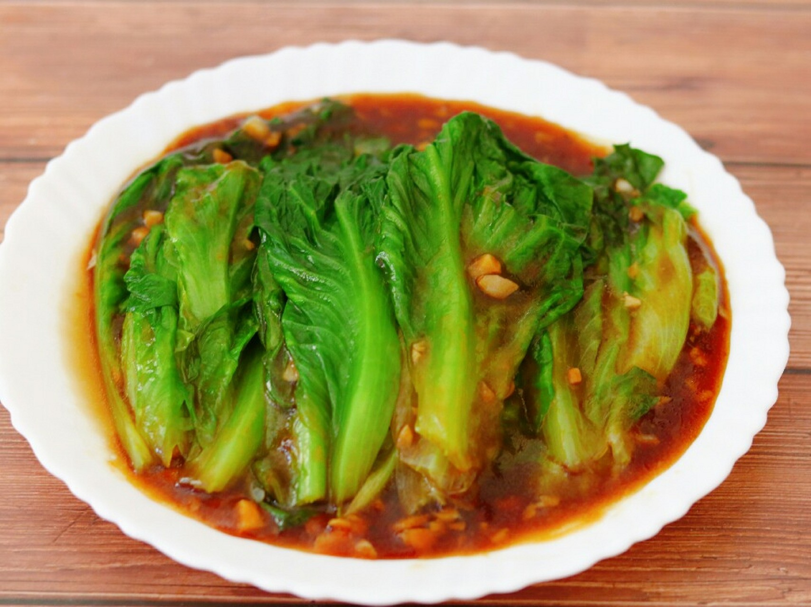

# 蠔油生菜 (Cantonese Lettuce with Vegetarian Oyster Sauce)

## 📋 基本資訊 / Recipe Overview
- **料理名稱 (繁體)**：蠔油生菜
- **料理名称 (简体)**：蚝油生菜（素蚝油）
- **English Title**：Cantonese Poached Lettuce with Vegetarian Oyster Sauce & Garlic Glaze
- **素食流派 / Diet**：全素 / 纯素 Vegan (含蒜五辛素；可依戒律去蒜做纯净素)
- **料理分類 / Category**：01-蔬菜本味类 / 港式家常 / 粤式时蔬
- **份量 / Servings**：2-3 人份
- **準備時間 / Prep Time**：5 分鐘
- **烹飪時間 / Cook Time**：3 分鐘
- **總計耗時 / Total Time**：8 分鐘
- **來源 / Source**：现代中华素菜 Top 100 · [01-蔬菜本味类.md](../01-蔬菜本味类.md) 第 3 道

## 📖 菜品特色 / Description
港式家常。生菜焯水或快炒，素蚝油蒜蓉芡汁，清脆鲜甜。

---

## 🌿 食材與調味清單 / Ingredients & Seasonings

### 主料
- 球生菜 / 罗马生菜（或玻璃生菜） 350g
- 大蒜 5-6 瓣（剁成细碎蒜蓉）
- 红椒丝（选配，装饰配色） 少量

### 焯水调料（保脆锁色）
- 食盐 1 茶匙（约 5g）
- 食用植物油 1/2 汤匙（约 7.5ml）

### 灵魂素蚝油芡汁
- 香菇素蚝油 2 汤匙（约 30ml）
- 优质生抽 1 汤匙（约 15ml）
- 白砂糖 1/2 茶匙（约 2.5g，提鲜中和咸味）
- 清水 / 素高汤 3 汤匙（约 45ml）
- 土豆水淀粉 1 汤匙（土豆淀粉 1 茶匙 + 清水 1 汤匙调匀）
- 芝麻香油 1/2 茶匙（约 2.5ml）
- 熟花生油 / 植物油 1 汤匙（约 15ml，炒蒜蓉用）

---

## 🍳 烹飪步驟 / Step-by-Step Cooking Steps

### 步骤 1：生菜处理与彻底沥水
1. 将生菜叶一片片剥下，放入清水中清洗干净。
2. **手撕要点**：大片生菜直接用手撕成两半（切勿用金属菜刀切，以防切口氧化发黑）。
3. 放入沥水篮充分沥干水分备用。

### 步骤 2：水宽火旺，极速焯烫（10-15 秒）
1. 锅中倒入足量清水（宽水），大火烧至完全沸腾。
2. 沸水中加入 **1 茶匙食盐** 与 **1/2 汤匙食用油**（油膜隔绝空气锁住翠绿，盐入底味）。
3. 下入生菜，用漏勺快速按压使其全部浸没水中，大火焯烫 **10-15 秒**。
4. 见菜叶变软、颜色碧绿立即捞出，迅速投入纯净水或冷水中过凉 15 秒（热胀冷缩锁住清脆）。
5. 捞出彻底甩干水分，整齐码入长盘中。

### 步骤 3：调制素蚝油蒜蓉芡汁
1. 净锅上火，倒入 1 汤匙植物油，油温 4-5 成热时下入蒜蓉，小火慢煸至蒜蓉微黄、蒜香浓烈溢出（切勿煸焦发苦）。
2. 倒入香菇素蚝油 2 汤匙、生抽 1 汤匙、白糖 1/2 茶匙及素高汤 3 汤匙，小火烧至微沸。
3. 淋入调匀的土豆水淀粉，转中火快速搅拌至芡汁变透明且呈浓稠油亮的“流芡”状态。
4. 关火前滴入半茶匙芝麻香油提亮增香。

### 步骤 4：浇淋出盘
1. 将锅中滚烫浓稠的素蚝油芡汁，由上至下均匀淋在摆好的生菜上。
2. 点缀少许红椒丝即可趁热享用。

---

## 💡 大厨秘诀 / Chef's Tips

1. **焯水不过 15 秒**：生菜细胞壁极薄，焯烫超过 20 秒就会软塌并大量脱水，10-15 秒断生即捞是爽脆第一要诀。
2. **焯后过凉与彻底甩干**：过凉水能防止余温自熟，甩干水分能防止盘底积水稀释酱汁。
3. **选用土豆淀粉勾芡**：土豆淀粉透明度高、光泽感好且不易“返水”，能让素蚝油汁完美挂在生菜表面。
4. **素蚝油离火前煮透**：素蚝油在芡汁微沸时激发出香菇浓香，最后滴香油则锁住酱汁光泽。

---
*食谱归档时间：2026-08-20 · 收录于 20260818-vegetarianism 本地菜谱库 (1Top 精选)*
