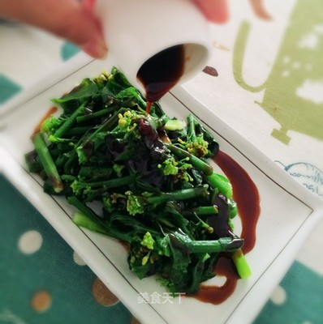

# 蠔油芥蘭 (Chinese Gai Lan in Oyster Sauce)

## 📋 基本資訊 / Recipe Overview
- **料理名稱 (繁體)**：蠔油芥蘭
- **料理名称 (简体)**：蚝油芥兰
- **English Title**：Cantonese Gai Lan (Chinese Broccoli) in Savory Vegetarian Oyster Sauce
- **素食流派 / Diet**：全素 / 纯素 Vegan (含蒜五辛素；可依戒律去蒜做纯净素)
- **料理分類 / Category**：01-蔬菜本味类 / 粤菜经典 / 酒楼名菜
- **份量 / Servings**：2-3 人份
- **準備時間 / Prep Time**：6 分鐘
- **烹飪時間 / Cook Time**：3 分鐘
- **總計耗時 / Total Time**：9 分鐘
- **來源 / Source**：现代中华素菜 Top 100 · [01-蔬菜本味类.md](../01-蔬菜本味类.md) 第 15 道

## 📖 菜品特色 / Description
粤菜经典。芥兰焯或炒，素蚝油蒜蓉，微苦回甘。

---

## 🌿 食材與調味清單 / Ingredients & Seasonings

### 主料
- 新鲜广东芥兰 350g
- 大蒜 5 瓣（剁碎成蒜蓉）
- 生姜丝 5g

### 焯水调料（去苦回甜关键）
- 食盐 1 茶匙（约 5g）
- 食用油 1/2 汤匙（约 7.5ml）
- 白砂糖 1/2 茶匙（约 2.5g，中和芥兰苦味）

### 灵魂素蚝油浓汁
- 香菇素蚝油 2 汤匙（约 30ml）
- 优质生抽 1 汤匙（约 15ml）
- 白砂糖 1/2 茶匙（约 2.5g）
- 素高汤 / 清水 3 汤匙（约 45ml）
- 土豆淀粉 1/2 茶匙（约 2.5g）
- 芝麻香油 1/2 茶匙（约 2.5ml）
- 炒油 1.5 汤匙（约 22ml）

---

## 🍳 烹飪步驟 / Step-by-Step Cooking Steps

### 步骤 1：去老皮与改刀
1. 挑选脆嫩芥兰，择去泛黄老叶，洗净。
2. **削去根部老皮**：用削皮刀将根部下半段粗糙老硬外皮削去（去渣保嫩核心刀工）。
3. 根部较粗壮处用刀纵切十字花刀（便于熟透与入味）。

### 步骤 2：分段焯水去苦提甜
1. 锅内加入宽水大火烧沸，加入盐 1 茶匙、油 1/2 汤匙与白糖 1/2 茶匙。
2. 手持菜叶，先将较硬的芥兰根茎浸入沸水中焯烫 30 秒；随后将全株推入水中继续焯烫 30 秒。
3. 捞出迅速投入凉水中过凉 15 秒，彻底沥干水分，头尾整齐码在长盘中。

### 步骤 3：煮制浓稠素蚝油汁
1. 净锅上火，倒入 1.5 汤匙植物油，下姜丝和蒜蓉小火慢煸出香。
2. 碗中混合素蚝油 2 汤匙、生抽 1 汤匙、白糖 1/2 茶匙、素高汤 3 汤匙与淀粉 1/2 茶匙搅匀倒入锅中。
3. 中小火加热搅拌至芡汁沸腾透明、呈油亮浓稠状，关火淋入香油。

### 步骤 4：浇淋摆盘
1. 将锅中滚烫的素蚝油芡汁顺着芥兰根部向叶部均匀浇淋，即可端盘享用。

---

## 💡 大厨秘诀 / Chef's Tips

1. **削去根茎老皮**：芥兰根部外皮纤维极粗，削去一层老皮是入口脆嫩无渣的关键。
2. **焯水加糖去苦涩**：沸水中加入半茶匙白糖，能中和芥兰天然的苦涩味，凸显清甜回甘。
3. **先茎后叶分段烫**：根茎与叶片熟化时间不同，分段焯烫使整株受热恰到好处。

---
*食谱归档时间：2026-08-20 · 收录于 20260818-vegetarianism 本地菜谱库 (1Top 精选)*
