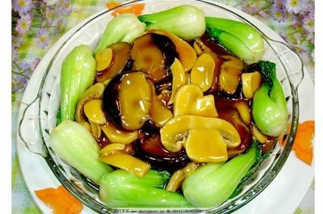

# 蚝油菜胆 (Braised Choy Sum Hearts in Vegetarian Oyster Sauce (Glazed Bok Choy Hearts))

## 📋 基本資訊 / Recipe Overview
- **料理名稱 (繁體)**：蠔油菜膽
- **料理名称 (简体)**：蚝油菜胆
- **English Title**：Braised Choy Sum Hearts in Vegetarian Oyster Sauce (Glazed Bok Choy Hearts)
- **素食流派 / Diet**：纯素 Vegan
- **料理分類 / Category**：01-蔬菜本味类 / 粤式经典 / 酱香时蔬
- **份量 / Servings**：2-3 人份
- **準備時間 / Prep Time**：6 分鐘
- **烹飪時間 / Cook Time**：3 分鐘
- **總計耗時 / Total Time**：9 分鐘
- **來源 / Source**：现代中华素菜 Top 100 · [01-蔬菜本味类.md](../01-蔬菜本味类.md) 第 73 道

## 📖 菜品特色 / Description
菜胆配素蚝油，比白灼更酱香。

---

## 🌿 食材與調味清單 / Ingredients & Seasonings
### 主料
- 鲜嫩菜心胆（或小油菜心/上海青菜胆） 350g

### 配料
- 大蒜 3 瓣（剁成细末 10g；纯净素免）
- 鲜生姜末 3g

### 焯水调料
- 食盐 1 茶匙（约 5g）
- 食用植物油 1/2 汤匙（约 7.5ml）

### 秘制素蚝油琉璃芡汁配方
- 优质香菇素蚝油 2 汤匙（约 30ml）
- 纯酿造生抽 1 茶匙（约 5ml）
- 白砂糖 1/2 茶匙（约 2.5g，调和酱香回甘）
- 优质素高汤 / 清水 4 汤匙（约 60ml）
- 玉米淀粉 1 茶匙（约 3g）
- 纯正芝麻香油 1/2 茶匙（约 2.5ml）
- 烹调植物油 1 汤匙（约 15ml）

---

## 🍳 烹飪步驟 / Step-by-Step Cooking Steps
### 步骤 1：菜胆修整与调配芡汁
1. 菜胆剥净外叶切齐根底，底部划十字浅刀，清洗沥干。
2. 小碗中混合素蚝油 2 汤匙、生抽 1 茶匙、白糖 1/2 茶匙、素高汤 4 汤匙和玉米淀粉 1 茶匙，搅拌均匀成素蚝油芡汁备用。

### 步骤 2：油盐焯水，整齐码盘
1. 锅中烧沸足量宽水，加 1 茶匙盐与半汤匙油，下菜胆焯烫 45-50 秒至断生碧绿。
2. 捞出充分沥干水分，将菜胆头尾一致整齐排入盘中（或沿盘周环形摆成花瓣状）。

### 步骤 3：煸香蒜姜
1. 净炒锅烧热，倒入 1 汤匙植物油，下蒜末和姜末，中小火煸炒至微黄出香（纯净素直接下姜末）。

### 步骤 4：熬煮素蚝油琉璃芡
1. 将调好的素蚝油芡汁重新搅匀倒入锅中。
2. 中小火慢搅加热，煮至芡汁透明浓稠、起密集明亮小泡。

### 步骤 5：淋香浇汁
1. 滴入 1/2 茶匙香油推匀，将滚烫油亮的素蚝油芡汁均匀浇淋在菜胆上，即成酱香浓郁、清脆滑爽的粤式名馔。

---

## 💡 大厨秘诀 / Chef's Tips
1. **素蚝油必须调芡熬透**：香菇素蚝油不可直接生淋，加素高汤与淀粉微火熬成琉璃芡，口感才滑润醇厚、均匀挂汁。
2. **白糖中和菌酱涩味**：素蚝油多以香菇提取物酿造，少许白砂糖能有效消除菌菇发酵酱涩味，提拉出浓郁鲜甜回甘。
3. **充分沥干再浇汁**：菜胆捞出后必须控干水分，盘底若有余水会冲淡芡汁浓度，造成挂汁不牢脱芡。

---
*食谱归档时间：2026-08-20 · 收录于 20260818-vegetarianism 本地菜谱库 (1Top 精选)*
