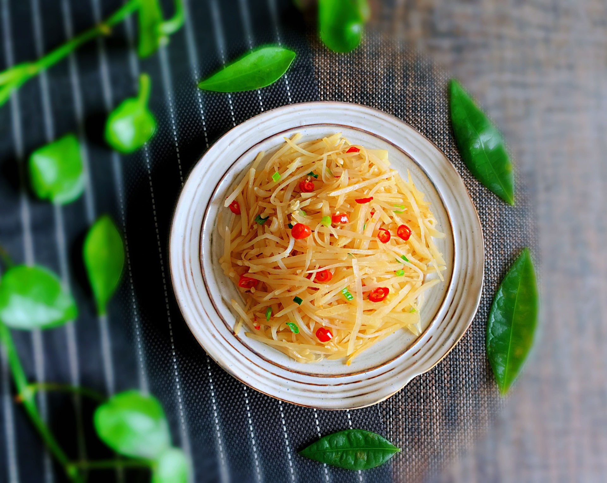

# 酸辣土豆絲 (Hot and Sour Shredded Potatoes)

## 📋 基本資訊 / Recipe Overview
- **料理名稱 (繁體)**：酸辣土豆絲
- **料理名称 (简体)**：酸辣土豆丝
- **English Title**：Hot and Sour Shredded Potatoes with Sichuan Peppercorns and Vinegar
- **素食流派 / Diet**：全素 / 纯素 Vegan (含干辣椒、花椒、蒜；可去蒜做纯净素)
- **料理分類 / Category**：01-蔬菜本味类 / 国民家常 / 酸辣爽脆
- **份量 / Servings**：2-3 人份
- **準備時間 / Prep Time**：8 分鐘
- **烹飪時間 / Cook Time**：3 分鐘
- **總計耗時 / Total Time**：11 分鐘
- **來源 / Source**：现代中华素菜 Top 100 · [01-蔬菜本味类.md](../01-蔬菜本味类.md) 第 36 道

## 📖 菜品特色 / Description
家常素菜之王。去淀粉，干椒花椒醋盐糖快炒，五分钟出锅。

---

## 🌿 食材與調味清單 / Ingredients & Seasonings

### 主料
- 黄心土豆 2 个（约 400g）
- 干红辣椒 4-6 根（剪段，去籽）
- 花椒粒 15 粒
- 大蒜 3 瓣（切蒜片）
- 青红椒丝（选配配色） 各少许

### 黄金酸辣调味汁
- 食用植物油 2 汤匙（约 30ml）
- 白醋 / 香醋 2 汤匙（约 30ml，分两次烹入）
- 食盐 1/2 茶匙（约 3g）
- 白糖 1/3 茶匙（约 1.5g，提鲜柔酸）
- 纯芝麻香油 1/2 茶匙（约 2.5ml）

---

## 🍳 烹飪步驟 / Step-by-Step Cooking Steps

### 步骤 1：刀工切丝与彻底洗去淀粉（脆爽第一定律）
1. 土豆去皮，先切薄片，再切成火柴棍粗细的均匀细丝（手切比擦丝更挺括脆爽）。
2. **三遍洗粉**：切好的土豆丝立即浸入大盆冷水中，用手反复揉洗换水 2-3 次，直至洗出来的水完全清澈见底，捞出彻底沥干水分。

### 步骤 2：花椒干椒炝香底油
1. 炒锅大火烧热，倒入 2 汤匙食用油，下入花椒粒小火炸出麻香后捞出花椒粒（弃去或保留均可）。
2. 下入干红辣椒段和蒜片，爆出呛辣香气。

### 步骤 3：猛火快炒与第一道醋
1. 迅速将火调至**最大极限猛火**，倒入沥干的土豆丝和青红椒丝。
2. 土豆丝入锅翻炒 15 秒后，立即沿滚烫锅边烹入 **第 1 汤匙白醋**（借高温醋蒸汽瞬间锁住土豆丝脆度并去生味）。
3. 保持大火快速颠锅翻炒 1 分钟左右，见土豆丝变得晶莹剔透、刚达断生。

### 步骤 4：第二道醋调味与秒级出锅
1. 撒入 **食盐 1/2 茶匙** 与 **白糖 1/3 茶匙** 颠匀。
2. 沿锅边烹入 **第 2 汤匙香醋/白醋**，淋入少许香油，最大火狂翻 5-8 秒立刻关火出锅。

---

## 💡 大厨秘诀 / Chef's Tips

1. **三遍洗净表面淀粉**：必须洗至水清澈无浑浊，否则下锅受热淀粉糊化粘锅，土豆丝变成糊塌烂泥。
2. **两头醋法酸香有骨**：下锅即烹第一道醋为了“定脆立骨”，起锅再淋第二道醋为了“激发出酸香”，层次立体。
3. **全程猛火速战速决**：下锅到出锅不超过 2 分钟，断生即止，保留土豆丝内部清爽的“咔嚓”脆响。

---
*食谱归档时间：2026-08-20 · 收录于 20260818-vegetarianism 本地菜谱库 (1Top 精选)*
