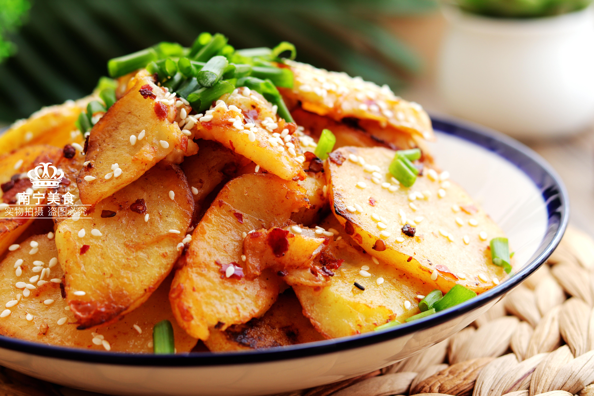

# 醋溜土豆絲 (Vinegar Glazed Shredded Potatoes)

## 📋 基本資訊 / Recipe Overview
- **料理名稱 (繁體)**：醋溜土豆絲
- **料理名称 (简体)**：醋溜土豆丝
- **English Title**：Northern Chinese Vinegar Glazed Shredded Potatoes (Culiu)
- **素食流派 / Diet**：全素 / 纯素 Vegan (含花椒、葱蒜可选；依戒律微调)
- **料理分類 / Category**：01-蔬菜本味类 / 鲁式家常 / 醋香清脆
- **份量 / Servings**：2-3 人份
- **準備時間 / Prep Time**：8 分鐘
- **烹飪時間 / Cook Time**：3 分鐘
- **總計耗時 / Total Time**：11 分鐘
- **來源 / Source**：现代中华素菜 Top 100 · [01-蔬菜本味类.md](../01-蔬菜本味类.md) 第 38 道

## 📖 菜品特色 / Description
偏醋香，与酸辣土豆丝近亲，更清。

---

## 🌿 食材與調味清單 / Ingredients & Seasonings

### 主料
- 黄心土豆 2 个（约 400g）
- 大葱白 1 小段（切细丝）
- 大蒜 2 瓣（切蒜片）
- 花椒粒 10-15 粒

### 鲁式醋溜汁
- 优质山西老陈醋 / 镇江香醋 2.5 汤匙（约 35-40ml）
- 食用油 2 汤匙（约 30ml）
- 优质生抽 1 茶匙（约 5ml，少许调味不宜重色）
- 食盐 1/2 茶匙（约 3g）
- 白糖 1/2 茶匙（约 2.5g，回味甘润）
- 纯芝麻香油 1/2 茶匙（约 2.5ml）

---

## 🍳 烹飪步驟 / Step-by-Step Cooking Steps

### 步骤 1：切丝漂洗与沥干
1. 土豆去皮切成粗细均匀的细丝，放入冷水中浸泡抓洗 2 遍洗去游离淀粉，捞出彻底控干水分。

### 步骤 2：花椒葱蒜激油香
1. 锅烧热倒油，下入花椒粒小火炸出花椒油香后捞去花椒粒。
2. 放入葱丝和蒜片爆香。

### 步骤 3：大火快炒与顺边烹醋
1. 调至大火，下入沥干的土豆丝快速翻炒 30 秒。
2. 沿锅壁四周淋入 **陈醋 1.5 汤匙**，利用高温让醋香充分渗透土豆丝。
3. 加入生抽 1 茶匙、食盐 1/2 茶匙、白糖 1/2 茶匙继续大火翻炒 40 秒至土豆丝呈半透明爽脆状。

### 步骤 4：二次溜醋出锅
1. 起锅前再次顺锅边烹入剩余 **1 汤匙陈醋**，淋入少许香油。
2. 猛火颠锅 5 秒，醋香扑鼻，立即出锅盛盘。

---

## 💡 大厨秘诀 / Chef's Tips

1. **不放辣椒，专注醇厚醋香**：与酸辣土豆丝不同，醋溜土豆丝不以辣夺味，核心在于花椒油香与老陈醋遇热激发的复合酸香。
2. **生抽极少，保持色泽明亮**：生抽仅滴数滴调底味，保持土豆丝金黄透亮或本色清爽。
3. **两遍烹醋，溜出灵魂**：前醋定脆、后醋留香，出锅时热醋气扑鼻，酸而不涩，爽口清脆。

---
*食谱归档时间：2026-08-20 · 收录于 20260818-vegetarianism 本地菜谱库 (1Top 精选)*
