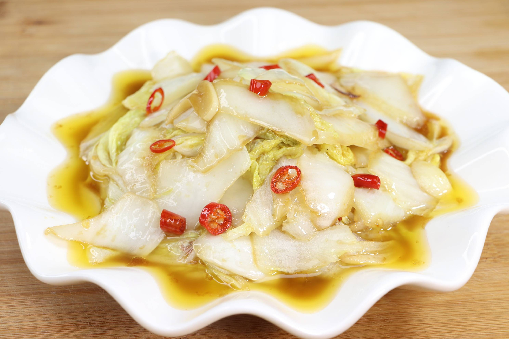

# 醋溜白菜 (Sweet and Sour Chinese Cabbage)

## 📋 基本資訊 / Recipe Overview
- **料理名稱 (繁體)**：醋溜白菜
- **料理名称 (简体)**：醋溜白菜
- **English Title**：Northern Chinese Sweet & Sour Crispy Cabbage (Cu Liu Bai Cai)
- **素食流派 / Diet**：全素 / 纯素 Vegan (含葱姜蒜五辛素；可依戒律去蒜葱做纯净素)
- **料理分類 / Category**：01-蔬菜本味类 / 鲁菜经典 / 传统家常
- **份量 / Servings**：2-3 人份
- **準備時間 / Prep Time**：8 分鐘
- **烹飪時間 / Cook Time**：3 分鐘
- **總計耗時 / Total Time**：11 分鐘
- **來源 / Source**：现代中华素菜 Top 100 · [01-蔬菜本味类.md](../01-蔬菜本味类.md) 第 8 道

## 📖 菜品特色 / Description
鲁菜、东北家常。帮叶分开，醋糖盐干辣椒快炒，酸甜清脆，火候要准。

---

## 🌿 食材與調味清單 / Ingredients & Seasonings

### 主料
- 结球大白菜（以脆嫩白菜帮为主，带少许菜叶） 450g
- 大蒜 3 瓣（切薄片）
- 大葱 1 小段（切马蹄片）
- 生姜 5g（切细丝）
- 干红辣椒 3-4 个（剪小段去籽）
- 大红袍花椒 10 粒

### 灵魂醋溜糖醋芡汁（比例 酱油:醋:糖 = 1:3:2）
- 山西老陈醋 / 镇江香醋 2 汤匙（约 30ml）
- 白砂糖 1.5 汤匙（约 20g）
- 优质生抽 1 汤匙（约 15ml）
- 食盐 1/2 茶匙（约 3g）
- 玉米淀粉 1 茶匙（约 5g）
- 清水 / 素高汤 2 汤匙（约 30ml）

### 烹调油与锅边醋
- 植物油 2 汤匙（约 30ml）
- 香醋（起锅锅边烹入） 1/2 茶匙（约 2.5ml）
- 芝麻香油 1/2 茶匙（约 2.5ml）

---

## 🍳 烹飪步驟 / Step-by-Step Cooking Steps

### 步骤 1：白菜斜刀片帮与手撕叶
1. 白菜洗净，将白菜叶与白菜帮彻底切开分开。
2. **斜刀片帮（刀工关键）**：菜刀与砧板呈 30 度角，将白菜帮斜刀片成大薄片（片切能切断粗纤维，受热面积大且极易吸附酸甜芡汁）。
3. 白菜叶用手撕成大片备用。

### 步骤 2：调制黄金糖醋碗汁
1. 取小碗，加入陈醋 2 汤匙、白糖 1.5 汤匙、生抽 1 汤匙、食盐 1/2 茶匙、玉米淀粉 1 茶匙和清水 2 汤匙。
2. 充分搅拌均匀，使糖盐完全融化，调匀成芡汁备用（提前调汁避免炒菜时手忙脚乱）。

### 步骤 3：花椒炝油与爆香底料
1. 炒锅烧热，倒入 2 汤匙植物油，先下花椒粒小火慢炸出浓郁椒香，捞出花椒粒弃之不要（留花椒香油）。
2. 转中火下葱片、姜丝、蒜片和干红辣椒段，煸炒 5 秒爆出复合香气。

### 步骤 4：大火猛炒与烹汁
1. 转**最大猛火**，先倒入切好的白菜帮，大火快速翻炒 40 秒，至白菜帮边缘微微软化、呈半透明油润状。
2. 下入白菜叶，快速翻炒 15 秒使菜叶受热断生。
3. 重新搅匀碗汁，沿锅边一圈淋入锅中，大火快速翻炒颠锅 10 秒，使芡汁迅速糊化并紧密包裹在每一片白菜上。
4. 关火前沿锅边淋入半茶匙陈醋（锅边醋激香）和香油，颠翻两下立刻出锅装盘。

---

## 💡 大厨秘诀 / Chef's Tips

1. **斜刀片白菜帮**：斜刀片刀法（坡刀片）增大了截面，使脆硬的白菜帮受热均匀且外脆内嫩，汁水丰盈。
2. **分段下锅保脆**：白菜帮与叶含水率和熟化时间不同，先帮后叶才能做到帮脆叶嫩。
3. **两头醋技法**：碗汁中加醋定酸甜底味，出锅前沿滚烫锅边烹入微量陈醋激发出扑鼻醋香，酸而不呛。

---
*食谱归档时间：2026-08-20 · 收录于 20260818-vegetarianism 本地菜谱库 (1Top 精选)*
