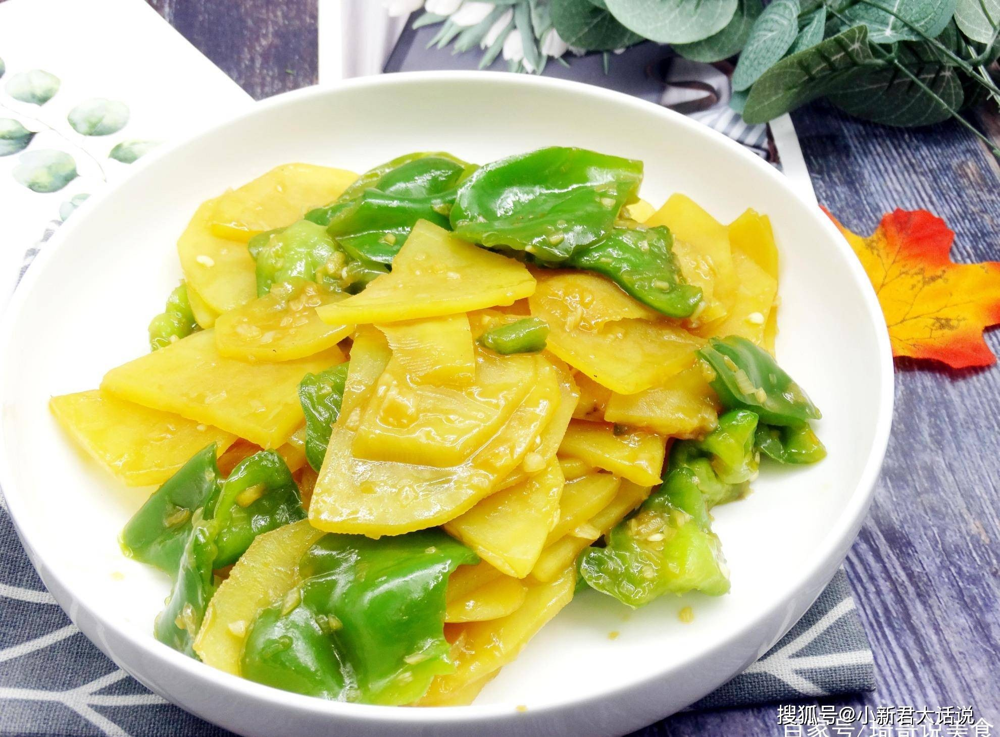

# 青椒土豆片 (Stir-Fried Potato Slices with Green Peppers)

## 📋 基本資訊 / Recipe Overview
- **料理名稱 (繁體)**：青椒土豆片
- **料理名称 (简体)**：青椒土豆片
- **English Title**：Homestyle Stir-Fried Potato Slices with Green Pepper and Garlic
- **素食流派 / Diet**：全素 / 纯素 Vegan (含蒜；可去蒜做纯净素)
- **料理分類 / Category**：01-蔬菜本味类 / 家常经典 / 咸香微辣
- **份量 / Servings**：2-3 人份
- **準備時間 / Prep Time**：8 分鐘
- **烹飪時間 / Cook Time**：5 分鐘
- **總計耗時 / Total Time**：13 分鐘
- **來源 / Source**：现代中华素菜 Top 100 · [01-蔬菜本味类.md](../01-蔬菜本味类.md) 第 37 道

## 📖 菜品特色 / Description
全国高频。青椒配土豆片，咸香微辣。

---

## 🌿 食材與調味清單 / Ingredients & Seasonings

### 主料
- 土豆 2 个（约 350g）
- 绿尖椒或薄皮青椒 2 个（约 100g，切斜片）
- 大蒜 3 瓣（切片）
- 生姜 1 片（切细丝）
- 干红辣椒 2 根（切段）

### 家常咸香调味料
- 食用油 2 汤匙（约 30ml）
- 优质生抽 1.5 汤匙（约 22.5ml）
- 素蚝油 1/2 汤匙（约 7.5ml）
- 食盐 1/2 茶匙（约 2.5g）
- 白糖 1/4 茶匙（约 1g）
- 纯芝麻香油 1/2 茶匙（约 2.5ml）

---

## 🍳 烹飪步驟 / Step-by-Step Cooking Steps

### 步骤 1：土豆片切配与过水
1. 土豆去皮切成约 2 毫米厚的均匀薄片。
2. 放入清水中漂洗一遍洗掉多余淀粉，捞出沥干（保留微量淀粉可使土豆片炒后油润微糯且不易粘锅）。

### 步骤 2：煸炒土豆片至透明微焦
1. 锅热倒入食用油，先下入土豆片，中火翻炒 2-3 分钟。
2. 炒至土豆片边缘微焦黄、质地转为微透明熟软时盛出。

### 步骤 3：爆香与合炒
1. 原锅留底油，下入姜丝、蒜片和干辣椒段炒出香味。
2. 下入青椒片大火翻炒 30 秒至青椒断生散发出清甜辣香。
3. 倒入炒好的土豆片合锅翻炒。

### 步骤 4：调味收汁装盘
1. 淋入生抽 1.5 汤匙、素蚝油 1/2 汤匙、食盐 1/2 茶匙和白糖 1/4 茶匙。
2. 大火快速颠翻 15 秒使酱汁均匀裹在土豆片与青椒上，淋入香油即可出锅。

---

## 💡 大厨秘诀 / Chef's Tips

1. **厚薄均匀 2 毫米**：切片均匀才能保证同锅受热成熟一致，避免有的夹生有的散碎。
2. **先煸后炒焦香四溢**：土豆片先在锅中慢煸至半透明带微焦斑，口感既糯又香，吸收青椒清甜汁水后极其下饭。
3. **青椒快炒保留脆嫩**：青椒不可久炒，大火翻炒数十秒断生即可，保留清脆爽口与鲜艳碧绿。

---
*食谱归档时间：2026-08-20 · 收录于 20260818-vegetarianism 本地菜谱库 (1Top 精选)*
