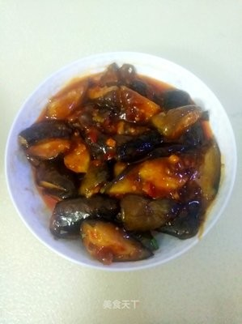

# 魚香茄子（素） (Vegetarian Yu-Shiang Eggplant)

## 📋 基本資訊 / Recipe Overview
- **料理名稱 (繁體)**：魚香茄子（素）
- **料理名称 (简体)**：鱼香茄子（素）
- **English Title**：Sichuan Vegetarian Fish-Fragrant Eggplant (Yuxiang Eggplant)
- **素食流派 / Diet**：全素 / 纯素 Vegan (含葱姜蒜、川味豆瓣酱；可依戒律去五辛)
- **料理分類 / Category**：01-蔬菜本味类 / 川味经典 / 酸甜微辣
- **份量 / Servings**：2-3 人份
- **準備時間 / Prep Time**：10 分鐘
- **烹飪時間 / Cook Time**：8 分鐘
- **總計耗時 / Total Time**：18 分鐘
- **來源 / Source**：现代中华素菜 Top 100 · [01-蔬菜本味类.md](../01-蔬菜本味类.md) 第 30 道

## 📖 菜品特色 / Description
川味。茄条煎软，豆瓣酱糖醋生抽鱼香汁，无鱼也下饭。

---

## 🌿 食材與調味清單 / Ingredients & Seasonings

### 主料
- 紫长茄子 2-3 根（约 400g）
- 四川红油郫县豆瓣酱 1 汤匙（约 15g，剁细碎）
- 大蒜 5 瓣（剁碎末）
- 生姜 1 块（约 10g，剁碎末）
- 葱花（或香芹碎） 1 汤匙（约 10g）
- 泡红辣椒（选配，正宗川味必备） 2 根（剁细泥）

### 黄金鱼香调味汁（万能比例）
- 优质生抽 1.5 汤匙（约 22.5ml）
- 镇江香醋 / 保宁醋 1.5 汤匙（约 22.5ml）
- 白砂糖 1.5 汤匙（约 20g，糖醋 1:1 经典比例）
- 素蚝油 / 香菇酱油 1/2 汤匙（约 7.5ml）
- 玉米淀粉 1 茶匙（约 5g）
- 清水 4 汤匙（约 60ml）

### 煎制用油
- 食用油 2-3 汤匙（约 35ml）

---

## 🍳 烹飪步驟 / Step-by-Step Cooking Steps

### 步骤 1：茄条切配与盐渍脱水
1. 长茄子洗净，切成长约 6-7 厘米、宽约 1.5 厘米的长条。
2. 茄条放入盆中撒入 **1/2 茶匙食盐** 抓匀，静置 8 分钟。
3. 挤出茄条中析出的深色水分（脱水后茄肉紧实，下锅不吸油且熟得更快）。

### 步骤 2：煎软茄条
1. 锅中倒入 2 汤匙食用油烧热，下入挤干水分的茄条。
2. 保持中大火翻煎 3-4 分钟，直到茄条变软、表面微金黄透明，盛出控油。

### 步骤 3：炒香川味红油豆瓣
1. 原锅底留 1 汤匙油，转小火，下入剁碎的郫县豆瓣酱（和泡椒泥），慢火煸炒 30 秒炒出红亮红油与浓郁酱香。
2. 加入姜末和一半蒜末，继续小火炒出辛香味。

### 步骤 4：合味收浓鱼香汁
1. 将煎好的茄条重新倒入锅中，与红油豆瓣翻炒均匀上色。
2. 搅拌均匀调好的黄金鱼香汁，顺着锅边一圈淋入。
3. 大火烧开，让鱼香汁在沸腾中渗透进软糯茄肉，翻炒至芡汁晶亮紧裹茄条。
4. 起锅前撒入剩余蒜末和葱花，翻颠两下出锅。

---

## 💡 大厨秘诀 / Chef's Tips

1. **鱼香调味精髓**：“鱼香无鱼”，全靠泡椒/豆瓣酱与葱姜蒜、糖醋按比例调和，糖与醋的 1:1 达到酸甜微辣、回味绵长的复合味型。
2. **豆瓣酱必须小火剁碎慢炒**：豆瓣酱剁碎能使红油充分溢出，小火慢煸去生味出酱香，才能让菜品色泽红润诱人。
3. **先盐渍挤水省油法**：挤出茄子细胞间隙的水分，煎炒时油脂无法渗入，既省油软糯又健康清爽。

---
*食谱归档时间：2026-08-20 · 收录于 20260818-vegetarianism 本地菜谱库 (1Top 精选)*
