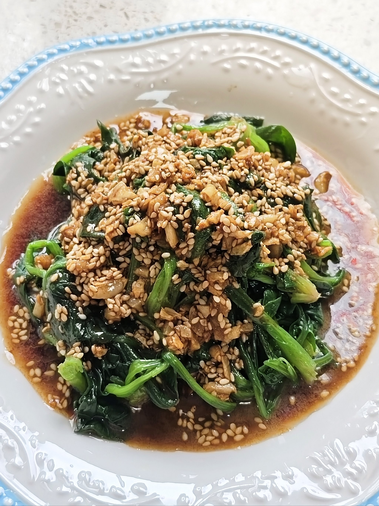

# 麻醬拌菠菜 (Cold Spinach with Sesame Sauce)

## 📋 基本資訊 / Recipe Overview
- **料理名稱 (繁體)**：麻醬拌菠菜
- **料理名称 (简体)**：麻酱拌菠菜
- **English Title**：Northern Chinese Chilled Spinach Tower with Savory Sesame Dressing & Peanuts
- **素食流派 / Diet**：全素 / 纯素 Vegan (含蒜五辛素；可依戒律去蒜做纯净素)
- **料理分類 / Category**：01-蔬菜本味类 / 北方凉菜 / 传统清供
- **份量 / Servings**：2-3 人份
- **準備時間 / Prep Time**：10 分鐘
- **烹飪時間 / Cook Time**：2 分鐘
- **總計耗時 / Total Time**：12 分鐘
- **來源 / Source**：现代中华素菜 Top 100 · [01-蔬菜本味类.md](../01-蔬菜本味类.md) 第 20 道

## 📖 菜品特色 / Description
北方凉菜。焯水切段，芝麻酱花生碎，清爽有分量。

---

## 🌿 食材與調味清單 / Ingredients & Seasonings

### 主料
- 新鲜菠菜 400g
- 熟花生碎 2 汤匙（约 20g，增香酥脆）
- 熟白芝麻 1 茶匙（约 3g）
- 大蒜 3 瓣（捣成细腻蒜泥）

### 黄金浓香麻酱汁
- 纯芝麻酱 2 汤匙（约 30g）
- 温开水 2-3 汤匙（约 30-45ml，化开麻酱用）
- 优质生抽 1 汤匙（约 15ml）
- 陈醋 / 米醋 1/2 汤匙（约 7.5ml）
- 白砂糖 1/2 茶匙（约 2.5g）
- 食盐 1/3 茶匙（约 2g）
- 芝麻香油 1/2 茶匙（约 2.5ml）

---

## 🍳 烹飪步驟 / Step-by-Step Cooking Steps

### 步骤 1：菠菜焯水与挤干
1. 菠菜洗净，锅中大火烧开宽水，加少许盐和油。
2. 放入菠菜焯烫 30 秒至软绿断生，捞出迅速投入纯净凉水中过凉。
3. 捞出菠菜，用双手用力攥干多余水分，切成 3-4cm 长的小段。

### 步骤 2：完美调和澥麻酱
1. 碗中放入纯芝麻酱 2 汤匙。
2. 分 3-4 次少量加入温开水，用筷子顺一个方向不断搅拌，将芝麻酱由浓稠搅至顺滑如酸奶状。
3. 加入蒜泥、生抽 1 汤匙、醋 1/2 汤匙、白糖 1/2 茶匙、食盐 1/3 茶匙与香油 1/2 茶匙，彻底搅拌均匀成咸香浓稠的麻酱汁。

### 步骤 3：定型造型与淋酱
1. 将切段的菠菜放入小圆碗或圆柱形模具中，用勺背轻轻压实。
2. 倒扣在盘子正中央，轻轻取下模具，形成挺拔精致的菠菜塔造型。
3. 将调好的香浓麻酱汁均匀浇淋在菠菜塔顶部，任其自然顺着边缘流淌。

### 步骤 4：点缀上桌
1. 在麻酱汁顶端撒上香脆的熟花生碎和熟白芝麻点缀即可。

---

## 💡 大厨秘诀 / Chef's Tips

1. **温水分次澥麻酱**：必须少量多次加入温水朝同方向搅打，麻酱才能乳化顺滑且挂汁牢固。
2. **菠菜充分挤干水分**：水分未挤干会稀释麻酱导致水酱分离，挤干后的菠菜才能吸饱醇厚酱香。
3. **模具倒扣提升宴席质感**：圆筒倒扣定型美观大方，花生碎提供坚果油脂脆感，口感层次极为丰富。

---
*食谱归档时间：2026-08-20 · 收录于 20260818-vegetarianism 本地菜谱库 (1Top 精选)*
