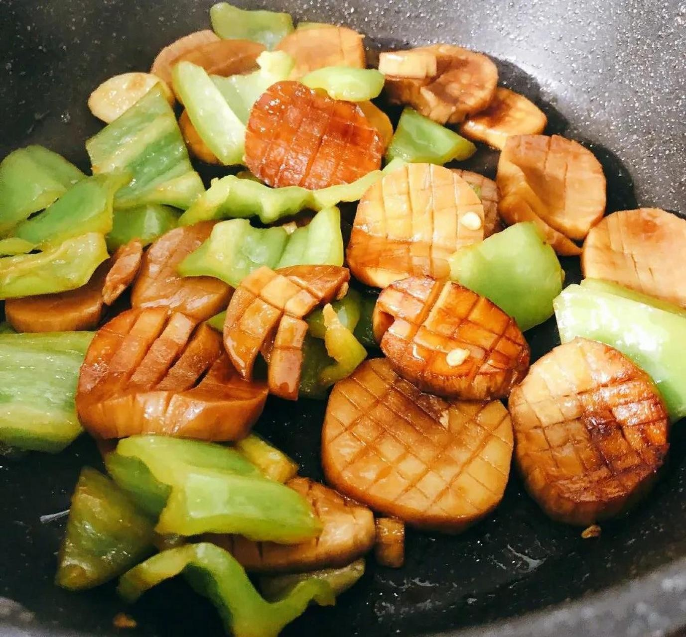

# 三杯杏鮑菇 (Taiwanese Three-Cup King Oyster Mushrooms with Basil)

## 📋 基本資訊 / Recipe Overview
- **料理名稱 (繁體)**：三杯杏鮑菇
- **料理名称 (简体)**：三杯杏鲍菇
- **English Title**：Taiwanese Three-Cup King Oyster Mushrooms with Basil
- **素食流派 / Diet**：全素 / 纯素 Vegan (纯净素 / 无五辛；若食五辛可加大蒜粒；无酒精者可用素高汤替代米酒)
- **料理分類 / Category**：02-菌菇山珍类 / 台闽风味 / 砂锅浓汁
- **份量 / Servings**：2-3 人份
- **準備時間 / Prep Time**：10 分鐘
- **烹飪時間 / Cook Time**：12 分鐘
- **總計耗時 / Total Time**：22 分鐘
- **來源 / Source**：现代中华素菜 Top 100 · [02-菌菇山珍类.md](../02-菌菇山珍类.md) 第 26 道

## 📖 菜品特色 / Description
黑麻油、酱油、米酒与九层塔三杯酱汁焖杏鲍，台闽风味。

---

## 🌿 食材與調味清單 / Ingredients & Seasonings
### 主料
- 鲜嫩杏鲍菇 3 根（约 350g）

### 灵魂配料
- 新鲜九层塔（罗勒叶） 1 大把（约 20g）
- 老姜 1 大块（约 25g，切厚片）
- 红辣椒 1 根（斜切厚圈，配色增微辣）

### 黄金三杯酱汁
- 纯正台湾黑麻油 2 汤匙（30ml，分前后两次下）
- 纯酿造生抽 2 汤匙（30ml）
- 台湾红标料理米酒 2 汤匙（30ml，纯素无醇者用素高汤加 1/2 茶匙苹果醋替代）
- 优质老抽 1/2 茶匙（2.5ml，增添酱红光泽）
- 单晶冰糖 1 汤匙（约 12g）
- 植物油 1 汤匙（15ml，辅助煸姜防焦）

---

## 🍳 烹飪步驟 / Step-by-Step Cooking Steps
### 步骤 1：杏鲍菇改刀与干煸
1. 杏鲍菇洗净擦干，切成约 2.5cm 大小的滚刀块，在较厚切面上划浅十字花刀。
2. 炒锅烧热不放油，放入杏鲍菇块中火干煸 2-3 分钟，逼出菇体内部多余水分，至表面微微发黄变软，盛出备用。

### 步骤 2：黑麻油慢火煸透老姜
1. 砂锅或炒锅中倒入 1 汤匙植物油和 1 汤匙黑麻油（麻油与调和油混合可提高烟点）。
2. 放入老姜厚片，保持极小火慢慢煸炒 3-4 分钟。
3. 煸至姜片边缘微微卷曲、起皱并呈金黄色，彻底逼出老姜的深层辛香。

### 步骤 3：下菇翻炒与三杯慢煨
1. 倒入煸过的杏鲍菇块和红辣椒圈，转中火与姜片翻炒均匀。
2. 倒入米酒 2 汤匙、生抽 2 汤匙、老抽 1/2 茶匙和冰糖 1 汤匙，翻炒至冰糖融化。
3. 加盖转小火焖煨 5-6 分钟，中途翻动一次，让杏鲍菇充分吸饱三杯酱汁。

### 步骤 4：大火收浓汁与九层塔焖香
1. 揭开锅盖转大火，快速翻炒收汁，直至酱汁浓稠红亮、紧紧挂在每一颗杏鲍菇块上。
2. 沿锅边淋入剩余的 1 汤匙黑麻油提亮增香。
3. 投入洗净擦干的新鲜九层塔，立即盖上锅盖关火，利用砂锅余温焖 15-20 秒，开盖香气扑鼻即可上桌。

---

## 💡 大厨秘诀 / Chef's Tips
1. **黑麻油煸姜防焦苦**：黑麻油不耐极高温，先用少量植物油混合黑麻油极小火煸老姜，出锅前再补一勺生麻油，香气醇正绝不发苦。
2. **老姜煸至卷曲金黄**：三杯菜的灵魂在于煸透的老姜片，必须煸至干扁起皱，姜香味方能完全融于麻油与酱汁中。
3. **九层塔关火余温焖透**：九层塔遇长时间高温会变黑且香气挥发，必须在起锅关火最后一瞬下锅加盖焖香，保持翠绿与芳香。

---
*食谱归档时间：2026-08-21 · 收录于 20260818-vegetarianism 本地菜谱库 (1Top 精选)*
