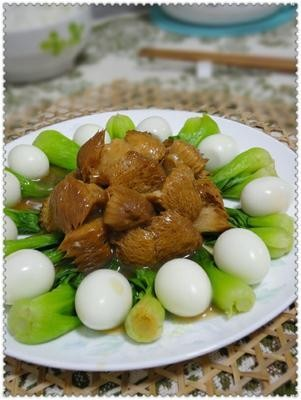

# 三杯猴頭菇 (Taiwanese Three-Cup Lion's Mane Mushrooms with Ginger and Basil)

## 📋 基本資訊 / Recipe Overview
- **料理名稱 (繁體)**：三杯猴頭菇
- **料理名称 (简体)**：三杯猴头菇
- **English Title**：Taiwanese Three-Cup Lion's Mane Mushrooms with Ginger and Basil
- **素食流派 / Diet**：全素 / 纯素 Vegan (纯净素 / 无五辛；若食五辛可加大蒜粒；无酒精者可用素高汤替代米酒)
- **料理分類 / Category**：02-菌菇山珍类 / 台闽珍馔 / 砂锅浓香
- **份量 / Servings**：2-3 人份
- **準備時間 / Prep Time**：30 分鐘 (含泡发去苦)
- **烹飪時間 / Cook Time**：15 分鐘
- **總計耗時 / Total Time**：45 分鐘
- **來源 / Source**：现代中华素菜 Top 100 · [02-菌菇山珍类.md](../02-菌菇山珍类.md) 第 28 道

## 📖 菜品特色 / Description
炸或煎猴头菇，麻油姜九层塔三杯汁慢煨透味。

---

## 🌿 食材與調味清單 / Ingredients & Seasonings
### 主料
- 优质干猴头菇 4 朵（约 60g，泡发去苦挤干后约 250g）

### 爆香配料
- 老姜 1 大块（约 30g，切厚片）
- 新鲜九层塔（罗勒） 1 大把（约 20g）
- 红辣椒 1 根（切斜段）

### 预处理拍粉
- 玉米淀粉 1.5 汤匙（20g）
- 纯酿生抽 1 茶匙（5ml）
- 白胡椒粉 1/4 茶匙（1g）

### 黄金三杯调味汁
- 台湾纯黑麻油 2 汤匙（30ml，分次加入）
- 纯酿造生抽 2 汤匙（30ml）
- 台湾红标米酒 2 汤匙（30ml，纯素无醇者用素高汤替代）
- 优质老抽 1 茶匙（5ml，增添酱色）
- 单晶冰糖 1 汤匙（12g）
- 纯素高汤 / 清水 100ml
- 植物油 1 汤匙（15ml）

---

## 🍳 烹飪步驟 / Step-by-Step Cooking Steps
### 步骤 1：猴头菇温水去苦泡发（核心步骤）
1. 干猴头菇用清水抓洗去浮尘，放入 40-50℃ 温水中，加入 1/2 茶匙红糖与 1 茶匙淀粉，上面压一个重盘确保完全浸没泡软 20 分钟。
2. 捞出用剪刀彻底剪掉根部发黑、发硬的**黑色蒂头**（苦味最主要来源）。
3. 放入清水中，像海绵一样反复抓揉、用力挤干黄色苦水，换水 **重复抓洗挤压 6-7 遍**，直到挤出的水变得清澈透明无一丝黄色。
4. 用力挤干多余水分，手撕成适口的大块朵状。

### 步骤 2：底味微腌与香煎定型
1. 撕好的猴头菇放入碗中，加入生抽 1 茶匙与白胡椒粉抓拌入底味，薄薄拍上一层玉米淀粉。
2. 平底锅倒入 1 汤匙植物油烧热，放入猴头菇块中小火慢煎 2-3 分钟，至两面焦黄微脆，锁住内部结构，盛出备用。

### 步骤 3：黑麻油慢煸老姜片
1. 砂锅或深炒锅烧热，倒入 1 汤匙植物油和 1 汤匙黑麻油。
2. 放入老姜厚片，极小火慢煸 3-4 分钟，至姜片边缘微微卷曲、金黄起皱，散发深层姜香。
3. 放入红辣椒段翻炒片刻。

### 步骤 4：三杯慢煨与透味
1. 倒入煎好的猴头菇块，转中火翻炒片刻。
2. 倒入米酒 2 汤匙、生抽 2 汤匙、老抽 1 茶匙、冰糖 1 汤匙和素高汤 100ml。
3. 大火烧开后加盖，转小火慢煨 6-8 分钟，让猴头菇像海绵一样将三杯浓郁汤汁吸饱吸透。

### 步骤 5：收汁与九层塔加盖焖香
1. 开盖转大火收汁，翻炒至汤汁浓稠红亮、紧裹在猴头菇表面。
2. 沿锅边淋入剩余的 1 汤匙黑麻油，投入彻底擦干的九层塔叶片。
3. 立即盖上锅盖关火，利用砂锅余温焖 20 秒，开盖即可热气腾腾上桌。

---

## 💡 大厨秘诀 / Chef's Tips
1. **猴头菇彻底去苦绝招**：剪尽黑色硬蒂，温水加淀粉反复揉搓挤压 6-7 次至水清无黄色，这是成菜清甜回甘不带任何苦涩的唯一关键。
2. **拍粉轻煎锁住形体**：去水后的猴头菇拍薄粉微煎，既能在煨煮时锁住弹性不软烂，又能形成微孔吸附浓郁酱汁，仿若多汁鲍鱼。
3. **黑麻油分次与九层塔余温**：黑麻油前半段低火煸姜，后半段起锅补香；九层塔关火余温焖透，芳香清雅碧绿。

---
*食谱归档时间：2026-08-21 · 收录于 20260818-vegetarianism 本地菜谱库 (1Top 精选)*
