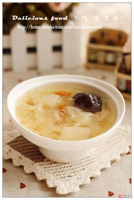

# 冰糖银耳 (Rock Sugar Stewed Tremella Soup)

## 📋 基本資訊 / Recipe Overview
- **料理名稱 (繁體)**：冰糖銀耳
- **料理名称 (简体)**：冰糖银耳
- **English Title**：Rock Sugar Stewed Tremella Soup (Crystal White Fungus Sweet Soup)
- **素食流派 / Diet**：全素 / 纯素 Vegan (纯素纯净甜品)
- **料理分類 / Category**：02-菌菇山珍类 / 润燥甜羹 / 晶莹滑爽
- **份量 / Servings**：2-3 人份
- **準備時間 / Prep Time**：2 小時（泡发时间）+ 5 分鐘
- **烹飪時間 / Cook Time**：35 分鐘
- **總計耗時 / Total Time**：40 分鐘（不含泡发）
- **來源 / Source**：现代中华素菜 Top 100 · [02-菌菇山珍类.md](../02-菌菇山珍类.md) 第 16 道

## 📖 菜品特色 / Description
银耳冰糖炖，最简润燥甜汤。

---

## 🌿 食材與調味清單 / Ingredients & Seasonings
### 主料
- 优质椴木银耳 / 丑耳 1 朵（干重约 18-20g）
- 宁夏枸杞 10-15 粒（洗净点缀）

### 调味料 / 配料
- 多晶黄老冰糖 35-45g
- 纯净水 1100ml-1200ml

---

## 🍳 烹飪步驟 / Step-by-Step Cooking Steps
### 步骤 1：银耳泡发与精细撕碎
1. 银耳冷水浸泡 2 小时泡透，彻底去净黄色硬根，用手细细撕成均匀的小碎花。

### 步骤 2：足量清水大火煮沸
1. 砂锅或养生壶中注入纯净水 1100ml，冷水下入撕碎的银耳，大火烧开。

### 步骤 3：小火慢熬出晶莹胶质
1. 水沸后用汤勺顺时针用力搅拌 20 秒，转小火慢炖 30 分钟，使银耳汤变得浓稠透亮、晶莹如燕窝。

### 步骤 4：化入冰糖撒枸杞焖化
1. 加入黄冰糖搅拌至完全融化，继续慢煨 5 分钟。
2. 关火前下入枸杞焖 2 分钟即可盛入白瓷碗中。

---

## 💡 大厨秘诀 / Chef's Tips
1. **纯粹极简，贵在选材**：冰糖银耳配料最纯，以优质丑耳为佳，汤色晶莹、胶质稠滑、入口即化。
2. **黄冰糖清甜润肺**：选用未脱色精炼的多晶老黄冰糖，清甜不齁喉，能最大程度烘托银耳的清润本味。
3. **冷热皆宜**：刚炖好温热饮用最是润燥暖胃；夏日冰镇后胶质凝稠如冻，清凉消暑。

---
*食谱归档时间：2026-08-21 · 收录于 20260818-vegetarianism 本地菜谱库 (1Top 精选)*
