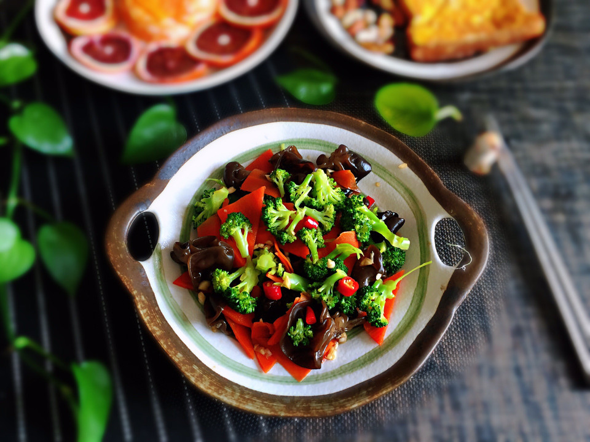

# 凉拌木耳 (Chinese Cold Black Fungus Salad)

## 📋 基本資訊 / Recipe Overview
- **料理名稱 (繁體)**：涼拌木耳
- **料理名称 (简体)**：凉拌木耳
- **English Title**：Chinese Cold Black Fungus Salad
- **素食流派 / Diet**：全素 / 纯素 Vegan (含大蒜；纯净素可去蒜，改用生姜末或纯花椒油调味)
- **料理分類 / Category**：02-菌菇山珍类 / 经典凉拌 / 酸辣爽脆
- **份量 / Servings**：2-3 人份
- **準備時間 / Prep Time**：1 小時（泡发时间）+ 8 分鐘
- **烹飪時間 / Cook Time**：3 分鐘
- **總計耗時 / Total Time**：11 分鐘（不含泡发）
- **來源 / Source**：现代中华素菜 Top 100 · [02-菌菇山珍类.md](../02-菌菇山珍类.md) 第 9 道

## 📖 菜品特色 / Description
泡发焯水，蒜醋生抽辣椒油香菜，爽脆开胃。

---

## 🌿 食材與調味清單 / Ingredients & Seasonings
### 主料
- 优质干黑木耳 / 小碗耳 30g（干重，泡发后约 250g，肉厚紧实）

### 调味料 / 配料
- 大蒜 4-5 瓣（压成蒜泥）
- 小米辣 2 根（切小圈）
- 新鲜香菜 2 根（切段）
- 熟白芝麻 1 茶匙
- 优质陈醋 / 香醋 2 汤匙（约 30ml）
- 优质生抽 1.5 汤匙（约 22.5ml）
- 白糖 1/2 汤匙（约 7.5g，柔和酸味提鲜）
- 食盐 1/3 茶匙（约 2g）
- 花椒油 1 茶匙（约 5ml）
- 红油辣椒 1 汤匙（约 15ml）
- 芝麻香油 1/2 茶匙
- 热植物油 1.5 汤匙（用于激香蒜蓉）

---

## 🍳 烹飪步驟 / Step-by-Step Cooking Steps
### 步骤 1：凉水泡发与细致清洗
1. 干木耳用凉水加入 1/2 茶匙白糖浸泡 1-2 小时至充分舒展，剪去根部硬蒂，抓洗干净泥沙。

### 步骤 2：精准焯水与冰水镇凉
1. 锅中水烧大沸，下入木耳焯烫 1.5-2 分钟断生。
2. 捞出立即投入冰水中浸泡 3 分钟，彻底捞出控干水分。

### 步骤 3：调制黄金酸辣蒜香汁
1. 小碗中放入蒜泥、小米辣圈、熟白芝麻，淋入 1.5 汤匙烧热的植物油激出浓郁香气。
2. 随后加入陈醋、生抽、白糖、盐、花椒油、红油辣椒和香油搅拌均匀。

### 步骤 4：浇汁拌匀与冷藏腌味
1. 将沥干的木耳放入大碗中，加入香菜段。
2. 倒入调好的秘制凉拌汁充分抓拌均匀，放入冰箱冷藏 15 分钟后食用口感更佳。

---

## 💡 大厨秘诀 / Chef's Tips
1. **冷水加糖泡发更厚脆**：切忌用热水或开水泡发木耳，热水会烫坏组织导致软烂无脆感；冷水加少许白糖可加速细胞吸水且保持木耳肥厚脆韧。
2. **焯水 2 分钟迅速冰镇是爽脆核心**：木耳不可久煮，水沸焯 1.5-2 分钟杀菌去生味后立即投冰水，利用热胀冷缩使木耳瞬间紧缩，产生清脆弹牙的“嘎嘣脆”口感。
3. **热油激蒜香与控干水分**：木耳表面水分必须彻底控干，否则会稀释酱汁味道；用滚油泼蒜泥和小米辣能彻底激出香味，酸辣浓醇。

---
*食谱归档时间：2026-08-21 · 收录于 20260818-vegetarianism 本地菜谱库 (1Top 精选)*
