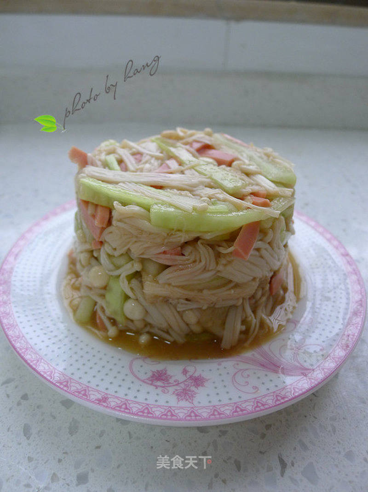

# 涼拌金針菇 (Cold Dressed Enoki Mushrooms in Garlic Chili Sauce)

## 📋 基本資訊 / Recipe Overview
- **料理名稱 (繁體)**：涼拌金針菇
- **料理名称 (简体)**：凉拌金针菇
- **English Title**：Cold Dressed Enoki Mushrooms in Garlic Chili Sauce
- **素食流派 / Diet**：五辛素 (含大蒜；纯素无五辛者可用生姜末加花椒油替代)
- **料理分類 / Category**：02-菌菇山珍类 / 凉拌开胃 / 爽脆滑嫩
- **份量 / Servings**：2-3 人份
- **準備時間 / Prep Time**：10 分鐘
- **烹飪時間 / Cook Time**：3 分鐘
- **總計耗時 / Total Time**：13 分鐘
- **來源 / Source**：现代中华素菜 Top 100 · [02-菌菇山珍类.md](../02-菌菇山珍类.md) 第 40 道

## 📖 菜品特色 / Description
焯水过凉蒜蓉剁椒香油拌，爽脆滑嫩。

---

## 🌿 食材與調味清單 / Ingredients & Seasonings
### 主料
- 新鲜金针菇 300g

### 爽脆配色辅料
- 水果黄瓜半根（切极细丝，约 60g）
- 胡萝卜 1/3 根（切细丝，约 30g）
- 大蒜 5 瓣（剁成细蒜末，约 20g）
- 小米辣 2 根（切细圈）
- 熟白芝麻 1 茶匙（3g）
- 新鲜香菜 1 根（切小段）

### 黄金灵魂凉拌汁
- 优质生抽 2 汤匙（30ml）
- 镇江香醋 / 陈醋 1.5 汤匙（22ml）
- 白糖 1 茶匙（5g，中和酸辣提鲜）
- 素蚝油 1/2 汤匙（7.5g）
- 秘制红油辣椒油 1 汤匙（15ml）
- 纯芝麻香油 1 茶匙（5ml）
- 滚烫热植物油 1 汤匙（15ml，激发出蒜蓉辣椒香味）

---

## 🍳 烹飪步驟 / Step-by-Step Cooking Steps
### 步骤 1：金针菇改刀撕散与配菜准备
1. 金针菇切除根部约 2cm 紧结部分，洗净后用手撕成细小撮（撕散利于受热均匀与入味）。
2. 黄瓜洗净切成极细丝；胡萝卜去皮切细丝；大蒜剁细末；小米辣切小圈。

### 步骤 2：精准焯水与冰水过凉（爽脆核心）
1. 锅中加入足量清水大火烧沸，加入食盐 1/2 茶匙与植物油 3 滴（保持金针菇光泽挺拔）。
2. 放入撕散的金针菇，大火焯烫 **45 至 60 秒** 至断生（切勿超时！）。
3. 捞出金针菇，**立即投入准备好的冰水（或凉开水）中**浸泡 1 分钟彻底降温。
4. 彻底冷却后捞出，用手轻轻攥干水分备用（不可过分用力捏碎）。

### 步骤 3：热油激香与调配料汁
1. 取调料碗，放入蒜末、小米辣圈、熟白芝麻。
2. 锅中将 1 汤匙植物油烧至八成热（冒青烟），迅速浇在蒜末与辣椒上，“呲啦”一声激发出浓郁蒜香与焦辣香。
3. 随后加入生抽 2 汤匙、香醋 1.5 汤匙、白糖 1 茶匙、素蚝油 1/2 汤匙、辣椒油 1 汤匙与芝麻香油 1 茶匙，彻底搅拌均匀成灵魂凉拌汁。

### 步骤 4：合拌装盘与冷藏风味
1. 大碗中放入攥干的金针菇、黄瓜丝、胡萝卜丝和香菜段。
2. 倒入调好的灵魂料汁，戴上一次性手套抓拌均匀，使每一根金针菇充分挂满料汁。
3. 盛入盘中即可开动（若放入冰箱冷藏 15 分钟后再食用，口感更加冰爽脆嫩、酸辣入味）。

---

## 💡 大厨秘诀 / Chef's Tips
1. **焯水严格控制 45-60 秒 + 冰水过凉**：金针菇焯水时间过长会绵软塞牙，45秒断生立即投冰水降温，能瞬间锁住细胞脆度，爽脆滑嫩。
2. **轻攥挤水防稀释**：过凉后轻轻攥去多余水分，避免水分过多稀释调味汁，保证酱汁浓郁附着。
3. **滚油泼蒜激出深层香**：热油泼淋蒜蓉小米辣能消除生蒜辛辣涩味，转化为浓郁蒜香红油，酸甜麻辣层次分明。

---
*食谱归档时间：2026-08-21 · 收录于 20260818-vegetarianism 本地菜谱库 (1Top 精选)*
