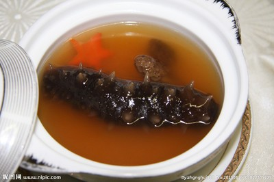

# 十全素菌煲 (Deluxe Ten-Mushroom Health Pot in Crystal Vegetarian Broth)

## 📋 基本資訊 / Recipe Overview
- **料理名稱 (繁體)**：十全素菌煲
- **料理名称 (简体)**：十全素菌煲
- **English Title**：Deluxe Ten-Mushroom Health Pot in Crystal Vegetarian Broth
- **素食流派 / Diet**：全素 / 纯素 Vegan
- **料理分類 / Category**：02-菌菇山珍类 / 养生大菜 / 珍馐荟萃
- **份量 / Servings**：4-6 人份
- **準備時間 / Prep Time**：30 分鐘
- **烹飪時間 / Cook Time**：45 分鐘
- **總計耗時 / Total Time**：75 分鐘
- **來源 / Source**：现代中华素菜 Top 100 · [02-菌菇山珍类.md](../02-菌菇山珍类.md) 第 55 道

## 📖 菜品特色 / Description
十种珍稀菌菇高汤慢煲，港台高档素宴养生大菜。汇聚干珍与鲜品，汤色金黄澄澈，醇厚甘鲜，滋补养元，素食天花板之作。

---

## 🌿 食材與調味清單 / Ingredients & Seasonings

### 十种精选珍稀菌菇
1. 羊肚菌（干品） 6 朵（温水泡发，滤清原汤）
2. 野生牛肝菌（干品） 15g（温水泡发，滤清原汤）
3. 姬松茸（干品） 6 朵（温水泡发）
4. 茶树菇（干品） 20g（剪去硬根泡发）
5. 金耳 / 黄耳（干品） 10g（泡发撕小朵，富含胶质）
6. 优质竹荪 6 根（去网头淡盐水泡发）
7. 鲜花菇 / 鲜香菇 4 朵（打十字花刀）
8. 新鲜松茸 / 鲜杏鲍菇 1 支（切厚片）
9. 新鲜白玉菇 60g（去根洗净）
10. 金色虫草花 30g（洗净）

### 滋补配料与基底素高汤
- 红枣 3 枚（去核）
- 宁夏枸杞 15 粒
- 老姜 4 大片
- 顶级素高汤 1200ml（黄豆芽 200g 煸香，加玉米、胡萝卜、干香菇蒂小火熬煮过滤）
- 泡菌沉淀过滤清汤 200ml（精华鲜味）

### 极简调味
- 纯天然海盐 1.5 茶匙（约 7.5g）
- 白胡椒粒 10 粒（拍碎提香）
- 优质芝麻香油 1/2 茶匙（出锅点缀）

---

## 🍳 烹飪步驟 / Step-by-Step Cooking Steps

### 步骤 1：干珍泡发与原汤留用（核心风味）
1. 羊肚菌、牛肝菌、姬松茸、茶树菇、金耳分别用 40℃ 温水浸泡 30 分钟至舒展变软。
2. 捞出菌菇轻轻挤水，将泡菇水静置沉淀后，用细密纱布过滤掉底部泥沙，保留上层清澈深褐色的“原菌鲜汤”备用。
3. 竹荪剪去封闭网状头部与底部黑圈，淡盐水中浸泡清洗挤水后切段。

### 步骤 2：鲜菌修切与预处理
鲜花菇打十字花刀，新鲜松茸/杏鲍菇切厚片，白玉菇与虫草花洗净沥干。

### 步骤 3：砂锅起香与注汤慢煲
1. 大砂锅内倒入 1 汤匙植物油，下入姜片与白胡椒碎微火煸香。
2. 注入顶级素高汤 1200ml 与过滤好的泡菌原汤 200ml。
3. 下入耐煮的干珍（羊肚菌、牛肝菌、姬松茸、茶树菇、金耳）、花菇、虫草花与去核红枣。
4. 大火煮沸，彻底撇净表面浮沫，转极小火，加盖慢煲 35 分钟，让深山菌香与多糖充分溶入金黄汤中。

### 步骤 4：后下鲜品与清润出锅
1. 开盖下入鲜松茸片、白玉菇、竹荪与枸杞，继续微火慢煲 10 分钟（保持鲜品脆嫩不软烂）。
2. 调入天然海盐 1.5 茶匙搅拌均匀，关火前滴入数滴香油，整煲端上素席。

---

## 💡 大厨秘诀 / Chef's Tips

1. **泡菌水是天然味精**：干牛肝菌与姬松茸的挥发油与水溶性鲜味多糖大量留在泡发水中，过滤沉淀后回入汤中是汤色金黄、甘醇无匹的秘诀。
2. **鲜珍干珍分批下锅**：干菌肉质紧实耐煮，需慢煲35分钟析出深层风味；而新鲜松茸与竹荪极嫩，久煮会失去清脆与挥发性香气，必须后下慢浸。
3. **调味只用海盐**：十种珍稀菌菇交织产生惊人的鲜味协同效应（Synergy Effect），切忌加入鸡精、味精或厚重酱油，以免破坏天然纯净的山野清韵。

---
*食谱归档时间：2026-08-21 · 收录于 20260818-vegetarianism 本地菜谱库 (1Top 精选)*
