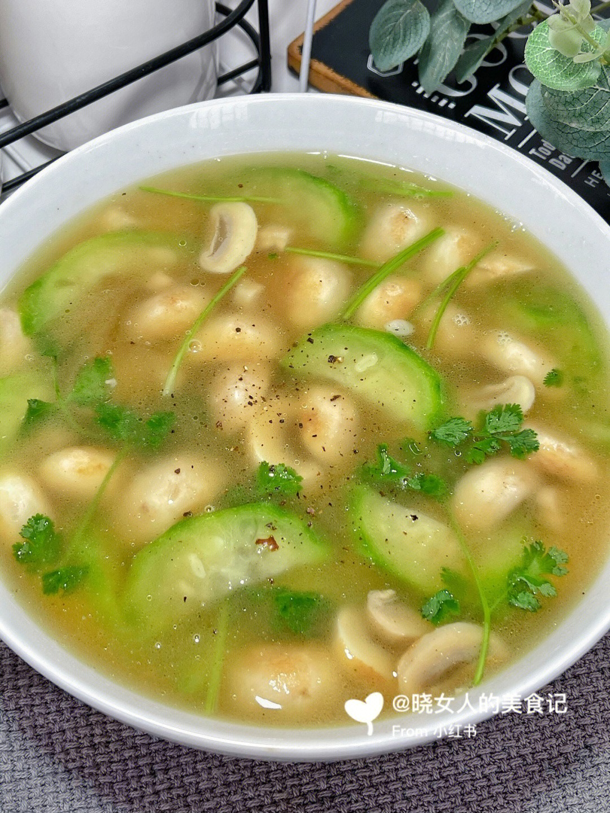

# 口蘑汤 (Northern Style Sliced White Button Mushroom Clear Soup)

## 📋 基本資訊 / Recipe Overview
- **料理名稱 (繁體)**：口蘑湯
- **料理名称 (简体)**：口蘑汤
- **English Title**：Northern Style Sliced White Button Mushroom Clear Soup
- **素食流派 / Diet**：全素 / 纯素 Vegan (纯净素 / 依家常可加葱)
- **料理分類 / Category**：02-菌菇山珍类 / 北方经典家常 / 极致鲜爽
- **份量 / Servings**：2-3 人份
- **準備時間 / Prep Time**：6 分鐘
- **烹飪時間 / Cook Time**：6 分鐘
- **總計耗時 / Total Time**：12 分鐘
- **來源 / Source**：现代中华素菜 Top 100 · [02-菌菇山珍类.md](../02-菌菇山珍类.md) 第 92 道

## 📖 菜品特色 / Description
口蘑片汤，北方。（口蘑切薄片煮清汤，北方经典家常鲜汤。）

---

## 🌿 食材與調味清單 / Ingredients & Seasonings
### 主料
- 新鲜白口蘑 250g（约 8-10 个）
- 生姜 5g（切细丝）
- 鲜香菜 1 根（切小段）/ 香葱末 5g（纯素可换为细芹菜末）

### 调味与汤水
- 植物油（或芝麻油）1 茶匙（约 5ml）
- 沸水 800ml
- 食盐 1/2 茶匙（约 3g，少盐以显口蘑原鲜）
- 白胡椒粉 1/8 茶匙（约 0.5g）
- 纯芝麻香油 1/2 茶匙（约 2.5ml）

---

## 🍳 烹飪步驟 / Step-by-Step Cooking Steps
### 步骤 1：口蘑切均匀薄片
1. 口蘑流水下快速冲洗干净表面浮尘，用厨房纸巾吸干水分。
2. 将口蘑切成 2mm 厚薄均匀的薄片（薄片受热快，极易在短时间内释出原汁）。

### 步骤 2：少油微煎激出原汁
1. 锅内加入 1 茶匙植物油润锅，下入姜丝煸香。
2. 下入口蘑薄片，中火轻轻翻煎 1-2 分钟，见口蘑片变软并渗出琥珀色的天然菌汁。

### 步骤 3：冲入滚水大火沸腾
1. 迅速冲入 800ml 滚烫沸水，保持大火沸腾滚煮 3 分钟。
2. 观察汤色迅速转化为温润的浅奶白色，口蘑鲜味完全释放到汤水中。

### 步骤 4：极简调味起锅
1. 撒入 1/2 茶匙食盐和少许白胡椒粉搅匀。
2. 关火，淋入 1/2 茶匙香油，撒上香菜段或芹菜碎，出锅盛碗。

---

## 💡 大厨秘诀 / Chef's Tips
1. **微煎口蘑出原汁**：北方做口蘑汤的秘诀在于“先煎后冲水”。口蘑片在锅中受热渗出的第一道琥珀色浓缩原汁是鲜味之源。
2. **必须冲入滚烫开水**：冲入滚水能在大火翻滚中使菌汁迅速乳化，汤白味甘，原汁原味。
3. **极简调味不夺主**：口蘑天生自带高鲜度，切勿加酱油、醋或浓重香料，只需少许海盐和胡椒即可品味至纯至美的山珍鲜汤。

---
*食谱归档时间：2026-08-21 · 收录于 20260818-vegetarianism 本地菜谱库 (1Top 精选)*
