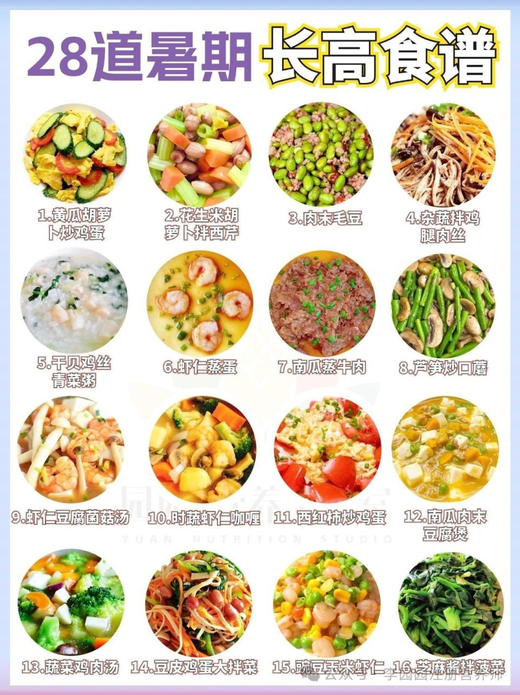

# 口蘑炒时蔬 (Sautéed White Button Mushrooms with Crisp Seasonal Greens)

## 📋 基本資訊 / Recipe Overview
- **料理名稱 (繁體)**：口蘑炒時蔬
- **料理名称 (简体)**：口蘑炒时蔬
- **English Title**：Sautéed White Button Mushrooms with Crisp Seasonal Greens
- **素食流派 / Diet**：全素 / 纯素 Vegan（五辛素可用蒜片；纯净素以姜丝、彩椒快炒）
- **料理分類 / Category**：02-菌菇山珍类 / 纯本清甜 / 鲜嫩多汁
- **份量 / Servings**：2-3 人份
- **準備時間 / Prep Time**：10 分鐘
- **烹飪時間 / Cook Time**：5 分鐘
- **總計耗時 / Total Time**：15 分鐘
- **來源 / Source**：现代中华素菜 Top 100 · [02-菌菇山珍类.md](../02-菌菇山珍类.md) 第 47 道

## 📖 菜品特色 / Description
口蘑片生煎出水再炒青菜，鲜嫩乳香。干煎逼出天然鲜汁，锁住天然谷氨酸，与时蔬的清脆相融，清淡至极却回味无穷。

---

## 🌿 食材與調味清單 / Ingredients & Seasonings

### 主料
- 新鲜白口蘑（双孢菇） 250g（切 3-4mm 厚片）
- 荷兰豆 / 嫩芦笋 / 广东菜心段 150g（摘洗干净）
- 红甜椒 1/3 个（切细条配色）

### 配料与调味料
- 大蒜 3 瓣（切薄片；全素用生姜丝 5g 替代）
- 初榨花生油 / 橄榄油 1.5 汤匙（约 22ml）
- 海盐 1 茶匙（约 5g）
- 现磨白胡椒粉 1/4 茶匙（约 1g）
- 极品生抽 1/2 茶匙（约 2.5ml，微量提香即可）
- 素高汤 / 温水 2 汤匙（约 30ml）

---

## 🍳 烹飪步驟 / Step-by-Step Cooking Steps

### 步骤 1：口蘑切片与时蔬焯水
1. 口蘑用湿厨房纸擦净菌盖杂质，切除根部少许干硬部分，切成 3-4mm 厚片。
2. 锅中烧开水加少许盐和油，下入荷兰豆或芦笋段焯水 20 秒断生，捞出立即过冷水沥干保脆。

### 步骤 2：口蘑干煎逼出原汁（关键技法）
1. 净锅烧热，**先不放油**，将口蘑厚片平铺入锅中，保持中火干煎 1-2 分钟。
2. 随着温度上升，口蘑会微微出汗并释放出清澈乳香的天然口蘑原汤，煎至一面微金黄后翻面再煎 1 分钟，盛出口蘑及原汁备用。

### 步骤 3：爆香与大火合炒
1. 锅中倒入 1.5 汤匙植物油烧热，下入蒜片（或姜丝）小火爆出香气。
2. 下入焯好水的时蔬与红甜椒条，转大火猛火翻炒 30 秒。
3. 倒入煎至金黄的口蘑片及碗底原汁，大火翻炒均匀。

### 步骤 4：调味出锅
沿锅边烹入 2 汤匙素高汤与 1/2 茶匙生抽，撒入海盐与现磨白胡椒粉，大火翻炒 15 秒收紧汤汁，带有镬气即可装盘。

---

## 💡 大厨秘诀 / Chef's Tips

1. **口蘑干煎出汤法**：口蘑含水量高达90%，先干煎能蒸发多余水汽，浓缩口蘑内部天然谷氨酸鲜味，产生独特的坚果乳香。
2. **厚切保持多汁感**：口蘑切片不宜过薄，3-4mm 厚度经煎炒后依然饱满肥厚，一口咬下爆汁感十足。
3. **极简调味突出本味**：无需过多重酱，仅用少许海盐和白胡椒，最能衬托口蘑与时蔬天然的甘甜。

---
*食谱归档时间：2026-08-21 · 收录于 20260818-vegetarianism 本地菜谱库 (1Top 精选)*
