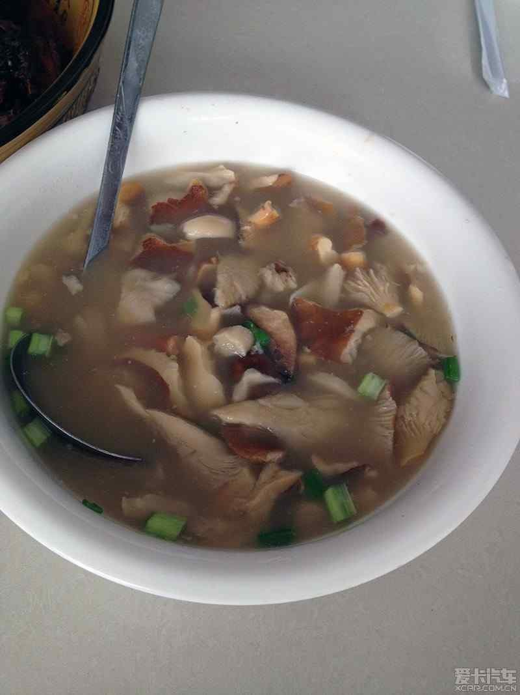

# 奶浆菌汤 (Lactarius Volemus Wild Mushroom Clear Soup)

## 📋 基本資訊 / Recipe Overview
- **料理名稱 (繁體)**：奶漿菌湯
- **料理名称 (简体)**：奶浆菌汤
- **English Title**：Lactarius Volemus Wild Mushroom Clear Soup
- **素食流派 / Diet**：全素 / 纯素 Vegan (纯净素)
- **料理分類 / Category**：02-菌菇山珍类 / 云南野生菌珍馐 / 鲜美清汤
- **份量 / Servings**：3-4 人份
- **準備時間 / Prep Time**：10 分鐘
- **烹飪時間 / Cook Time**：20 分鐘
- **總計耗時 / Total Time**：30 分鐘
- **來源 / Source**：现代中华素菜 Top 100 · [02-菌菇山珍类.md](../02-菌菇山珍类.md) 第 84 道

## 📖 菜品特色 / Description
云南奶浆菌。（云南野生奶浆菌清汤，乳白鲜甜。）

---

## 🌿 食材與調味清單 / Ingredients & Seasonings
### 主料
- 新鲜野生奶浆菌 300g（掰开分泌乳白乳汁的鲜甜野生菌）
- 嫩姜 10g（切细丝）
- 枸杞 10 粒（温水泡洗干净）

### 汤底与调味
- 植物油 1 汤匙（约 15ml）
- 沸水 / 素高汤 1000ml
- 食盐 1 茶匙（约 5g）
- 白胡椒粉 1/4 茶匙（约 1g）
- 纯芝麻香油 几滴（出锅点缀）

---

## 🍳 烹飪步驟 / Step-by-Step Cooking Steps
### 步骤 1：轻柔清洗与改刀
1. 奶浆菌质地娇嫩，用流水轻轻冲洗干净表层泥沙，沥干水分。
2. 将大朵的奶浆菌轻轻撕成两半或切成厚片，小朵保持原形。

### 步骤 2：热油煸香姜丝与奶浆菌
1. 汤锅烧热，倒入 1 汤匙植物油，下入姜丝小火煸出清香。
2. 倒入沥干的奶浆菌，转中火轻柔煸炒 1-2 分钟，直至奶浆菌受热软化并释放出特有的乳白鲜甜汁液。

### 步骤 3：注入滚水大火滚煮
1. 锅中一口气冲入 1000ml 沸水（务必加热水，能激发出乳白汤色与深层菌鲜）。
2. 大火煮沸后撇去浮沫，盖上锅盖，转中小火持续慢炖 15-20 分钟，使奶浆菌的鲜味与天然多糖完全溶入汤汁中。

### 步骤 4：调味出锅
1. 揭盖加入 10 粒枸杞，撒入 1 茶匙食盐和 1/4 茶匙白胡椒粉。
2. 慢滚 1 分钟后关火，滴入几滴纯芝麻香油，盛入汤碗中趁热享用。

---

## 💡 大厨秘诀 / Chef's Tips
1. **奶浆菌的天然乳汁**：奶浆菌掰开时会流出纯白色的天然菌浆，烹饪时务必保留，冲入热水后能煮出色泽微白、甘甜清润的菌汤。
2. **冲沸水大火催鲜**：先微煸菇体再冲入滚烫开水，乳化植物油脂与菌浆多糖，汤色醇厚鲜甜无比。
3. **文火慢炖 20 分钟**：野生菌类煲汤务必煲透 20 分钟以上，彻底激发甜香并确保食用安全。

---
*食谱归档时间：2026-08-21 · 收录于 20260818-vegetarianism 本地菜谱库 (1Top 精选)*
