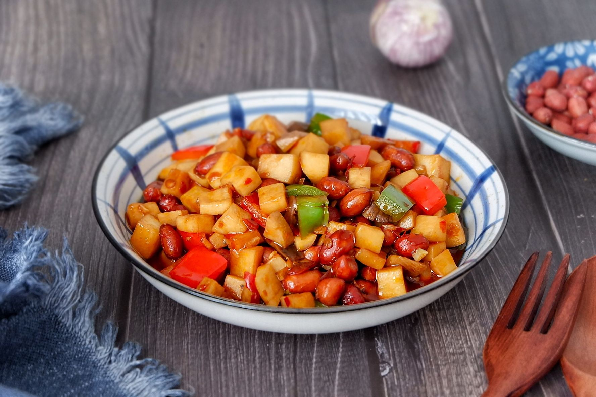

# 宮保杏鮑菇 (Kung Pao King Oyster Mushrooms with Peanuts and Chili)

## 📋 基本資訊 / Recipe Overview
- **料理名稱 (繁體)**：宮保杏鮑菇
- **料理名称 (简体)**：宫保杏鲍菇
- **English Title**：Kung Pao King Oyster Mushrooms with Peanuts and Chili
- **素食流派 / Diet**：全素 / 纯素 Vegan (纯净素 / 无五辛；若食五辛可加大葱白丁)
- **料理分類 / Category**：02-菌菇山珍类 / 川味经典 / 荔枝微辣
- **份量 / Servings**：2-3 人份
- **準備時間 / Prep Time**：12 分鐘
- **烹飪時間 / Cook Time**：8 分鐘
- **總計耗時 / Total Time**：20 分鐘
- **來源 / Source**：现代中华素菜 Top 100 · [02-菌菇山珍类.md](../02-菌菇山珍类.md) 第 25 道

## 📖 菜品特色 / Description
宫保汁配杏鲍丁、花生干椒，酸甜微辣荔枝味。

---

## 🌿 食材與調味清單 / Ingredients & Seasonings
### 主料
- 鲜嫩杏鲍菇 2 根（约 300g）

### 配料
- 熟去皮香脆花生米 50g
- 优质干红辣椒段 10g（剪成 1.5cm 段，去籽）
- 四川大红袍花椒粒 1.5 茶匙（约 3g）
- 生姜 1 小块（切指甲大薄片，约 10g）
- 莴笋丁 / 黄瓜丁 50g（切 1cm 丁，爽脆配色）

### 经典宫保小荔枝味汁
- 纯酿生抽 1.5 汤匙（22ml）
- 四川保宁醋 / 镇江香醋 1.5 汤匙（22ml）
- 白糖 1.5 汤匙（约 18g，糖醋 1:1 突出小荔枝回甘）
- 素蚝油 1 茶匙（5g）
- 老抽 1/2 茶匙（2.5ml，调上亮红酱色）
- 玉米淀粉 1 茶匙（3g）
- 素高汤 / 清水 3 汤匙（45ml）

### 用油
- 植物油 2 汤匙（30ml）

---

## 🍳 烹飪步驟 / Step-by-Step Cooking Steps
### 步骤 1：切丁与调配宫保滋汁
1. 杏鲍菇洗净擦干，切成约 1.2-1.5cm 见方的均匀丁块。
2. 莴笋去皮切成同等大小的丁块；生姜切指甲片；干辣椒剪段去籽备用。
3. 将生抽、保宁醋、白糖、素蚝油、老抽、玉米淀粉与清水倒入碗中，充分搅拌均匀调成宫保碗芡备用。

### 步骤 2：煸炒杏鲍丁锁紧肉质
1. 锅烧热，倒入 1 汤匙植物油润锅。
2. 倒入杏鲍菇丁，中小火煸炒 3-4 分钟。
3. 煸至杏鲍丁水分蒸发、四周呈金黄焦斑微皱缩（产生弹性肉质感），盛出备用。

### 步骤 3：小火爆出糊辣荔枝香
1. 锅中补入 1 汤匙植物油，保持小火，下入花椒粒慢炒出麻香。
2. 放入干红辣椒段，小火慢煸至辣椒颜色由鲜红转为“棕红色（棕木色）”，释放醇正糊辣香。
3. 下入姜片翻炒 5 秒爆出姜香。

### 步骤 4：大火合炒与泼汁亮油
1. 转大火，倒入煸好的杏鲍丁与莴笋丁，快速颠锅翻炒 15 秒。
2. 再次搅匀宫保碗芡，沿锅边一圈淋入锅中。
3. 旺火快速推炒颠翻，使芡汁迅速糊化裹紧在食材上，呈现明亮光泽。
4. 关火前最后一秒下入熟花生米，快速翻拌两下即刻出锅装盘。

---

## 💡 大厨秘诀 / Chef's Tips
1. **糊辣油火候关键**：干辣椒必须用小火慢煸至“棕红”，切不可炒焦变黑，此为正宗川味宫保菜独有的糊辣焦香。
2. **小荔枝味黄金配比**：糖、醋、生抽比例为 1.5:1.5:1.5，酸甜适口、回味带微辣微麻，咸酸甜辣平衡绝妙。
3. **花生米起锅前下**：香脆花生米必须在出锅前最后一刻倒入，避免长时间浸润在汤汁中吸水变软，确保酥脆嚼劲。

---
*食谱归档时间：2026-08-21 · 收录于 20260818-vegetarianism 本地菜谱库 (1Top 精选)*
