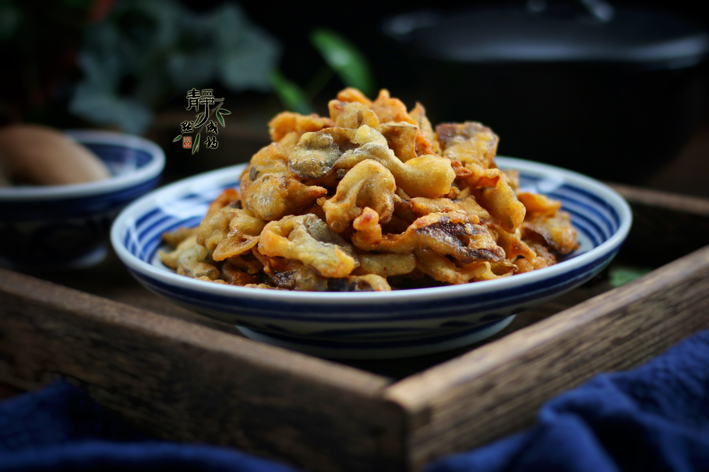

# 干煸平菇 (Dry-Fried Spicy Oyster Mushrooms with Sichuan Pepper)

## 📋 基本資訊 / Recipe Overview
- **料理名稱 (繁體)**：乾煸平菇
- **料理名称 (简体)**：干煸平菇
- **English Title**：Sichuan Dry-Fried Shredded Oyster Mushrooms with Chili and Cumin
- **素食流派 / Diet**：全素 / 纯素 Vegan (川味经典，素食下酒名品)
- **料理分類 / Category**：02-菌菇山珍类 / 川味干煸 / 香韧下酒
- **份量 / Servings**：2-3 人份
- **準備時間 / Prep Time**：15 分鐘
- **烹飪時間 / Cook Time**：12 分鐘
- **總計耗時 / Total Time**：27 分鐘
- **來源 / Source**：现代中华素菜 Top 100 · [02-菌菇山珍类.md](../02-菌菇山珍类.md) 第 71 道

## 📖 菜品特色 / Description
平菇撕细条煸至干香微韧，椒盐麻辣。平菇经长时间中小火耐心中度干煸，彻底脱水收缩，表层焦脆微韧，内部富有嚼劲，裹满花椒干椒与孜然芝麻，香辣麻香，风味媲美干巴牛肉干。

---

## 🌿 食材與調味清單 / Ingredients & Seasonings
### 主料
- 新鲜平菇 400g
### 川式干煸香料
- 干红辣椒 10 根（剪段去籽，约 8g）
- 四川大红袍花椒粒 1 茶匙（约 3g）
- 生姜 5g（切细丝）
- 大蒜片 3 瓣（约 10g，可选）
### 复合麻辣调味粉
- 优质椒盐粉 1 茶匙（约 4g）
- 细辣椒粉 1/2 茶匙（约 2g）
- 现磨孜然粉 1/2 茶匙（约 2g）
- 特级生抽 1 茶匙（约 5ml）
- 细白糖 1/3 茶匙（约 1.5g，提鲜柔和）
- 熟白芝麻 1 汤匙（约 10g）
- 香菜段 15g（出锅点缀）
- 食用植物油 2.5 汤匙（约 35ml）

---

## 🍳 烹飪步驟 / Step-by-Step Cooking Steps
### 步骤 1：撕细条与焯水彻底脱水
1. 平菇洗净顺纤维手撕成细长条（约小指粗细），细条受热均匀脱水更快。
2. 沸水加盐焯水 30 秒变软捞出，用冷水冲凉，用纱布或双手分批用力拧干水分至极干状态。

### 步骤 2：耐心干煸出焦香微韧
1. 净锅倒入 2 汤匙植物油烧至四成热，倒入挤干的平菇细条。
2. 转中小火耐心慢煸 6-8 分钟，不断用锅铲翻动，让平菇内部水分充分蒸发，直至菇条明显收缩变细、颜色由灰白转为金黄微焦、质地变得干香微韧时，推至锅边。

### 步骤 3：爆香麻辣底料
1. 在锅底空出处补入 1/2 汤匙植物油，下入姜丝、蒜片、花椒粒和干辣椒段，用微火煸炒出红亮麻辣香气。

### 步骤 4：合炒复合香料与出锅
1. 将金黄韧香的平菇条与麻辣料翻炒混合均匀。
2. 沿锅边烹入生抽 1 茶匙，加入白糖 1/3 茶匙翻炒均匀，随后均匀撒入椒盐粉 1 茶匙、辣椒粉 1/2 茶匙、孜然粉 1/2 茶匙与熟白芝麻。
3. 转大火快速颠翻 20 秒让粉料紧附菇条表面，最后撒入香菜段翻匀即刻关火出锅。

---

## 💡 大厨秘诀 / Chef's Tips
1. **“撕细条 + 极度挤干”是干煸基石**：平菇粗大不易煸干，撕成细条并用布拧至极干，能大幅缩短干煸时间，且成菜韧劲十足。
2. **中小火耐心干煸至焦黄微缩**：不要急于用大火，中小火慢慢逼干水分才能形成外焦脆内韧弹的肉感，切忌中途盖盖。
3. **调味粉后放防焦糊**：椒盐粉、孜然粉与辣椒粉极易在高温油锅中焦糊变苦，必须等平菇煸干出香后再下锅快颠出锅。

---
*食谱归档时间：2026-08-21 · 收录于 20260818-vegetarianism 本地菜谱库 (1Top 精选)*
