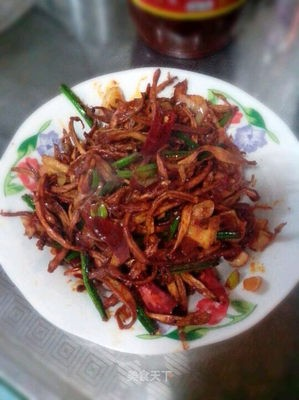

# 干煸杏鲍菇 (Dry-Fried Shredded King Oyster Mushrooms)

## 📋 基本資訊 / Recipe Overview
- **料理名稱 (繁體)**：乾煸杏鮑菇
- **料理名称 (简体)**：干煸杏鲍菇
- **English Title**：Dry-Fried Shredded King Oyster Mushrooms
- **素食流派 / Diet**：全素 / 纯素 Vegan (含葱蒜；纯净素去葱蒜用生姜丝炒制)
- **料理分類 / Category**：02-菌菇山珍类 / 川味干煸 / 焦香劲道
- **份量 / Servings**：2-3 人份
- **準備時間 / Prep Time**：10 分鐘
- **烹飪時間 / Cook Time**：12 分鐘
- **總計耗時 / Total Time**：22 分鐘
- **來源 / Source**：现代中华素菜 Top 100 · [02-菌菇山珍类.md](../02-菌菇山珍类.md) 第 19 道

## 📖 菜品特色 / Description
杏鲍撕丝干煸至焦香，芝麻干椒。

---

## 🌿 食材與調味清單 / Ingredients & Seasonings
### 主料
- 新鲜粗壮杏鲍菇 2-3 根（约 350g）

### 调味料 / 配料
- 干红辣椒段 8-10 根（剪段去籽）
- 四川大红袍花椒 1 茶匙（约 3g）
- 熟白芝麻 1 汤匙
- 熟孜然粉 / 孜然粒 1 茶匙（烧烤风味灵魂）
- 生姜 1 小块（切细丝）
- 大蒜 3 瓣（切片）
- 香葱 1 根（切段）
- 优质生抽 1.5 汤匙（约 22.5ml）
- 素蚝油 1 茶匙（约 5ml）
- 白糖 1/2 茶匙（约 2.5g，提鲜和味）
- 食盐 1/4 茶匙（约 1g）
- 食用植物油 2 汤匙（约 30ml）

---

## 🍳 烹飪步驟 / Step-by-Step Cooking Steps
### 步骤 1：顺纹手撕成细丝
1. 杏鲍菇洗净擦干，用手顺着天然纤维撕成筷子粗细的长丝，手撕截面粗糙更易入味。

### 步骤 2：无油/少油耐心干煸出焦边
1. 炒锅烧热抹少许底油，下入杏鲍菇丝，中火耐心地翻炒煸炒。
2. 随着水汽大量蒸发，菇丝由硬变软、体积缩小一半并析出自身原汁，继续煸炒至水分彻底收干、菇丝边缘泛起诱人的金黄焦边，盛出备用。

### 步骤 3：小火煸香干椒花椒香料
1. 锅中留底油 1 汤匙，转小火，下入姜丝、蒜片、花椒和干红辣椒段，慢火煸出红油香辣与麻香。

### 步骤 4：合锅调味撒芝麻孜然
1. 倒入煸干的杏鲍菇丝转大火翻炒，加入生抽、素蚝油、白糖和盐快速炒匀入味。
2. 最后撒入孜然粉、熟白芝麻和葱段，大火爆炒 10 秒即成。

---

## 💡 大厨秘诀 / Chef's Tips
1. **手撕而非刀切**：顺着纵向纤维手撕，断口不规则多孔，口感比刀切更有肉丝般的弹韧嚼劲，且极易挂味。
2. **耐心煸干水分是焦香灵魂**：杏鲍菇含水量高，必须在中火下慢煸 5-7 分钟把内部水汽彻底逼出，直到焦黄微卷，才能产生类似手撕牛肉干的焦香劲道。
3. **孜然与芝麻增添复合风味**：出锅前撒入烘香的白芝麻与现磨孜然粉，配合干椒与花椒，香辣焦脆，下酒下饭堪称一绝。

---
*食谱归档时间：2026-08-21 · 收录于 20260818-vegetarianism 本地菜谱库 (1Top 精选)*
