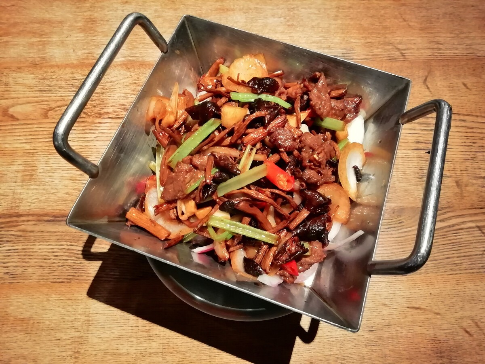

# 干锅杂菌 (Sizzling Dry Pot Assorted Wild Mushrooms (Sichuan Style))

## 📋 基本資訊 / Recipe Overview
- **料理名稱 (繁體)**：干鍋雜菌
- **料理名称 (简体)**：干锅杂菌
- **English Title**：Sizzling Dry Pot Assorted Wild Mushrooms (Sichuan Style)
- **素食流派 / Diet**：全素 / 纯素 Vegan（五辛素含蒜与葱；纯素以生姜、芹菜、干椒豆瓣酱为主）
- **料理分類 / Category**：02-菌菇山珍类 / 川香干煸 / 浓郁微辣
- **份量 / Servings**：3-4 人份
- **準備時間 / Prep Time**：15 分鐘
- **烹飪時間 / Cook Time**：10 分鐘
- **總計耗時 / Total Time**：25 分鐘
- **來源 / Source**：现代中华素菜 Top 100 · [02-菌菇山珍类.md](../02-菌菇山珍类.md) 第 53 道

## 📖 菜品特色 / Description
干锅微辣多菌合煸，川式干香下饭。菌菇经干煸脱水至焦香柔韧，裹满红油豆瓣与干椒花椒的浓烈麻辣，回味悠长。

---

## 🌿 食材與調味清單 / Ingredients & Seasonings

### 主料（干锅杂菌组合）
- 鲜杏鲍菇 150g（手撕成粗细均匀的细长丝）
- 鲜茶树菇 100g（去根切段）
- 鲜海鲜菇 / 白玉菇 100g（去根洗净）
- 鲜香菇 80g（切条）

### 干锅配料与香料
- 鲜芹菜段 60g（切 4cm 长段）
- 优质干红辣椒段 15g（剪段去籽）
- 四川大红袍花椒粒 1 茶匙（约 3g）
- 生姜 4 片（切丝）
- 大蒜 4 瓣（切片；纯素可免）
- 郫县豆瓣酱（纯素剁细） 1.5 汤匙（约 25g）
- 熟白芝麻 1 汤匙（约 8g）
- 熟去皮花生碎 1.5 汤匙（约 15g）

### 调味与油料
- 菜籽油 / 花生油 3 汤匙（约 45ml）
- 优质生抽 1 汤匙（约 15ml）
- 白砂糖 1/2 茶匙（约 2.5g，中和麻辣提鲜）
- 纯酿料酒 / 素高汤 1 汤匙（约 15ml）
- 芝麻香油 1 茶匙（约 5ml）

---

## 🍳 烹飪步驟 / Step-by-Step Cooking Steps

### 步骤 1：手撕杏鲍菇与食材准备
1. 杏鲍菇顺着纹理用手撕成筷子粗细的细长丝（手撕断面比刀切更易附着酱汁）。
2. 茶树菇、海鲜菇、香菇切条洗净，用厨房纸吸去表面明水；芹菜切段，干辣椒剪段。

### 步骤 2：无油干煸菌菇脱水（核心川菜技法）
1. 净炒锅烧热，**完全不放油**，倒入全部杂菌，保持中小火翻炒干煸。
2. 菌菇受热会先析出水分，继续翻炒 3-4 分钟，直至水分全部蒸发、菌丝体积缩小且表面呈现焦黄微干状态，盛出备用。

### 步骤 3：小火炒出红油底料
1. 锅中倒入 3 汤匙菜籽油烧至 5 成热，下入花椒粒与姜丝、蒜片，小火慢炸出麻香。
2. 下入剁细的郫县豆瓣酱，保持微火慢炒 1-2 分钟，炒出红亮油脂与浓郁酱香。
3. 下入干红辣椒段，小火翻炒至辣椒呈棕红色、辣香四溢（切勿炒糊发黑）。

### 步骤 4：合锅干炒与入味
1. 倒入干煸好的杂菌丝，转大火快速干炒 1 分钟，让红油豆瓣均匀包裹每根菌丝。
2. 烹入生抽 1 汤匙、料酒 1 汤匙与白糖 1/2 茶匙，大火翻炒入味。
3. 倒入芹菜段，大火快速翻炒 30 秒至芹菜断生保持爽脆。

### 步骤 5：淋油与干锅装盘
1. 淋入 1 茶匙香油翻匀关火。
2. 盛入提前加热的干锅或铁板中，撒上熟白芝麻与熟花生碎，可点燃下方酒精炉持续保温上桌。

---

## 💡 大厨秘诀 / Chef's Tips

1. **无油干煸脱水法**：菌菇含水量大，先无油干煸至水分收干微焦，成菜才有干锅特有的筋道焦香，杜绝汤水泛滥。
2. **小火慢煸红油豆瓣**：豆瓣酱必须低油温小火慢炒透，才能析出红油与醇厚陈香；干辣椒后放避免过早焦糊发苦。
3. **手撕杏鲍菇口感更胜**：手撕保留菌菇自然纤维粗糙面，比刀切更能紧紧吸附红油干香料。

---
*食谱归档时间：2026-08-21 · 收录于 20260818-vegetarianism 本地菜谱库 (1Top 精选)*
