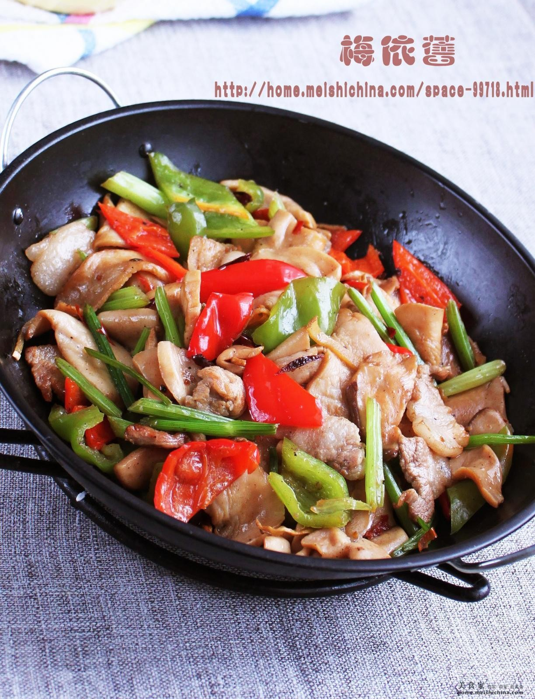

# 干锅杏鲍菇 (Sizzling Griddle King Oyster Mushrooms)

## 📋 基本資訊 / Recipe Overview
- **料理名稱 (繁體)**：乾鍋杏鮑菇
- **料理名称 (简体)**：干锅杏鲍菇
- **English Title**：Sizzling Griddle King Oyster Mushrooms
- **素食流派 / Diet**：全素 / 纯素 Vegan (含葱蒜、洋葱；纯净素去葱蒜洋葱，改用青红椒、芹菜段垫底炒制)
- **料理分類 / Category**：02-菌菇山珍类 / 川味干锅 / 浓郁焦香
- **份量 / Servings**：2-3 人份
- **準備時間 / Prep Time**：12 分鐘
- **烹飪時間 / Cook Time**：10 分鐘
- **總計耗時 / Total Time**：22 分鐘
- **來源 / Source**：现代中华素菜 Top 100 · [02-菌菇山珍类.md](../02-菌菇山珍类.md) 第 20 道

## 📖 菜品特色 / Description
杏鲍干锅，微辣锅气，仿肉质感。

---

## 🌿 食材與調味清單 / Ingredients & Seasonings
### 主料
- 杏鲍菇 3 根（约 400g，切 3-4mm 厚片或手撕粗条）
- 紫洋葱 1/2 个（切粗丝垫底）

### 调味料 / 配料
- 青红线椒 各 1 根（切斜段）
- 鲜芹菜 2 根（切小段）
- 大蒜 5 瓣（拍碎切大粒）
- 生姜 4 片
- 干红辣椒段 8 根
- 四川花椒粒 15 粒
- 正宗郫县豆瓣酱（剁细） 1 汤匙（约 15g）
- 素蚝油 1 汤匙（约 15ml）
- 优质生抽 1 汤匙（约 15ml）
- 白糖 1/2 汤匙（约 7.5g，中和咸辣提鲜）
- 熟白芝麻 1 茶匙
- 食用油 2.5 汤匙（约 37.5ml）

---

## 🍳 烹飪步驟 / Step-by-Step Cooking Steps
### 步骤 1：杏鲍菇切片与双面煎出焦香
1. 杏鲍菇切厚片；平底锅倒入 1 汤匙油烧热，下入杏鲍菇片平铺，中火慢煎至两面金黄微焦出浓郁香气，盛出控油。

### 步骤 2：砂锅/干锅洋葱丝垫底
1. 将干锅或小砂锅底部刷少许油，铺满紫洋葱丝和芹菜段备用。

### 步骤 3：小火炒出红油底料
1. 炒锅倒剩余 1.5 汤匙油，下入姜片、蒜粒、干辣椒和花椒粒爆香。
2. 加入剁细的郫县豆瓣酱，小火慢炒 1 分钟炒出红油和浓郁酱香。

### 步骤 4：大火合炒与干锅保温
1. 倒入煎好的杏鲍菇片和青红椒段，淋入生抽、素蚝油、白糖，转大火猛火翻炒 30 秒使酱汁紧裹食材。
2. 迅速倒入垫有洋葱的砂锅中，撒上熟白芝麻，置于小火炉或趁热上桌激出洋葱底香。

---

## 💡 大厨秘诀 / Chef's Tips
1. **平底锅先煎出焦边（锁住肉感）**：直接炒杏鲍菇容易析出大量水分变成水煮，先用少油两面煎至焦黄，外韧内嫩，肉质纤维感极为逼真。
2. **豆瓣酱小火炒出红油**：郫县豆瓣酱一定要在温油中小火慢炒至油色红亮，酱香完全释放后再下主料，这是干锅菜底味浓郁的关键。
3. **洋葱垫底热锅激香**：上桌前利用干锅或砂锅的高温余热烘烤洋葱丝，洋葱由生转熟释放天然甜香，与香辣杏鲍菇形成绝妙平衡。

---
*食谱归档时间：2026-08-21 · 收录于 20260818-vegetarianism 本地菜谱库 (1Top 精选)*
