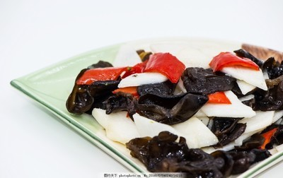

# 木耳炒山药 (Stir-Fried Chinese Yam with Black Fungus)

## 📋 基本資訊 / Recipe Overview
- **料理名稱 (繁體)**：木耳炒山藥
- **料理名称 (简体)**：木耳炒山药
- **English Title**：Stir-Fried Chinese Yam with Black Fungus
- **素食流派 / Diet**：全素 / 纯素 Vegan (含葱蒜；纯净素去葱蒜用姜丝替代)
- **料理分類 / Category**：02-菌菇山珍类 / 淮扬清雅 / 脆嫩爽滑
- **份量 / Servings**：2-3 人份
- **準備時間 / Prep Time**：12 分鐘
- **烹飪時間 / Cook Time**：5 分鐘
- **總計耗時 / Total Time**：17 分鐘
- **來源 / Source**：现代中华素菜 Top 100 · [02-菌菇山珍类.md](../02-菌菇山珍类.md) 第 11 道

## 📖 菜品特色 / Description
木耳山药清炒，脆嫩。

---

## 🌿 食材與調味清單 / Ingredients & Seasonings
### 主料
- 铁棍山药 / 脆山药 1 根（约 250g，去皮切 2mm 菱形片）
- 黑木耳（泡发好） 100g（撕成小朵）
- 胡萝卜 1/3 根（切菱形薄片配色）
- 青椒 1/3 个（切菱形块配色）

### 调味料 / 配料
- 大蒜 2 瓣（切片）
- 生姜 2 片（切丝）
- 葱白少许
- 食盐 1/2 茶匙（约 2.5g）
- 白糖 1/3 茶匙（约 1.5g）
- 素高汤 / 清水 2 汤匙
- 水淀粉 1.5 汤匙（生粉 1 茶匙 + 清水 1.5 汤匙，勾玻璃薄芡）
- 熟植物油 2 汤匙（约 30ml）

---

## 🍳 烹飪步驟 / Step-by-Step Cooking Steps
### 步骤 1：山药切片浸醋水防氧化
1. 山药去皮切菱形片，立即投入加了少许白醋的清水中浸泡，洗去多余黏液防止褐变氧化。

### 步骤 2：四色食材沸水焯烫
1. 锅中烧水加少许盐和油，先下入山药片和胡萝卜片焯烫 45 秒。
2. 再下入木耳和青椒焯烫 30 秒，捞出迅速投入凉水中过凉沥干。

### 步骤 3：爆香葱姜蒜快速滑炒
1. 热锅凉油，下蒜片、姜丝和葱白爆香。
2. 倒入控干水分的山药、木耳、胡萝卜和青椒，大火快速翻炒 30 秒。

### 步骤 4：清淡调味勾玻璃芡出锅
1. 加入食盐、白糖和 2 汤匙素高汤翻炒均匀。
2. 淋入水淀粉推匀挂上薄薄一层透亮玻璃芡，出锅装盘。

---

## 💡 大厨秘诀 / Chef's Tips
1. **醋水浸泡防发黑**：山药去皮后极易在空气中酚酶氧化发黑，切片后浸入滴有白醋的清水中，能长久保持洁白如玉。
2. **过冷水锁住爽脆度**：山药焯水 45 秒至断生即可，捞出立即过冰水或凉水，能洗去表面淀粉使山药口感嘎嘣脆爽。
3. **玻璃薄芡提亮增滑**：淮扬清炒不宜用深色酱油，仅用盐糖调底味，以晶莹剔透的水淀粉勾“二流薄芡”，色泽明亮雅致，滑润适口。

---
*食谱归档时间：2026-08-21 · 收录于 20260818-vegetarianism 本地菜谱库 (1Top 精选)*
