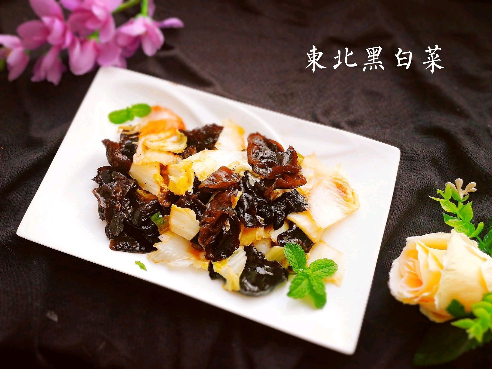

# 木耳炒白菜 (Stir-Fried Chinese Cabbage with Black Wood Ear / Northern Style)

## 📋 基本資訊 / Recipe Overview
- **料理名稱 (繁體)**：木耳炒白菜
- **料理名称 (简体)**：木耳炒白菜
- **English Title**：Stir-Fried Chinese Cabbage with Black Wood Ear (Northern Style)
- **素食流派 / Diet**：全素 / 纯素 Vegan (含葱蒜；可去葱蒜为纯净素)
- **料理分類 / Category**：02-菌菇山珍类 / 东北家常 / 清脆爽口
- **份量 / Servings**：2-3 人份
- **準備時間 / Prep Time**：10 分鐘
- **烹飪時間 / Cook Time**：5 分鐘
- **總計耗時 / Total Time**：15 分鐘
- **來源 / Source**：现代中华素菜 Top 100 · [02-菌菇山珍类.md](../02-菌菇山珍类.md) 第 10 道

## 📖 菜品特色 / Description
东北家常，木耳配白菜，清脆。

---

## 🌿 食材與調味清單 / Ingredients & Seasonings
### 主料
- 大白菜 400g（精选白菜帮与嫩叶）
- 干黑木耳 15g（泡发后约 120g，去蒂撕小朵）

### 调味料 / 配料
- 大蒜 3 瓣（切片）
- 大葱 1 段（切葱花）
- 干红辣椒 2 根（剪段，可选）
- 优质生抽 1 汤匙（约 15ml）
- 米醋 / 陈醋 1 汤匙（约 15ml，沿锅边烹入）
- 白糖 1/2 茶匙（约 2.5g）
- 食盐 1/2 茶匙（约 2.5g）
- 水淀粉 1 汤匙（生粉 1/2 茶匙 + 清水 1 汤匙）
- 花生油 2 汤匙（约 30ml）

---

## 🍳 烹飪步驟 / Step-by-Step Cooking Steps
### 步骤 1：刀工改刀与木耳焯水控干
1. 白菜帮斜刀片成 3cm 大小的薄片，菜叶切大段；木耳焯水 1 分钟捞出彻底控干水分防爆油。

### 步骤 2：热油炝锅爆出香气
1. 热锅倒入花生油烧热，下蒜片、葱花和干辣椒段，中火爆出浓郁炝锅香味。

### 步骤 3：大火急炒菜帮与木耳
1. 转最大火，先下白菜帮翻炒 30 秒至略呈半透明。
2. 接着倒入黑木耳大火猛翻 30 秒。

### 步骤 4：下菜叶烹醋调味出锅
1. 倒入白菜叶，加入生抽、食盐、白糖，沿滚烫锅边烹入米醋激出酸香。
2. 淋入少许水淀粉快速颠炒 5 秒，立即关火装盘。

---

## 💡 大厨秘诀 / Chef's Tips
1. **木耳焯水沥干防“炸锅”**：黑木耳下油锅容易噼啪爆响，提前焯水断生并彻底沥干表面水分，可彻底消除炸锅飞油现象。
2. **斜刀片白菜帮（抹刀片）**：白菜帮必须斜刀片成薄片，切面大且薄，能在 30 秒内快速受热断生，保持多汁脆甜。
3. **锅边淋醋提脆提香**：醋一定要在出锅前沿锅边高温处淋入（烹醋），醋酸受热挥发留下醇厚醋香并锁住白菜清脆细胞，酸咸鲜香。

---
*食谱归档时间：2026-08-21 · 收录于 20260818-vegetarianism 本地菜谱库 (1Top 精选)*
