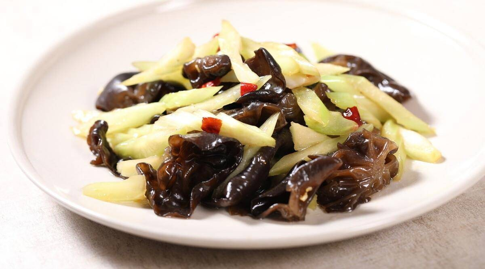

# 木耳炒西芹 (Stir-Fried Celery with Wood Ear Mushrooms)

## 📋 基本資訊 / Recipe Overview
- **料理名稱 (繁體)**：木耳炒西芹
- **料理名称 (简体)**：木耳炒西芹
- **English Title**：Stir-Fried Celery with Wood Ear Mushrooms
- **素食流派 / Diet**：全素 / 纯素 Vegan (含大蒜；纯净素去蒜用生姜丝代替)
- **料理分類 / Category**：02-菌菇山珍类 / 清雅小炒 / 脆爽多汁
- **份量 / Servings**：2-3 人份
- **準備時間 / Prep Time**：10 分鐘
- **烹飪時間 / Cook Time**：4 分鐘
- **總計耗時 / Total Time**：14 分鐘
- **來源 / Source**：现代中华素菜 Top 100 · [02-菌菇山珍类.md](../02-菌菇山珍类.md) 第 12 道

## 📖 菜品特色 / Description
木耳西芹，宴席素炒三丝近亲。

---

## 🌿 食材與調味清單 / Ingredients & Seasonings
### 主料
- 美国西芹 / 嫩芹菜茎 3-4 根（约 250g，抽去老筋，斜切菱形段）
- 黑木耳（泡发好） 100g（撕成小朵）
- 红彩椒 1/3 个（切菱形块增色）

### 调味料 / 配料
- 大蒜 3 瓣（切薄片）
- 生姜 2 片（切丝）
- 食盐 1/2 茶匙（约 2.5g）
- 白糖 1/3 茶匙（约 1.5g）
- 白胡椒粉 1/4 茶匙
- 水淀粉 1.5 汤匙（生粉 1 茶匙 + 清水 1.5 汤匙）
- 优质花生油 2 汤匙（约 30ml）
- 芝麻香油 1/3 茶匙

---

## 🍳 烹飪步驟 / Step-by-Step Cooking Steps
### 步骤 1：西芹抽丝与斜刀切段
1. 西芹根部反折撕去表面粗老纤维筋络，斜刀 45 度切成 3cm 长的菱形段；木耳撕成均匀小朵。

### 步骤 2：油盐水焯烫过凉
1. 锅中水沸加少许盐和油，先下木耳焯水 1 分钟，再下入西芹和彩椒焯水 30 秒，迅速捞出投凉水过凉沥干。

### 步骤 3：旺火爆香与急火翻炒
1. 炒锅烧热倒花生油，下蒜片和姜丝爆出香味。
2. 倒入沥干水分的西芹、木耳和彩椒，大火快速翻炒 20 秒。

### 步骤 4：调味勾芡淋香油装盘
1. 加入食盐、白糖和少许白胡椒粉翻炒均匀。
2. 淋入调匀的水淀粉快速翻匀，滴入香油即可出锅。

---

## 💡 大厨秘诀 / Chef's Tips
1. **西芹抽筋是脆嫩无渣的关键**：西芹表皮背部有粗纤维，抽去老筋后再切，吃起来清甜多汁毫无塞牙感。
2. **斜刀 45 度增大切面**：斜刀切段不仅形态挺拔美观，而且切面增大能让西芹受热更迅速、更容易附着芡汁入味。
3. **快焯快炒保留叶绿素与脆度**：西芹焯水时间不可超过 30 秒，入锅后大火翻炒 20 秒即可，久炒会失去清脆质感和鲜绿色泽。

---
*食谱归档时间：2026-08-21 · 收录于 20260818-vegetarianism 本地菜谱库 (1Top 精选)*
